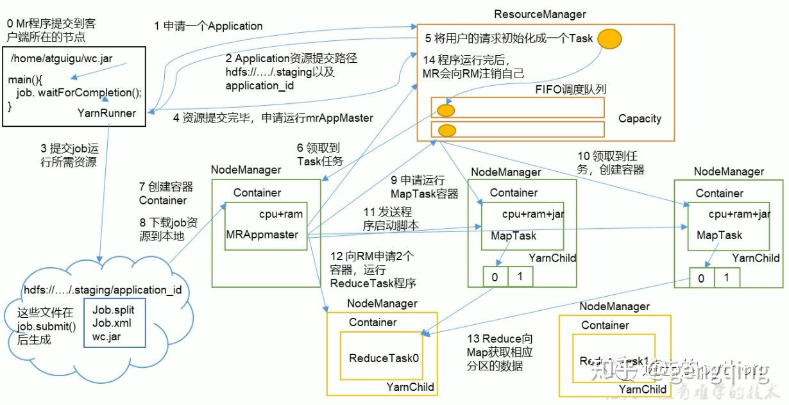

# Yarn工作机制

Yarn的核心思想是将资源管理和作业调度/监视功能拆分为单独的守护进程。

       （1）MR程序提交到客户端所在的节点。

       （2）YarnRunner向ResourceManager申请一个Application。

       （3）RM将该应用程序的资源路径返回给YarnRunner。

       （4）该程序将运行所需资源提交到HDFS上。

       （5）程序资源提交完毕后，申请运行mrAppMaster。

       （6）RM将用户的请求初始化成一个Task。

       （7）其中一个NodeManager领取到Task任务。

       （8）该NodeManager创建容器Container，并产生MRAppmaster。

       （9）Container从HDFS上拷贝资源到本地。

       （10）MRAppmaster向RM 申请运行MapTask资源。

       （11）RM将运行MapTask任务分配给另外两个NodeManager，另两个NodeManager分别领取任务并创建容器。

       （12）MR向两个接收到任务的NodeManager发送程序启动脚本，这两个NodeManager分别启动MapTask，MapTask对数据分区排序。

（13）MrAppMaster等待所有MapTask运行完毕后，向RM申请容器，运行ReduceTask。

       （14）ReduceTask向MapTask获取相应分区的数据。

       （15）程序运行完毕后，MR会向RM申请注销自己。