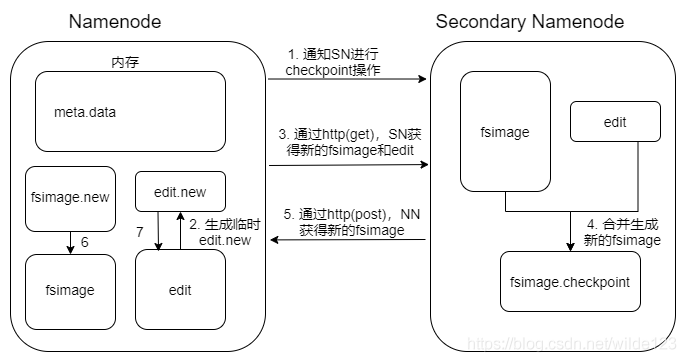

# fsimage 和 editlog 定义及合并过程

* fsimage 是镜像文件，是元数据在某个时间段的快照
* edits 记录了生成快照之后的一系列写操作。
* 检查点机制：定时将fsimage和editlog合并并产生新的fsimage的过程，这一过程非常耗费cpu和IO，一般放在Secondary Namenode（非HA）和Standby Namenode（HA）中完成。

HDFS 第一次启动时，会创建一份 fsimage 和 edits 文件，后续每一次客户端操作时，会先记录客户端执行的操作到 Edits 文件中，然后再更新内存中对应的目录树结构。如果不是第一次启动，直接加载 fsimage 和 edits 文件到内存中。

也就是说，内存中的元数据信息是完整的。前面生成的快照 Fsimage 只是元数据的一部分，执行完 Edits 文件中相关操作才能与内存中元数据相同。

