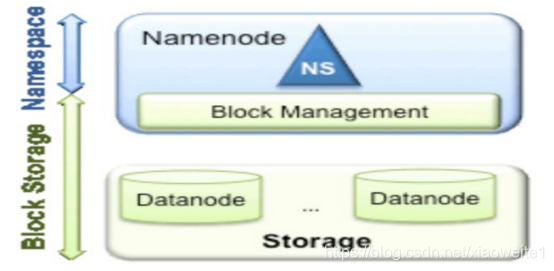
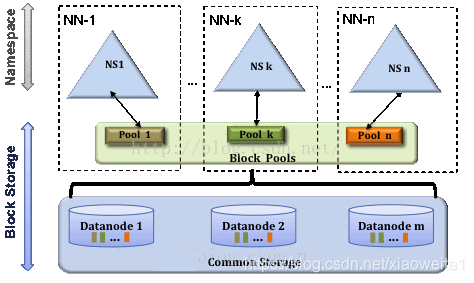

#Hadoop的联邦机制 Federation

## 背景 

单NameNode的架构使得HDFS在集群扩展性和性能上都有潜在的问题，当集群大到一定程度后，NameNode进程使用的内存可能会达到上百G，NameNode成为了性能的瓶颈。因而提出了namenode水平扩展方案-- Federation。

从上图中,我们可以很明显地看出现有的HDFS数据管理,数据存储2层分层的结构.也就是说,所有关于存储数据的信息和管理是放在NameNode这边,而真实数据的存储则是在各个DataNode下.而这些隶属于同一个NameNode所管理的数据都是在同一个命名空间下的.

一个namespace对应一个block pool。Block Pool是同一个namespace下的block的集合.当然这是我们最常见的单个namespace的情况,也就是一个NameNode管理集群中所有元数据信息的时候.如果我们遇到了之前提到的NameNode内存使用过高的问题,这时候怎么办?元数据空间依然还是在不断增大,一味调高NameNode的jvm大小绝对不是一个持久的办法.这时候就诞生了HDFS Federation的机制.

## Federation架构设计

Federation意味着在集群中将会有多个namenode和namespace。这些namenode之间是联合的，也就是说，他们之间相互独立且不需要互相协调，各自分工，管理自己的区域。分布式的datanode被用作通用的数据块存储存储设备。每个datanode要向集群中所有的namenode注册，且周期性地向所有namenode发送心跳和块报告，并执行来自所有namenode的命令。

Federation一个典型的例子就是上面提到的NameNode内存过高问题,我们完全可以将上面部分大的文件目录移到另外一个NameNode上做管理.更重要的一点在于,这些NameNode是共享集群中所有的DataNode的,它们还是在同一个集群内的。

这时候在DataNode上就不仅仅存储一个Block Pool下的数据了,而是多个 。

### 概括

* 多个NN共用一个集群里的存储资源，每个NN都可以单独对外提供服务。
* 每个NN都会定义一个存储池（block pool），有单独的id，每个DN都为所有存储池提供存储。
* DN会按照存储池id向其对应的NN汇报块信息，同时，DN会向所有NN汇报本地存储可用资源情况。

## HDFS Federation加高可用

HDFS Federation并没有完全解决单点故障问题。虽然namenode/namespace存在多个，但是从单个namenode/namespace看，仍然存在单点故障：如果某个namenode挂掉了，其管理的相应的文件便不可以访问。Federation中每个namenode仍然像之前HDFS上实现一样，配有一个secondary namenode，以便主namenode挂掉一下，用于还原元数据信息。

所以一般集群规模真的很大的时候，会采用HA+Federation的部署方案。也就是每个联合的namenodes都是ha的。

