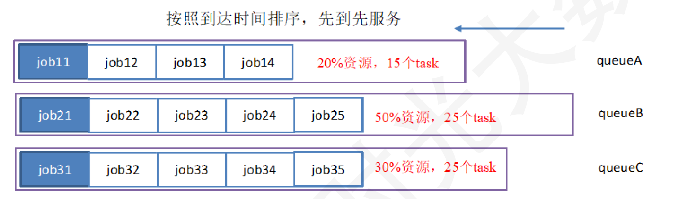

#Mapreduce之自带wordcount示例
---

##1.准备文本

创建input目录：

	hadoop fs -mkdir /input 

之后可以用命令看

	hadoop fs -ls / 

创建input目录成功

将LICENSE.txt放到input目录下：

	hadoop fs -put /root/hadoop-3.2.1/LICENSE.txt /input 

可以通过命令

	hadoop fs -ls /input

看到license.txt已经存在input目录下了

##2.统计

将/input通过hadoop自带示例程序wordcount计算出其中各字母出现的次数便可

	hadoop jar /root/hadoop-3.2.1/share/hadoop/mapreduce/hadoop-mapreduce-examples-3.2.1.jar wordcount /input /output

##3.查看结果

	hadoop fs -ls /

HDFS系统下多了个/output 和/tmp目录

打开/output目录可以看到下面有两个文件（_SUCCESS和part-r-00000），说明已经运行成功了，直接打开part-r-00000便可以查看结果，命令

	hadoop fs -cat /output/part-r-00000
