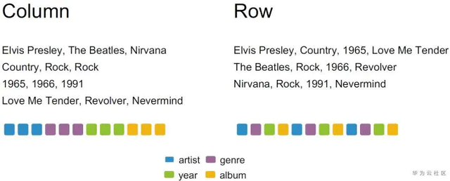

# Parquet 

参考：https://baijiahao.baidu.com/s?id=1707816052087829378&wfr=spider&for=pc

## 简介

Apache Parquet是面向分析型业务的列式存储格式，由Twitter和Cloudera合作开发，Parquet是一种与语言无关的列式存储文件类型，可以适配多种计算框架。

## 列式存储和行式存储

行式存储（Row-oriented）、列式存储（Column-oriented）是两个重要的数据组织方式，列存的有parquet， ORC；行存的则有Avro，JSON，CSV，Text。 举例说明行式存储和列式存储的区别

在上图的music表中，如果用列存和行存存储会得到下面两种不同的组织方式。在左边的列存中，同一列的数据被组织在一起，当一列数据存储完毕时，接着下一列的数据存放，直到数据全部存好；而在行存中，数据按照行的顺序依次放置，同一行中包括了不同列的一个数据，在图中通过不同的颜色标识了数据的排列方法。

如果使用列存去处理下面的查询，可以发现它只涉及到了两列数据（album和artist），而列存中同一列的数据放在一起，那么我们就可以快速定位到所需要的列的位置，然后只读取查询中所需要的列，有效减少了无用的数据IO（year 以及 genre）。同样的，如果使用行存处理该查询就无法起到 列裁剪 的作用，因为一列中的数据被分散在文件中的各个位置，每次IO不可避免地需要读取到其他的数据，所以需要读取表中几乎所有的数据才能满足查询的条件。

列存适合处理在几个列上作分析的查询，因为可以避免读取到不需要的列数据，同时，同一列中的数据数据类型一致放置在一起也十分适合压缩。但是，如果需要对列存进行INSET INTO操作需要挪动几乎所有数据，效率十分低下。行存则只需要在文件末尾append一行数据即可。列存适合读密集的场景，特别是那些仅仅需要部分列的分析型查询；行存适合写密集的场景，或者不需要只查询某些列。

## Parquet的优势

###（1）列裁剪（offset of first data page -> 列的起始结束位置）

Parquet列式存储方式可以方便地在读取数据到内存之间找到真正需要的列，具体是并行的task对应一个Parquet的行组（row group），每一个task内部有多个列块，列快连续存储，同一列的数据存储在一起，任务中先去访问footer的File metadata，其中包括每个行组的metadata，里面的Column Metadata记录offset of first data page和offset of first index page，这个记录了每个不同列的起始位置，这样就找到了需要的列的开始和结束位置。其中data和index是对数值和字符串数据的处理方式，对于字符变量会存储为key/value对的字典转化为数值

### （2）谓词下推（Column Statistic -> 列的range和枚举值信息）

Parquet中File metadata记录了每一个Row group的Column statistic，包括数值列的max/min，字符串列的枚举值信息，比如如果SQL语句中对一个数字列过滤>21以上的，因此File 0的行组1和File 1的行组0不需要读取

	File 0
	Row Group 0, Column Statistics -> (Min -> 20, Max -> 30)
	Row Group 1, Column Statistics -> (Min -> 10, Max -> 20)
	File 1
	Row Group 0, Column Statistics -> (Min -> 6, Max -> 21)
	Row Group 1, Column Statistics -> (Min -> 25, Max -> 45)

### （3）压缩效率高，占用空间少，存储成本低

Parquet这类列式存储有着更高的压缩比，相同类型的数据为一列存储在一起方便压缩，不同列可以采用不同的压缩方式，结合Parquet的嵌套数据类型，可以通过高效的编码和压缩方式降低存储空间提高IO效率

## Spark操作Parquet性能测试

将一个csv格式数据上传hdfs

	[root@cloudera01 pgeng]# hdfs dfs -mkdir -p /tmp/test_data.txt
	[root pgeng]# hdfs dfs -put -test_data.txt /tmp/test_data.txt
	
使用spark读取文件，再存储为parquet格式

	scala> val df = spark.read.format("csv").option("sep", "\t").load("hdfs:///tmp/test_data.txt")
	df: org.apache.spark.sql.DataFrame = [_c0: string, _c1: string ... 12 more fields]
	scala> df.repartition(1).write.format("parquet").save("hdfs:///tmp/test_data.parquet")

查看hdfs上两个不同格式的文件目录，第一列是目标文件大小，第二列是目标文件在集群上所有副本大小综合，可见使用parquet格式文件大小较csv缩小为原来1/7

	[root ~]# hdfs dfs -du -h /tmp
	60.6 M 181.8 M /tmp/test_data.parquet
	401.9 M 1.2 G /tmp/test_data.txt