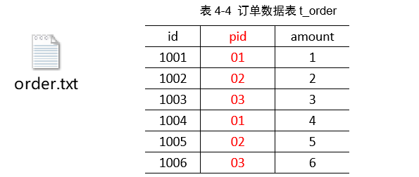
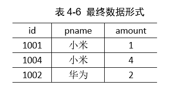
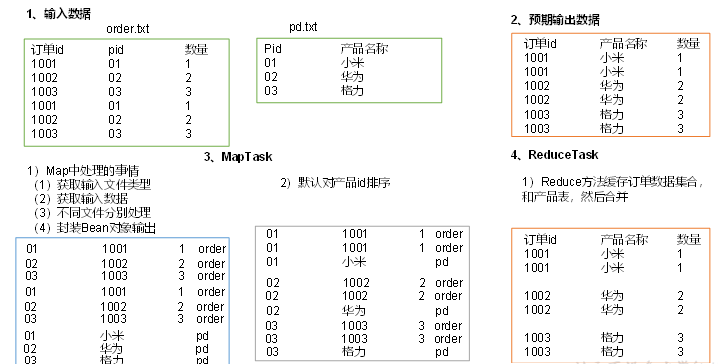
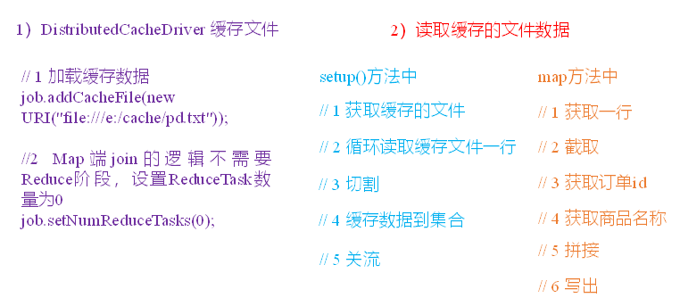

# map join 与 reduce join的区别

## 概念

解决的都是同一个问题，即将两张“表‘进行join操作。更广义地来讲，就是不同数据源数据的合并问题。

reduce join是在map阶段完成数据的标记，在reduce阶段完成数据的合并

map join是直接在map阶段完成数据的合并，没有reduce阶段

##  举例

现在需要将商品表中的商品名称填充到订单表中。得到如下的联合表：

### Reduce Join

#### map
将输入数据统一封装为一个Bean，此Bean包含了商品表和订单表的所有公共和非公共属性，相当于进行了全外连接，并新增加一个属性——文件名称，以区分数据是来自与商品表还是订单表,便于在reduce阶段数据的 处理；map输出的key是pid，value是bean

#### shuffle
根据pid对bean进行排序，所有pid相同的数据都会被聚合到同一个key下，发往同一个reducetask

#### reduce
对同一个pid下所有的bean，首先要区分出它们是来自于哪个表，是商品表还是订单表。如果是商品表，数据只有一条，保存其中的pname属性；如果是订单表，数据有多条，用保存的pname属性替换pid属性，并输出

### map join

没有reduce过程，所有的工作都在map阶段完成，极大减少了网络传输和io的代价。如何实现：

上述的join过程可以看作外表与内表的连接过程，外表是订单表，外表大，内表是商品表，内表小。所以可以把内表事先缓存于各个maptask结点，然后等到外表的数据传输过来以后，直接用外表的数据连接内表的数据并输出即可。

