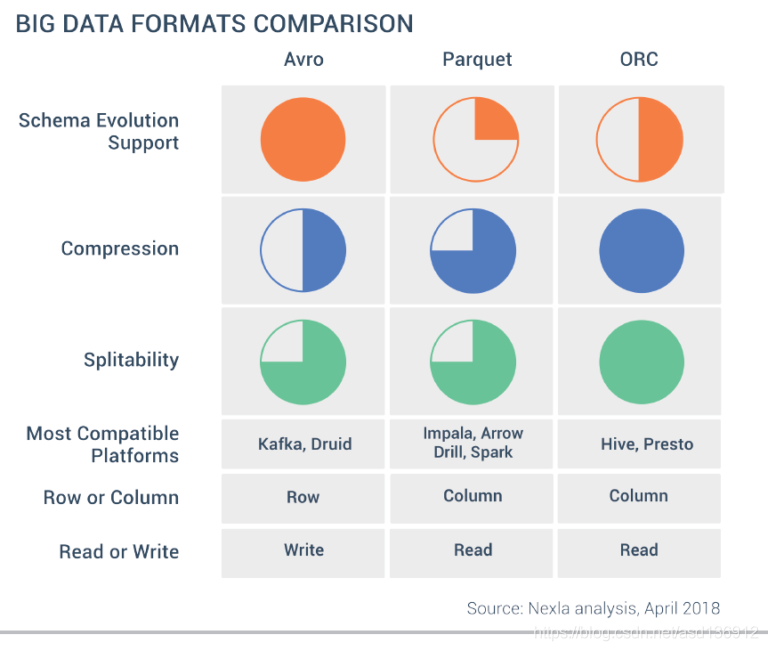

# 大数据文件格式对比 Parquet Avro ORC

## Apache Avro

Avro是一种远程过程调用和数据序列化框架，是在Apache的Hadoop项目之内开发的。它使用JSON来定义数据类型和通讯协议，使用压缩二进制格式来序列化数据。它主要用于Hadoop，它可以为持久化数据提供一种序列化格式，并为Hadoop节点间及从客户端程序到Hadoop服务的通讯提供一种电报格式。

* 基于行的(存储数据行):基于行的数据库是最适合write-heavy事务性工作负载
* 支持序列化
* 快速二进制格式
* 支持块压缩和可分离
* 支持schema更新

## Apache Parquet

pache Parquet 最初的设计动机是存储嵌套式数据，比如Protocolbuffer，thrift，json等，将这类数据存储成列式格式，以方便对其高效压缩和编码，且使用更少的IO操作取出需要的数据，这也是Parquet相比于ORC的优势，它能够透明地将Protobuf和thrift类型的数据进行列式存储，在Protobuf和thrift被广泛使用的今天，与parquet进行集成，是一件非容易和自然的事情。 除了上述优势外，相比于ORC, Parquet没有太多其他可圈可点的地方，比如它不支持update操作（数据写成后不可修改），不支持ACID等。

* 基于列(在列中存储数据):用于数据存储是包含大量读取操作的优化分析工作负载
* 与Snappy的压缩压缩率高(75%)
* 只需要列将获取/读(减少磁盘I / O)
* 可以使用Avro API和Avro读写模式
* 支持谓词下推(减少磁盘I / O的成本)

## Apache ORC

ORC（OptimizedRC File）存储源自于RC（RecordColumnar File）这种存储格式，RC是一种列式存储引擎，对schema演化（修改schema需要重新生成数据）支持较差，而ORC是对RC改进，但它仍对schema演化支持较差，主要是在压缩编码，查询性能方面做了优化。RC/ORC最初是在Hive中得到使用，最后发展势头不错，独立成一个单独的项目。Hive 1.x版本对事务和update操作的支持，便是基于ORC实现的（其他存储格式暂不支持）。ORC发展到今天，已经具备一些非常高级的feature，比如支持update操作，支持ACID，支持struct，array复杂类型。你可以使用复杂类型构建一个类似于parquet的嵌套式数据架构，但当层数非常多时，写起来非常麻烦和复杂，而parquet提供的schema表达方式更容易表示出多级嵌套的数据类型。

* 用于(在列中存储数据):用于数据存储是包含大量读取操作的优化分析工作负载
* 高压缩率(ZLIB)
* 支持Hive(datetime、小数和结构等复杂类型,列表,地图,和联盟)
* 元数据使用协议缓冲区存储,允许添加和删除字段
* HiveQL兼容
* 支持序列化

##  总结

