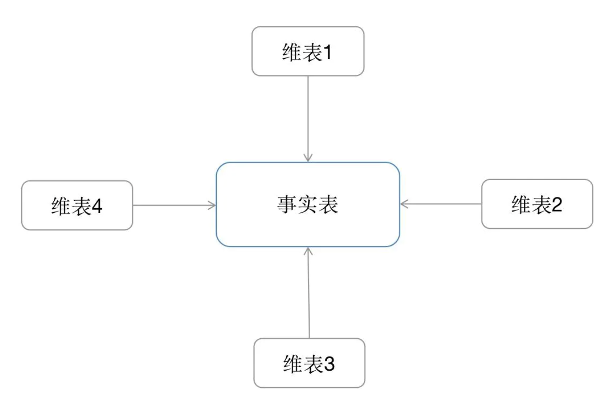
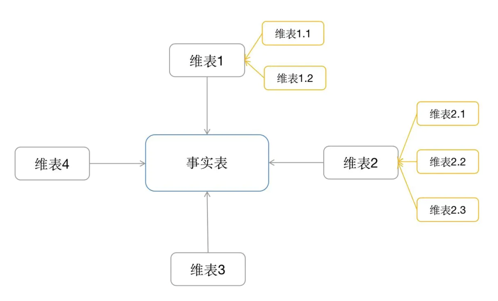
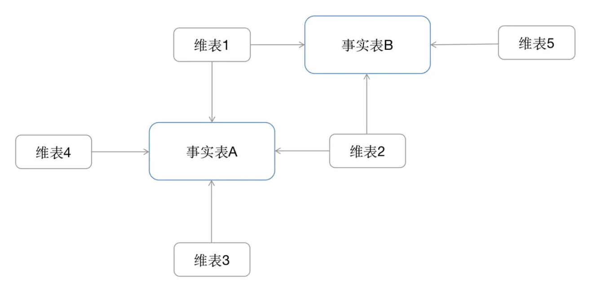

# 数仓建模方式

## 关系建模

关系建模，是数据仓库之父Inmon推崇的，被称为“实体-关系”模型，以一种“标准化”的方式存在，强调数据之间非冗余，满足3NF。

## 维度建模法

### 星形模式

* 维表只和事实表关联，维表之间没有关联；
* 每个维表的主码为单列，且该主码放置在事实表中，作为两边连接的外码；
* 以事实表为核心，维表围绕核心呈星形分布；

### 雪花模式

雪花模式(Snowflake Schema)是对星形模式的扩展，每个维表可继续向外连接多个子维表。

### 星座模式

#### 比较

1、雪花模型在维度表、事实表之间的连接很多，因此性能方面会比星型模型低。

2、雪花模型使用的是规范化数据，数据冗余来减少数据量。其维度层级和维度信息都存储在数据模型之中。星形模型是反规范化数据，数据存在冗余，维度直接关联事实表，维度层级清晰明了。

3、雪花模型在设计上更加复杂，由于附属维度的限制，ETL复杂且不能并行化。星形模型加载维度表，不需要添加附属维度层级，ETL相对简单，可以实现高度的并行化。

4、雪花模型使得维度分析更加容易，比如“针对特定的广告主，有哪些客户或者公司是在线的?”。星形模型用来做指标分析更适合，比如“给定的一个客户他们的收入是多少?”