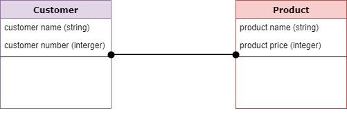

# 概念模型、逻辑模型、物理模型

参考：https://www.guru99.com/data-modelling-conceptual-logical.html#:~:text=Logical%20data%20model%20defines%20the%20structure%20of%20the,offered%20by%20the%20functional%20team%20are%20represented%20accurately.

## 概念

### 两类数据建模技术

* Entity Relationship (E-R) Model
* UML (Unified Modelling Language)

### DBMS的数据模型类型

###概念模型CDM （Conceptual Data Model） 偏商业理解

概念模型是最终用户对数据存储的看法，反映了最终用户综合性的信息需求，以数据类的方式描述企业级的数据需求

概念模型的内容包括重要的实体与实体之间的关系，在概念模型中不包含实体的属性，也不包含定义实体的主键

概念模型的目的是统一业务概念，作为业务人员和技术人员之间的沟通桥梁，确定不同实体之间的最高层次的关系

**CDM包含三种类型的内容**：

* Entity：真实世界的东西
* Attribute：Entity的属性
* Relationship：两个Entity之间的依赖和联系

#### 例子

* Customer and Product are two entities. Customer number and name are attributes of the Customer entity
* Product name and price are attributes of product entity
* Sale is the relationship between the customer and product

### 逻辑模型LDM：偏业务

逻辑模型反映的是系统分析人员对数据存储的观点，是对概念模型的进一步分解和细化，逻辑模型是根据业务规则确定的，关于业务对象，业务对象的数据项以及业务对象之间关系的基本蓝图

逻辑模型的内容包括所有的实体和关系，确定每个实体的属性，定义每个实体的主键，指定实体的外键，需要进行范式化处理

逻辑模型的目标是尽可能详细的描述数据，并不考虑物理上如何实现

#### 例子

### 物理模型PDM：偏技术

物理模型是在逻辑模型的基础上，考虑各种具体的技术实现因素，进行数据体系结构设计，真正实现数据在数据仓库中的存放

物理模型的内容包括确定所有的表和列，定义外键用确认表之间的关系，基于用户的需求可能要进行反范式化等内容

