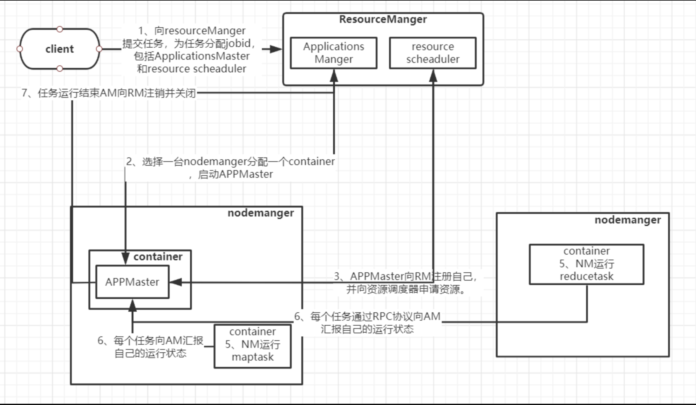
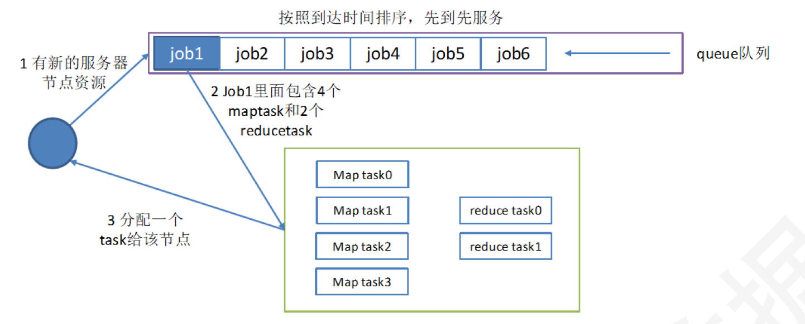
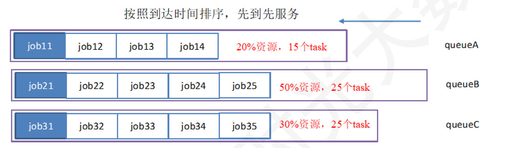
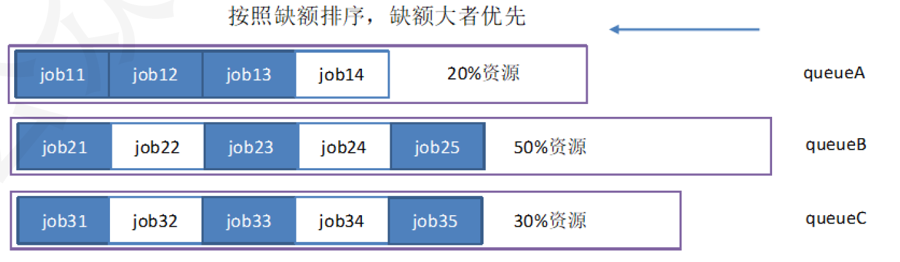

**使用Virtualbox搭建环境**

**1. 使用virtualbox搭建centos7环境**

搭建一个centos7的虚拟机环境

**2.配置ip**

使用命令查看ip地址：
    
    ip addr

如果没有ip地址，则使用命令：

	vi /etc/sysconfig/network-scripts/ifcfg-ens33

将其中的

ONBOOT=no改成ONBOOT=yes
	
BOOTPROTO = static

插入：

	IPADDR=192.168.195.128
	NETMASK=255.255.255.0
	GATEWAY=192.168.195.2

设置resolv.conf

	vi /etc/resolv.conf

插入：

    nameserver 192.168.195.2

重启服务

	sudo service network restart

配置hosts文件

    vi /etc/hosts

插入：

	192.168.195.128 Master001
	192.168.195.129 Master002
	192.168.195.130 Slave001
	192.168.195.131 Slave002
	192.168.195.132 Slave003

使配置生效

    service network restart

**3. 添加用户**

	#新增用户	
    adduser hadoop
    
	#设置hadoop用户的密码
    passwd hadoop

	#设置密码为hadoop

	#验证是否成功
	su -l root

**4. 安装JDK**

将JDK安装包拷贝到服务器

	#解压
    tar -zxf jdk-8u221-linux-x64.tar.gz

	cd jdk1.8.0_221/

	#打印路径
	pwd

设置环境变量：
	
	vi /etc/profile

在底部插入

	#Java
	export JAVA_HOME=/root/jdk1.8.0_221
	export PATH=$PATH:$JAVA_HOME/bin
	

使得环境变量生效

	source /etc/profile

验证：

	java -version

**5. 安装Hadoop**

将Hadoop安装包拷贝到服务器

    #解压
    tar -zxf hadoop-3.2.1.tar.gz

	cd hadoop-3.2.1
	
	#打印路径
	pwd

配置环境变量

	vi /etc/profile

插入：

	#zk
	export ZK_HOME=/root/zookeeper-3.4.14 
	export PATH=$PATH:$ZK_HOME/bin

    #hadoop
    export HADOOP_HOME=/root/hadoop-3.2.1
    export PATH=$PATH:$HADOOP_HOME/bin
    export PATH=$PATH:$HADOOP_HOME/sbin
    export HADOOP_MAPRED_HOME=$HADOOP_HOME
    export HADOOP_COMMON_HOME=$HADOOP_HOME
    export HADOOP_HDFS_HOME=$HADOOP_HOME
    export HADOOP_YARN_HOME=$HADOOP_HOME
    export YARN_HOME=$HADOOP_HOME
    export HADOOP_COMMON_LIB_NATIVE_DIR=$HADOOP_HOME/lib/native
    export HADOOP_OPTS="-Djava.library.path=$HADOOP_HOME/lib"
    export JAVA_LIBRARY_PATH=$HADDOP_HOME/lib/native:$JAVA_LIBRARY_PATH

使得环境变量生效：

	source /etc/profile

验证：
	
	hadoop

配置core-site.xml文件：

    vi /root/hadoop-3.2.1/etc/hadoop/core-site.xml

插入：

    <configuration>
    	<!--指定zookeeper地址-->
    	<property>
    		<name>ha.zookeeper.quorum</name>
    		<value>Slave001:2181, Slave002:2181, Slave003:2181</value>
    	</property>
    	<!--指定Hadoop临时目录-->
    	<property>
    		<name>hadooo.temp.dir</name>
    		<value>/root/hadoop-3.2.1/tmp</value>
    	</property>
    	<!--指定Namenode访问端口-->
    	<property>
    		<name>fs.defaultFS</name>
    		<value>hdfs://Master001:9000</value>
    	</property>
    </configuration>

	
修改hadoop-env.sh文件：

	vi hadoop-env.sh

修改JAVA_HOME=/root/jdk1.8.0_221

修改hdfs-site.xml:

	vi hdfs-site.xml

插入：

	<configuration>
	
	<!--指定设备备份数量-->
	    <property>
	        <name>dfs.replication</name>
	        <value>3</value>
	    </property>
	
	<!--指定高可用集群的名字空间-->
	    <property>
	        <name>dfs.nameservices</name>
	        <value>mycluster</value>
	    </property>
	
	<!-- 指定NameNode节点的名字空间 -->
	    <property>
	      <name>dfs.ha.namenodes.mycluster</name>
	      <value>nn1,nn2</value>
	    </property>
	
	<!--指定nn1,nn2的RPC地址-->
	    <property>
	      <name>dfs.namenode.rpc-address.mycluster.nn1</name>
	      <value>Master001:9000</value>
	    </property>
	    <property>
	      <name>dfs.namenode.rpc-address.mycluster.nn2</name>
	      <value>Master002:9000</value>
	    </property>
	
	<!-- 指定nn1、nn2的http地址 -->
	        <property>
	        <name>dfs.namenode.http-address.mycluster.nn1</name>
	        <value>Master001:50070</value>
	    </property>
	    <property>
	      <name>dfs.namenode.http-address.mycluster.nn2</name>
	      <value>Master002:50070</value>
	    </property>
	
	<!--解释：hadoop 守护进程一般同时运行RPC 和HTTP两个服务器，RPC服务器支持守护进程间的通信，HTTP服务器则提供与用户交互的Web页面。-->
	
	
	<!--设置共享edits的存放地址，将共享edits文件存放在哎QJournal集群中的QJCluster目录下-->
	    <property>
	      <name>dfs.namenode.shared.edits.dir</name>
	      <value>qjournal://Slave001:8485;Slave002:8485;Slave003:8485/QJCluster</value>
	    </property>
	
	
	<!--指定JournalNode集群在对NameNode的目录进行共享时，自己存储数据的磁盘路径-->
	
	    <property>
	      <name>dfs.journalnode.edits.dir</name>
	      <value>/root/hadoop-3.2.1/QJEditsData</value>
	    </property>
	
	
	<!--指定是否启动自动故障恢复，即当NameNode出故障时，是否自动切换到另一台NameNode-->
	
	    <property>
	       <name>dfs.ha.automatic-failover.enabled</name>
	       <value>true</value>
	     </property>
	
	
	<!--指定cluster1出故障时，哪个实现类负责执行故障切换-->
	
	    <property>
	      <name>dfs.client.failover.proxy.provider.mycluster</name>
	      <value>org.apache.hadoop.hdfs.server.namenode.ha.ConfiguredFailoverProxyProvider</value>
	    </property>
	
	
	<!--一旦需要NameNode切换，使用ssh方式进行操作-->
	
	    <property>
	      <name>dfs.ha.fencing.methods</name>
	      <value>sshfence</value>
	    </property>
	
	
	<!--如果使用ssh进行故障切换，使用ssh通信时用的密钥存储的位置-->
	
	    <property>
	      <name>dfs.ha.fencing.ssh.private-key-files</name>
	      <value>/home/beifeng/.ssh/id_rsa</value>
	    </property>
	
	</configuration>

设置mapred-site.xml文件：
	
	vi mapred-site.xml

插入：

	<configuration>
	   <property>
	        <name>mapreduce.framework.name</name>
	        <value>yarn</value>
	    </property>
	</configuration>

设置work文件：

	vi workers

删除localhost

插入

    Slave001
    Slave002
    Slave003
    

设置yarn-site.xml：

	vi yarn-site.xml

插入：

	<configuration>
	
	<!-- Site specific YARN configuration properties -->
	 <property>
	        <name>yarn.nodemanager.aux-services</name>
	        <value>mapreduce_shuffle</value>
	        <description>NodeManager上运行的附属服务。需配置成mapreduce_shuffle，才可运行MapReduce程序</description>
	    </property>
	
	<property>
	    <name>yarn.resourcemanager.hostname</name>
	    <value>master</value>
	    <description>Master001</description>
	</property>
	
	</configuration>

**6.安装SSH**

查看哪些SSH的rpm包

    yum list | grep ssh

安装：

    yum install -y openssh-clients.x86_64

	yum install -y openssh-server.x86_64

验证：

	ssh

**7.克隆虚拟机**

克隆之前，先更新yum:

    yum update

克隆虚拟机，搭建5台Centos环境。 ip地址分别为：

- Master001: 192.168.195.128
- 
- Master002: 192.168.195.129
- 
- Slave001:  192.168.195.130
- 
- Slave002:  192.168.195.131
- 
- Slave003:  192.168.195.132

在下面这个文件指定IP

	vi /etc/sysconfig/network-scripts/ifcfg-ens33

修改：
	
	BOOTPROTO="static

插入：

	IPADDR= XXXX #静态IP  (按章节7的规定)

	
**7.1.修改主机名**

    vi /etc/hostname

将机器名称修改为

    Master001
    Master002
    Slave001
    Slave002
    Slave003

**8.SSH免密**

生成秘钥：

    ssh-keygen -t rsa -P ''

在 /root/.ssh/id_rsa 下生成了密钥

	vi /root/.ssh/id_rsa

将密钥发给集群中的所有节点（包括自己），就免去输入密码去访问其他虚拟机。

    ssh-copy-id Master001
    ssh-copy-id Master002
    ssh-copy-id Slave001
    ssh-copy-id Slave002
    ssh-copy-id Slave003

在每一个节点上重复生成密钥--将密钥发给所有节点（包括自己）的步骤

验证是否成功：

	ssh Master001
	ssh Master001
	ssh Slave001
	ssh Slave002
	ssh Slave003

**9.安装zookeeper**

将zookeeper安装包zookeeper-3.4.14.tar.gz 上传到Slave003服务器

解压：

    tar -zxf zookeeper-3.4.14.tar.gz

进入zookeeper的conf目录，将zoo_sample.cfg模板复制出zoo.cf文件：

    cp zoo_sample.cfg zoo.cfg

	vi zoo.cfg

修改:

	dataDir=/root/zookeeper-3.4.14/temp/zookeeper

插入：

	server.1=Slave001:2888:3888
	server.2=Slave002:2888:3888
	server.3=Slave003:2888:3888

创建文件夹

	mkdir -p /root/zookeeper-3.4.14/temp/zookeeper

在/root/zookeeper-3.4.14/temp/zookeeper目录下创建myid文件：

	vi myid

插入：

	3

**10.复制zookeeper**

将Slave003中的zookeeper目录床送到Slave001和Slave002

	#复制到Slave002
    scp -r  /root/zookeeper-3.4.14  root@Slave002:/root
    
	#复制到Slave001
    scp -r  /root/zookeeper-3.4.14  root@Slave001:/root

修改root/zookeeper-3.4.14/temp/zookeeper目录下的myid文件:

	#修改Slave002的myid
	2

	#修改Slave001的myid
	1

修改后重启服务器

	reboot

**12.启动zookeeper**

关闭Slave001, Slave002, Slave003, Master001, Master002的防火墙：

	systemctl stop firewalld.service

 	systemctl disable firewalld.service

在Slave001, Slave002, Slave003中启动:

    . /root/zookeeper-3.4.14/bin/zkServer.sh start

查看状态：

	jps
	
	cd /root/zookeeper-3.4.14/bin

	sh zkServer.sh status
	

**13. 启动Hadoop集群**

在Slave001, Slave002, Slave003中启动journalnode

	hadoop-daemon.sh start journalnode

在Master001中格式化Namenode

	hdfs namenode -format

此时会在/root/hadoop-3.2.1目录下生成temp文件夹

将tmp文件拷贝到其他节点：

	#复制到Master002
    scp -r  /root/hadoop-3.2.1/tmp  root@Master002:/root/hadoop-3.2.1

	#复制到Slave001
    scp -r  /root/hadoop-3.2.1/tmp  root@Slave001:/root/hadoop-3.2.1

	#复制到Slave002
    scp -r  /root/hadoop-3.2.1/tmp  root@Slave002:/root/hadoop-3.2.1

	#复制到Slave003
    scp -r  /root/hadoop-3.2.1/tmp  root@Slave003:/root/hadoop-3.2.1

如果/root/hadoop-3.2.1目录下生成temp文件夹目录下没有tmp，则默认存放地址为：/tmp/hadoop-root

	#复制到Master002
    scp -r  /tmp/hadoop-root  root@Master002:/tmp

	#复制到Slave001
    scp -r  /tmp/hadoop-root  root@Slave001:/tmp

	#复制到Slave002
    scp -r  /tmp/hadoop-root  root@Slave002:/tmp

	#复制到Slave003
    scp -r  /tmp/hadoop-root  root@Slave003:/tmp

如果是root账号创建的Hadoop,需要在/hadoop/sbin路径下： 

将start-dfs.sh，stop-dfs.sh两个文件顶部添加以下参数

	#!/usr/bin/env bash
	HDFS_DATANODE_USER=root
	HADOOP_SECURE_DN_USER=hdfs
	HDFS_NAMENODE_USER=root
	HDFS_SECONDARYNAMENODE_USER=root
	HDFS_ZKFC_USER=root
 	HDFS_JOURNALNODE_USER=root

还有，start-yarn.sh，stop-yarn.sh顶部也需添加以下：

    #!/usr/bin/env bash
    YARN_RESOURCEMANAGER_USER=root
    HADOOP_SECURE_DN_USER=yarn
    YARN_NODEMANAGER_USER=root

**启动HDFS：**

只需要在Master001中执行 

	start-dfs.sh

它会分别在Master001, Master002中启动namenode进程，在 Slave001, Slave002, Slave003中启动datanode进程。

如果出现下面报错：

进程已经在运行中了，先执行stop-all.sh下，然后再执行start-all.sh

**启动Mapreduce：**

start-yarn.sh

**14. 验证是否搭建成功**

 	hadoop fs -ls /

