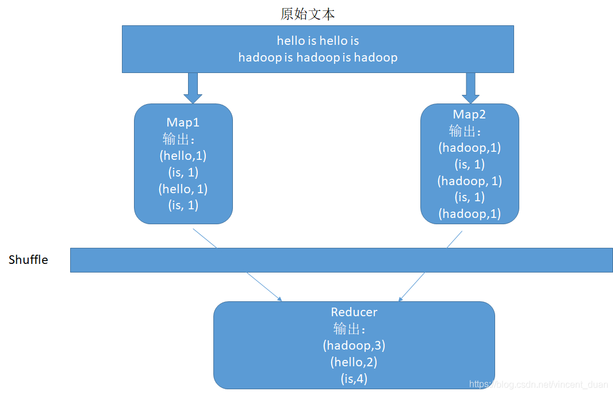
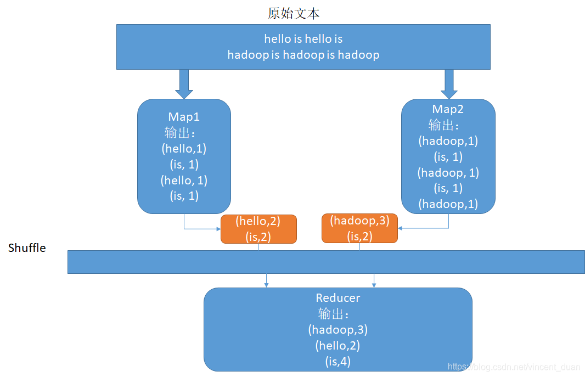
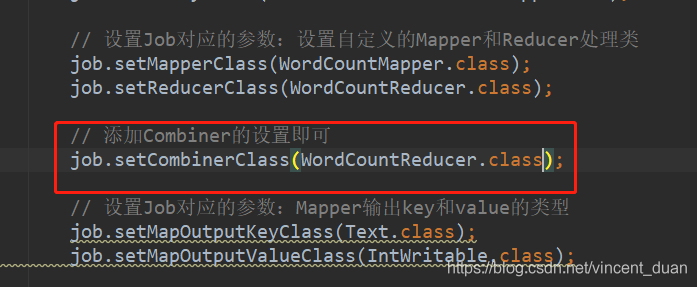

# 数据倾斜

## 发生原因
* 数据频率倾斜——某一个区域的数据量要远远大于其他区域。
* 数据大小倾斜——部分记录的大小远远大于平均值。

MR进行计算的时候，都会触发Shuffle动作，一旦触发，所有相同key的值就会拉到一个或几个节点上，就容易发生单个节点处理数据量爆增的情况。

## 解决思路

提前对数据做预处理，做好数据过滤。因此解决数据倾斜的重点落在了对数据设计与对业务理解。

### 单key造成的数据倾斜

#### 有损的办法

对空值，0直接过滤

#### 无损的办法

对分布不均匀的数据，单独计算。先对key做一层hash，先将数据随机打散让它的并行度变大，再汇集；或者添加数据随机数。

### 多key造成的数据倾斜

####原始任务：

#### 在map端聚合

在map端再做一次聚合，就会提高性能。这个聚合的操作和我们的Reduce逻辑完全一样。这个Map端的聚合操作就叫做Combiner。这样能很大程度上节省网络开销。

实现方法：

##### Combiner的优点
能减少IO，提升作业的执行性能

##### Combiner的局限性
在求平均数的场景下，会出现错误的结果。

### 小表JOIN大表造成的数据倾斜

将reduce join 改为map join,避免了Shuffle阶段，从而避免了数据倾斜。

实现原理：这个操作会将所有的小表全量复制到每个map任务节点，然后再将小表缓存在每个map节点的内存里与大表进行join工作。小表的大小的不能太大，一般也就几百兆，否则会出现OOM报错。

### sql语句造成的数据倾斜

	--优化前
	select count(distinct a) from test ;
	
	--优化后
	select count x.a 
	from 
	(select a from test group by a ) x 