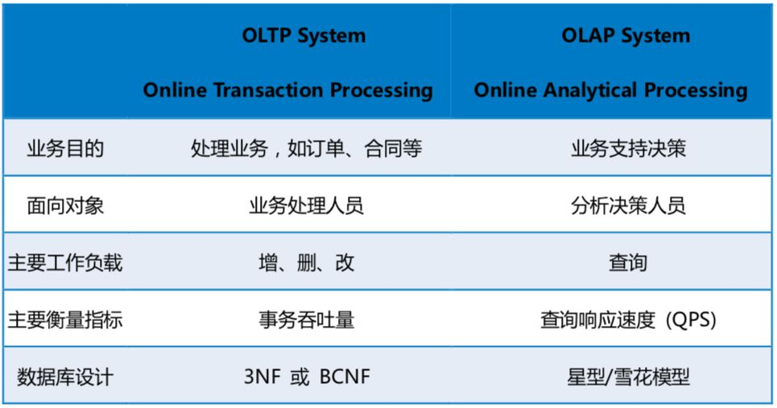
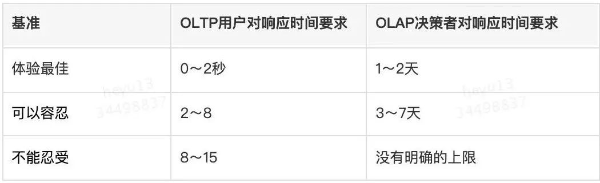
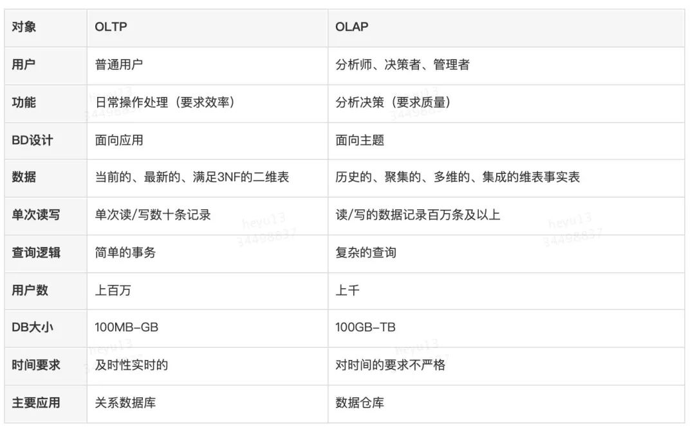

# OLAP 和 OLTP的区别

## OLAP
 OLAP（On-Line Analytical Processing）翻译为联机分析处理。
 
### OLAP分析的分类：ROLAP与MOLAP

OLAP分析分为关系型联机分析处理（ROLAP）、多维联机分析处理（MOLAP）两种，他们的设计理念以及解决场景不一样，各有优劣。

以ROLAP为代表的有传统关系型数据库、MPP分布式数据库以及基于Hadoop的Spark/Impala，特点是能同时连接明细数据和汇总数据，实时根据用户提出的需求对数据进行计算后返回给用户，所以用户使用相对比较灵活，可以随意选择维度组合来进行实时计算。正因为采用的实时计算技术，所以ROLAP的缺点也比较明显——当计算的数据量达到一定级别或并发数达到一定级别的时候，一定会出现性能问题(就好比如果领导一次性给你安排非常多的工作，你一个人是无法马上将所有事情做完答复领导的)。以传统关系型数据库为代表的如Teradata、Oracle等，由于传统架构可扩展性较差，所以对硬件的要求非常高，当计算的数据量达到千万，亿级别时，数据库的计算就会出现延时，使得用户不能及时得到响应，更别提高并发了。

### MPP分布式数据库（GreenPlum/GBase/Vertica）
解决了一部分可扩展性问题，对硬件设备的要求也稍稍下降了（还是有一定的硬件要求)，在支持的数据体量（GB，TB级别）上有了很大的提升。当集群有几百、上千节点时，会出现性能瓶颈(增加再多节点，性能提升也不会很明显)，扩容成本同样不菲。

## OLTP

OLTP（on-line transaction processing）翻译为联机事务处理。OLTP主要用来记录某类业务事件的发生，如购买行为，当行为产生后，系统会记录是谁在何时何地做了何事，这样的一行（或多行）数据会以增删改的方式在数据库中进行数据的更新处理操作，要求实时性高、稳定性强、确保数据及时更新成功，像公司常见的业务系统如ERP，CRM，OA等系统都属于OLTP。

因为OLTP所产生的业务数据分散在不同的业务系统中，而OLAP往往需要将不同的业务数据集中到一起进行统一综合的分析，这时候就需要根据业务分析需求做对应的数据清洗后存储在数据仓库中，然后由数据仓库来统一提供OLAP分析。所以我们常说OLTP是数据库的应用，OLAP是数据仓库的应用，下面用一张图来简要对比

