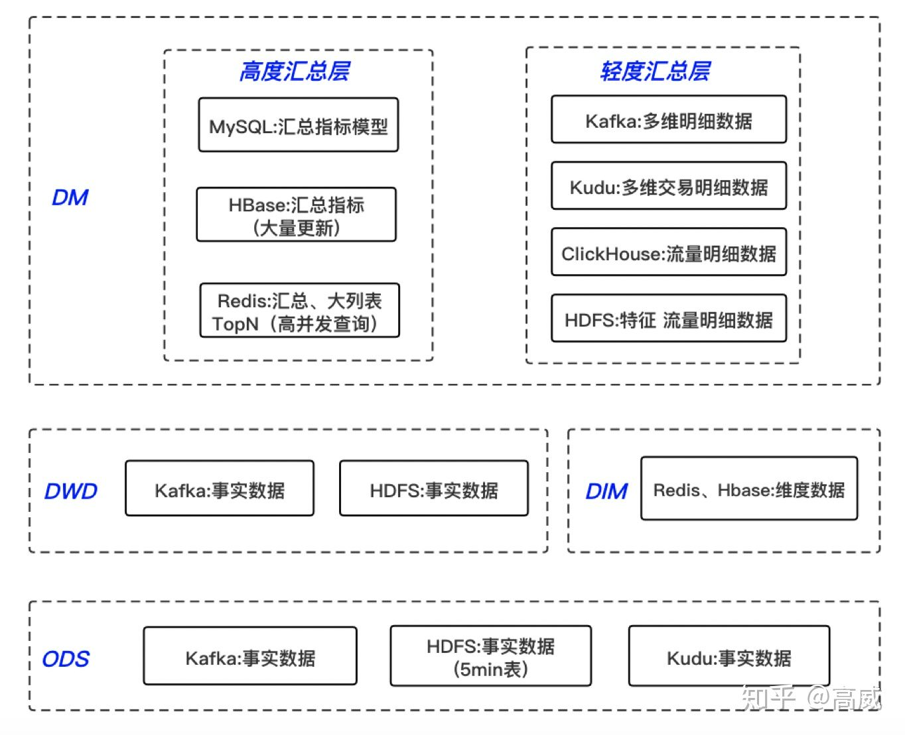
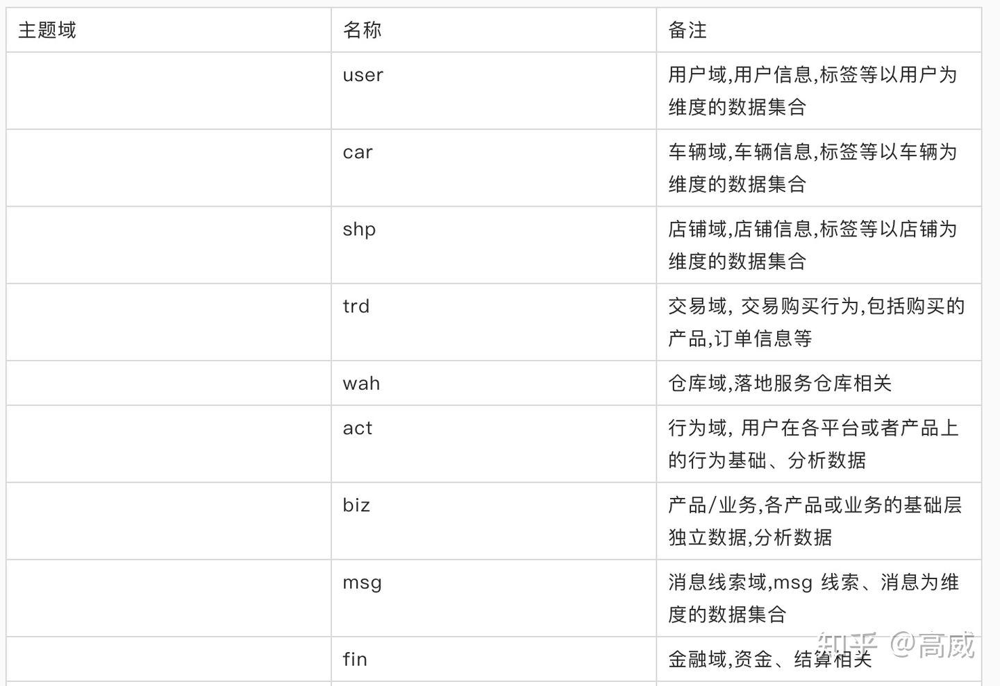
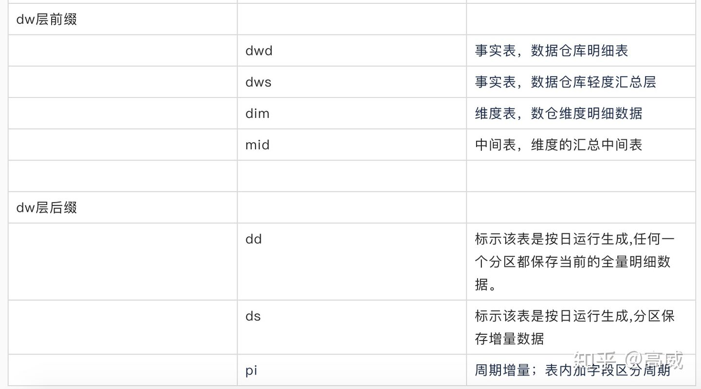
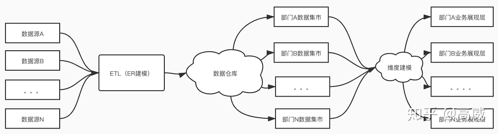
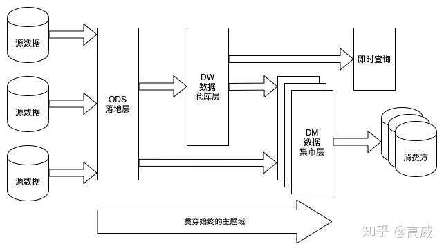

# 数仓分层

参考：https://zhuanlan.zhihu.com/p/137454121

## ODS原始层

存放原始数据，主要是埋点数据（日志数据）和业务操作数据（binlong），数据源主要是Mysql、HDFS、Kafka等

## DW中间层

### DWD（data warehouse detail）

数据仓库明细表，以业务过程作为建模驱动，基于每个具体的业务过程特点，构建最细粒度的明细层事实表。

### DWS（data warehouse summary)

数据仓库轻度汇总层，按照各个业务域进行轻度汇总成分析某一个主题域的服务数据，一般是宽表。

### DIM：维度表

## DM数据集市层

以数据域+业务域的理念建设公共汇总层，对于DM层比较复杂，需要综合考虑对于数据落地的要求以及具体的查询引擎来选择不同的存储方式，分为轻度汇总层和高度汇总层。

## 常见的数仓命名规则

## 数仓模型架构举例

## 数据流向图

