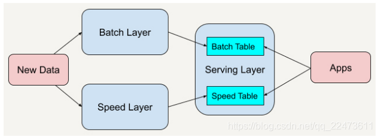
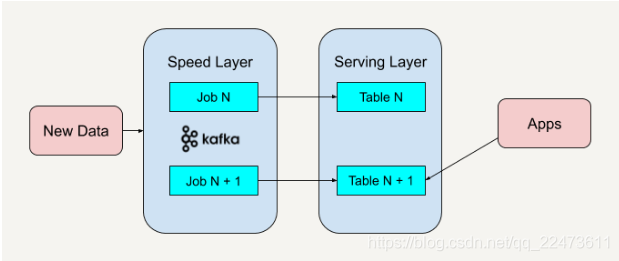

# 数仓架构

## 解决方案

* Persto、SparkSQL、Impala等MPP架构和ROLAP引擎
* Druid和Kylin等预处理架构
* Elasticsearch搜索引擎架构
* Clickhouse 列式数据库

## Lambda

Lambda 架构总共由三层系统组成：批处理层（Batch Layer），速度处理层（Speed Layer），以及用于响应查询的服务层（Serving Layer）。

例如广告投放预测这种推荐系统一般都会用到Lambda架构。一般能做精准广告投放的公司都会拥有海量用户特征、用户历史浏览记录和网页类型分类这些历史数据的。业界比较流行的做法有在批处理层用Alternating Least Squares (ALS)算法，也就是Collaborative Filtering协同过滤算法，可以得出与用户特性一致其他用户感兴趣的广告类型，也可以得出和用户感兴趣类型的广告相似的广告，而用k-means也可以对客户感兴趣的广告类型进行分类。

这里的结果是批处理层的结果。在速度层中根据用户的实时浏览网页类型在之前分好类的广告中寻找一些top K的广告出来。最终服务层可以结合速度层的top K广告和批处理层中分类好的点击率高的相似广告，做出选择投放给用户。

### 劣势

维护 Lambda 架构的复杂性在于我们要同时维护两套系统架构：批处理层和速度层。我们已经说过了，在架构中加入批处理层是因为从批处理层得到的结果具有高准确性，而加入速度层是因为它在处理大规模数据时具有低延时性。

## Keppa

与 Lambda 架构不同的是，Kappa 架构去掉了批处理层这一体系结构，而只保留了速度层。你只需要在业务逻辑改变又或者是代码更改的时候进行数据的重新处理。

### 劣势

因为 Kappa 架构只保留了速度层而缺少批处理层，在速度层上处理大规模数据可能会有数据更新出错的情况发生，这就需要我们花费更多的时间在处理这些错误异常上面。