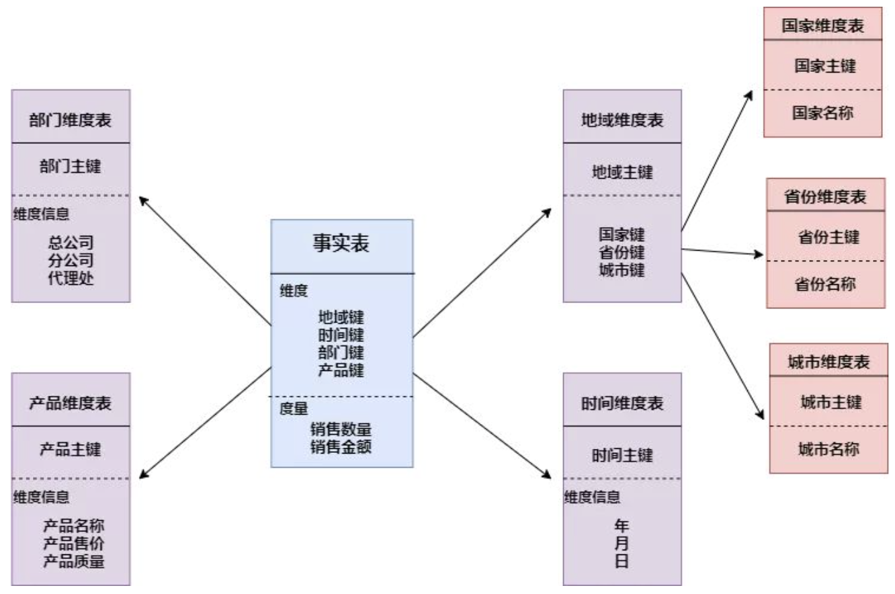
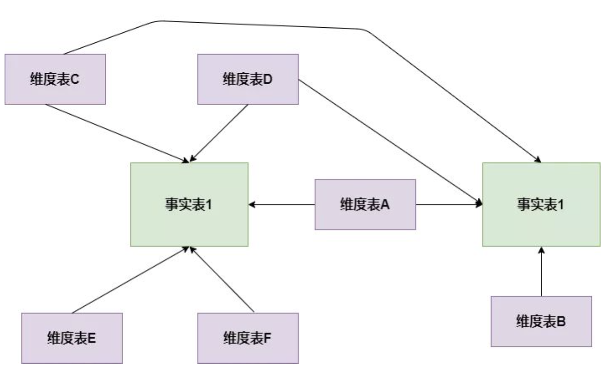
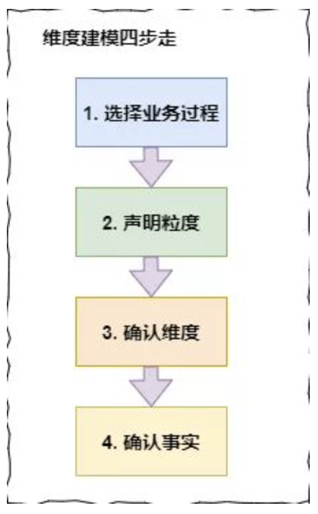

# 数据仓库——事实表、维度表、聚合表

## 事实表

在多维数据仓库中，保存度量值的详细值或事实的表称为“事实表”。

一个按照州、产品和月份划分的销售量和销售额存储的事实表有5个列，概念上与下面的示例类似。 

| Sate | Product | Mouth | Units | Dollars |
|  ----  | ----  |  ----  | ----  |----  |
| WA | Mountain-100 | January | 3 | 7.95 |
| WA | Cable Lock | January | 4 | 7.32 |
| OR | Mountain-100 | January | 3 | 7.95 |
| OR | Cable Lock | January | 4 | 7.32 |
| WA | Mountain-100 | February | 16 | 42.40 |

在这些事实表的示例数据行中，

* 前3个列——州、产品和月份——为键值列。
* 剩下的两个列——销售额和销售量——为度量值

更多的时候，事实表会映射为数字

| Sate_id | Product_id | Mouth | Units | Dollars |
|  ----  | ----  |  ----  | ----  |----  |
| 1 | 347 | 1 | 3 | 7.95 |
| 1 | 447 | 1 | 4 | 7.32 |
| 2 | 347 | 1 | 3 | 7.95 |
| 2 | 447 | 1 | 4 | 7.32 |
| 1 | 347 | 2 | 16 | 42.40 |

##  维度表

维度表包含了维度的每个成员的特定名称。维度成员的名称称为“属性”(Attribute)。假设Product维度中有3种产品，那么维度表将如下所示。

| PROD_ID | 	Product_Name | 
|  ----  | ----  |
|  347  | Mountain-100  |
|  339  | Road-650  |
|  447  | Cable Lock  |

| PROD_ID | 	Product_Name |  Category | 
|  ----  | ----  | ----  | ---- |
|  347  | Mountain-100  | Bikes |
|  339  | Road-650  | Bikes |
|  447  | Cable Lock  | Accessories |

## 维度建模的三种模式

### 星形模式

以事实表为中心，所有的维度表直接连在事实表上，最简单最常用的一种

### 雪花模式
雪花模式的维度表可以拥有其他的维度表，这种表不易维护，一般不推荐使用

### 星座模型

基于多张事实表，而且共享维度信息，即事实表之间可以共享某些维度表

## 维度建模怎么建

### 1、选择业务过程 

 维度建模是紧贴业务的，所以必须以业务为根基进行建模，那么选择业务过程，顾名思义就是在整个业务流程中选取我们需要建模的业务，根据运营提供的需求及日后的易扩展性等进行选择业务。比如商城，整个商城流程分为商家端，用户端，平台端，运营需求是总订单量，订单人数，及用户的购买情况等，我们选择业务过程就选择用户端的数据，商家及平台端暂不考虑。业务选择非常重要，因为后面所有的步骤都是基于此业务数据展开的。
 
 ### 2、声明粒度  
 
 先举个例子：对于用户来说，一个用户有一个身份证号，一个户籍地址，多个手机号，多张银行卡，那么与用户粒度相同的粒度属性有身份证粒度，户籍地址粒度，比用户粒度更细的粒度有手机号粒度，银行卡粒度，存在一对一的关系就是相同粒度。为什么要提相同粒度呢，因为维度建模中要求我们，在同一事实表中，必须具有相同的粒度，同一事实表中不要混用多种不同的粒度，不同的粒度数据建立不同的事实表。并且从给定的业务过程获取数据时，强烈建议从关注原子粒度开始设计，也就是从最细粒度开始，因为原子粒度能够承受无法预期的用户查询。但是上卷汇总粒度对查询性能的提升很重要的，所以对于有明确需求的数据，我们建立针对需求的上卷汇总粒度，对需求不明朗的数据我们建立原子粒度。
 
 ### 3、确认维度  
 
 维度表是作为业务分析的入口和描述性标识，所以也被称为数据仓库的“灵魂”。在一堆的数据中怎么确认哪些是维度属性呢，如果该列是对具体值的描述，是一个文本或常量，某一约束和行标识的参与者，此时该属性往往是维度属性，数仓工具箱中告诉我们牢牢掌握事实表的粒度，就能将所有可能存在的维度区分开，并且要确保维度表中不能出现重复数据，应使维度主键唯一
 
 
 ### 4、确认事实  
 
 事实表是用来度量的，基本上都以数量值表示，事实表中的每行对应一个度量，每行中的数据是一个特定级别的细节数据，称为粒度。维度建模的核心原则之一是同一事实表中的所有度量必须具有相同的粒度。这样能确保不会出现重复计算度量的问题。有时候往往不能确定该列数据是事实属性还是维度属性。记住最实用的事实就是数值类型和可加类事实。所以可以通过分析该列是否是一种包含多个值并作为计算的参与者的度量，这种情况下该列往往是事实。