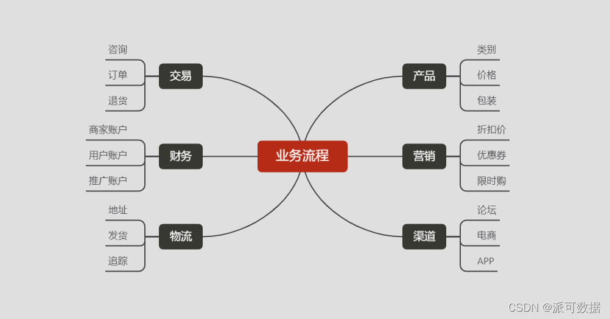
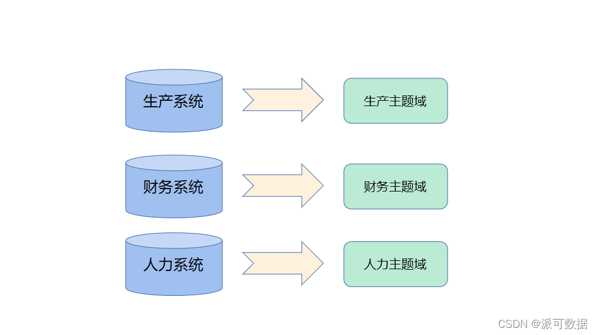
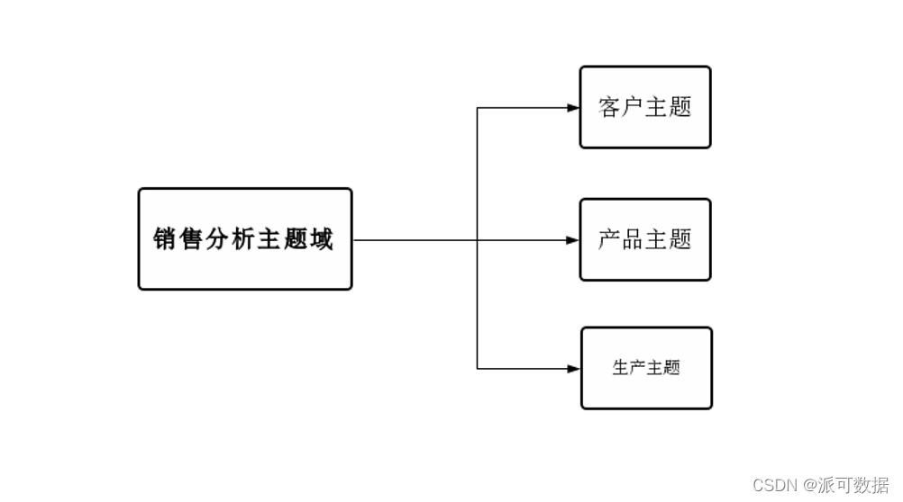
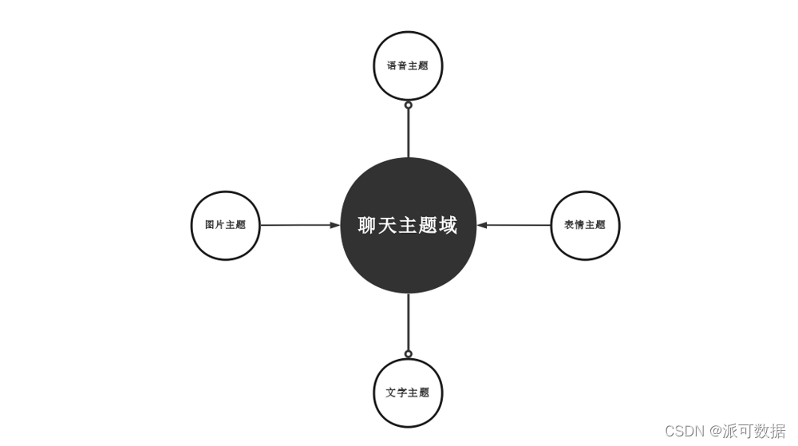
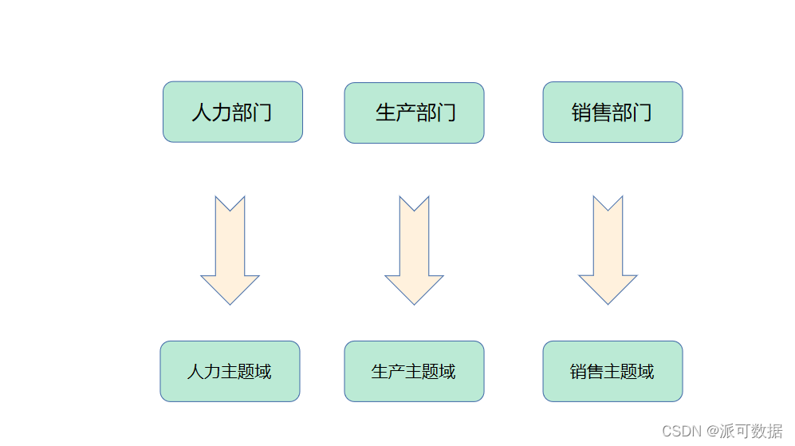

# 数据仓库建设-主题和主题域的划分

## 概念

数据仓库主题是指透过“上帝视角”将企业不同业务流程信息进行汇总、分类然后对其进行分析利用的一个抽象化的概念。也是指企业中某一分析领域具体的分析对象，这样一来，每一个数仓分析领域都有一个数仓主题相呼应。

分析对象是一个较为主观的选择过程，说它主观是因为不同的企业有不同的业务重心，没有办法统一分析得出一个普遍适用的结论。但这也让数据仓库的主题类型拥有了更多可能性，分析活动也变得更加灵活，具有针对性。

就拿企业分析时经常用到的生产系统举例，它并不能帮你直接获取答案，而是将整个业务流程中涉及到的生产机器、工人、工厂、仓库、经销商、顾客等链条中的每个角色分别建立主题，比如工厂主题、仓库主题以及经销商主题等。

待到需要对数据仓库中的数据进行实际分析时，分析人员就可以直接在不同主题数仓中按照需求自行处理数据，不需要再去寻找不同来源的数据并导入到数据仓库中。

## 数仓主题域是什么

数据仓库主题域就是把那些关联紧密但不同的数据主题，交汇融合到一个更大的主题域当中，让他们能够凭借相通点更完善的储存在数仓中，也更容易被分析人员调取利用。

同样，为了方便理解，举个例子，一名顾客通过手机在APP上购买了一件衣服，在这个过程中涉及到了顾客主题、库存主题、产品主题、订单主题等，这些主题虽然不同但因为关系紧密可以融入到一个更大的主题域。

## 如何划分主题域

就和多个主题组合成主题域一样，主题域自然也能进一步地分解、细化为不同的主题，这些主题也可以再次分解，产生更多的“小主题”，直到触及业务流程才不能再继续划分。

在企业实际搭建数据仓库时，一般都是把一个比较深层的主题或部分主题当做核心，围绕它来进行建设。这种建设方式因为涉及到主题的选择，必须先由最终用户和数据仓库建设人员共同确认主题域，然后继续完成搭建过程。

进行划分主题域时需要数仓建设人员了解业务流程，通过总结和分析清楚各个不同的业务流程都有哪些业务活动参与其中。

划分主题域的方法有很多，不同企业采取的方法也有所不同，总的来说，用得最多的有下面几种。

### 按照业务系统划分

因为大部分企业都已经经历过了信息化建设或者正处于信息化建设当中，企业各种业务系统都已经部署完成，财务部门有财务系统、销售部门有销售系统、生产部门有生产系统、供应链部门有供应链系统......

这些不同的业务系统，因为只会储存对应业务流程中产生的数据，下级数据主题都互相紧贴，是天然的主题域，业务系统有几种，就可以划分为几种主题域。

### 按照需求划分

很多时候，企业需要长期对某个方向进行分析，因为这个长期分析的过程涉及到各种主题，会对数据进行细分、归纳，在这个过程中，就由需求诞生了主题域。

就拿销售分析来说，这个分析过程会涉及到的对象有产品、仓库、经销商、顾客等，其中每一个分析对象就是一个数仓主题，而包含归纳这些主题的销售分析就成为了一个相应的主题域。

### 按照功能划分

现代社会，软件是每个加入互联网的网民都会使用到的东西，这些由企业开发的软件拥有着不同的功能模块，比如说社交软件中就会有聊天、朋友圈、群聊、发送文件等功能。

从这些功能中选一个模块，聊天模块会涉及到数据仓库中的用户主题、图片主题、文字主题等，所以聊天模块也能被归纳为聊天主题域。

### 按照部门划分

