# Flink CDC + Hudi 实践

参考：https://developer.aliyun.com/article/949402

## 历史架构
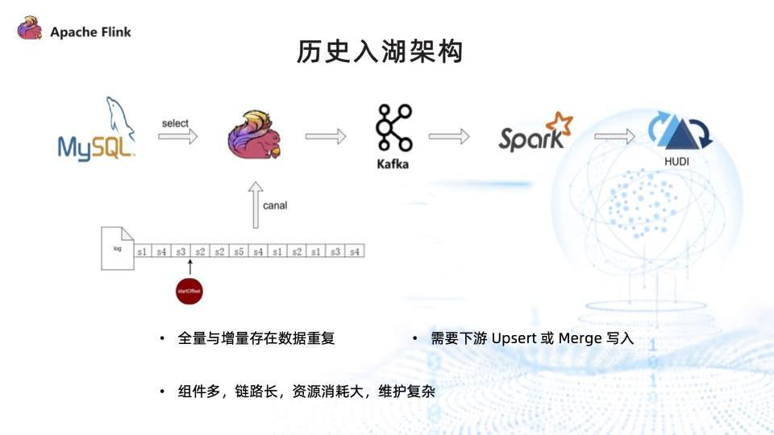

上图为 Flink + Canal 的实时数据入湖架构。

Flink 启动之后，首先读取当前的 Binlog 信息，标记为 StartOffset ，通过 select 方式将全量数据采集上来，发往下游 Kafka。全量采集完毕之后，再从 startOffset 采集增量的日志信息，发往 Kafka。最终 Kafka 的数据由 Spark 消费后写往 Hudi。

但是此架构存在以下三个问题：

* 全量与增量数据存在重复：因为采集过程中不会进行锁表，如果在全量采集过程中有数据变更，并且采集到了这些数据，那么这些数据会与 Binlog 中的数据存在重复；
* 需要下游进行 Upsert 或 Merge 写入才能剔除重复的数据，确保数据的最终一致性；
* 需要两套计算引擎，再加上消息队列 Kafka 才能将数据写入到数据湖 Hudi 中，过程涉及组件多、链路长，且消耗资源大。

基于以上问题，我们整理出了数据集成的核心需求：

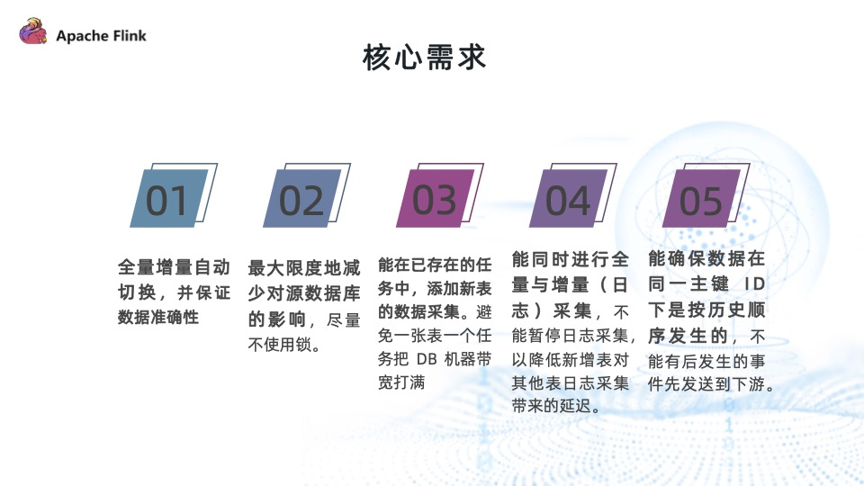

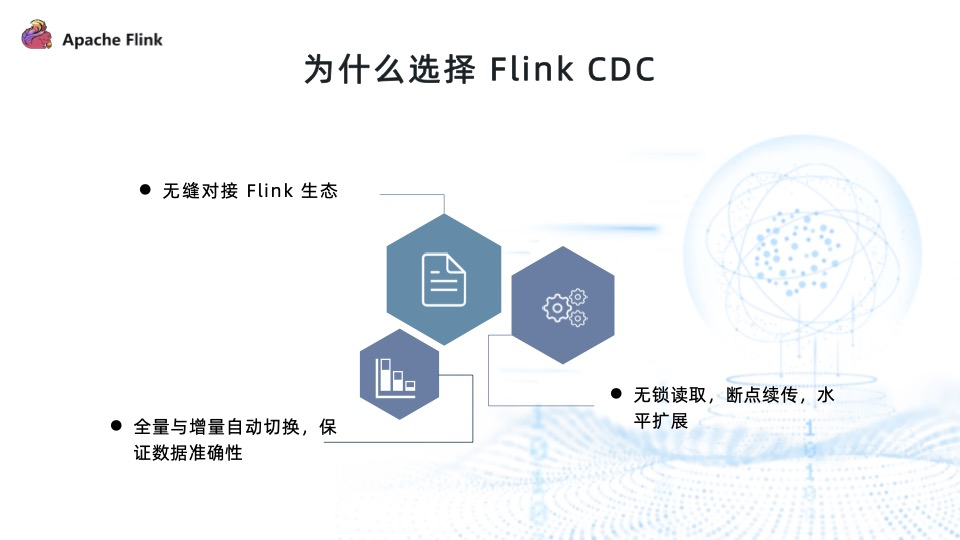

## Flink CDC + Hudi 实践问题与优化

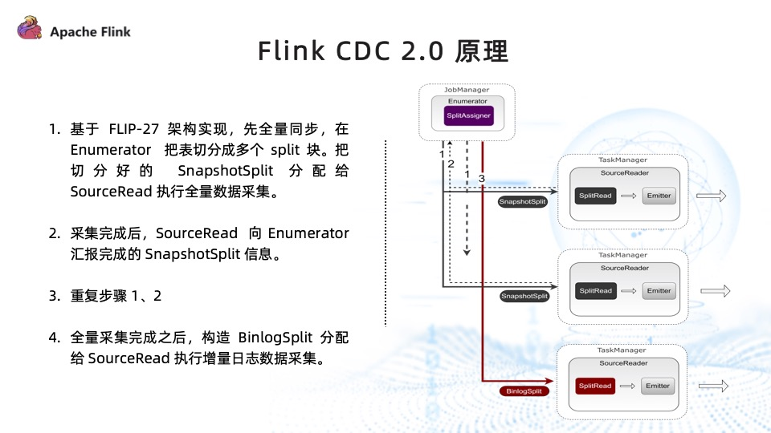

### 问题一：新增表会停止 Binlog 日志流

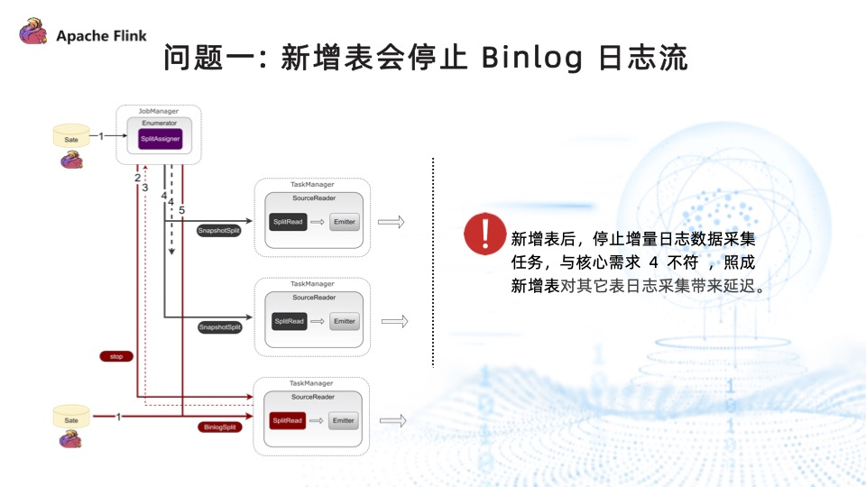

####解决方案：

全量和增量日志流并行读取，步骤如下：

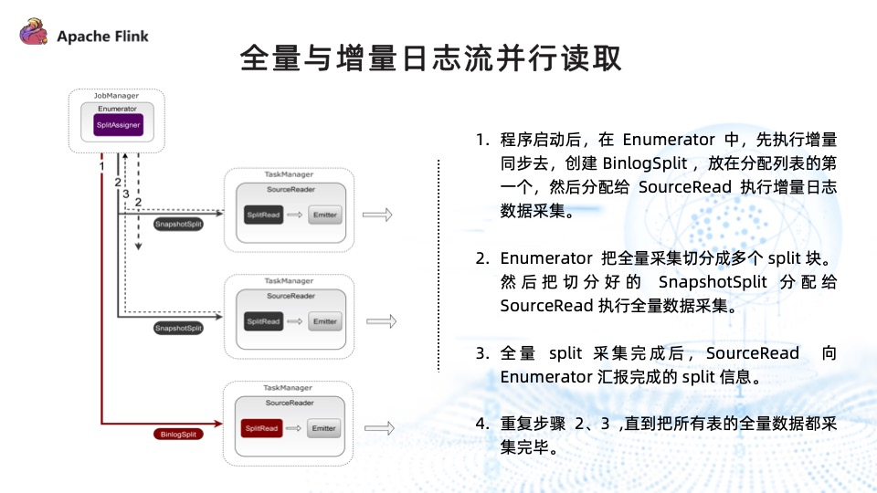

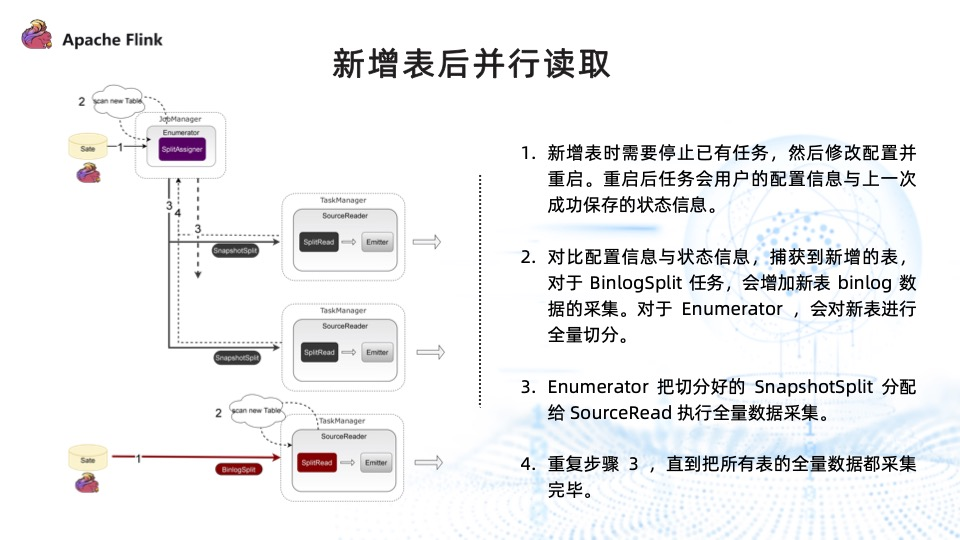

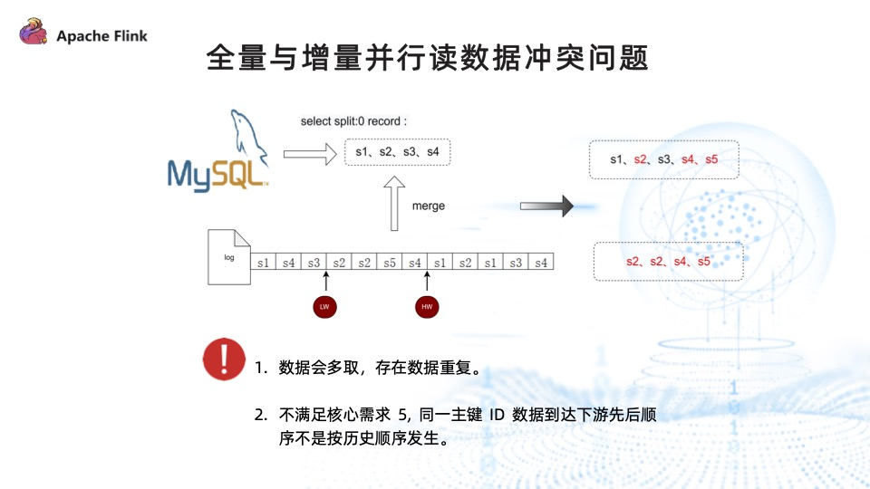

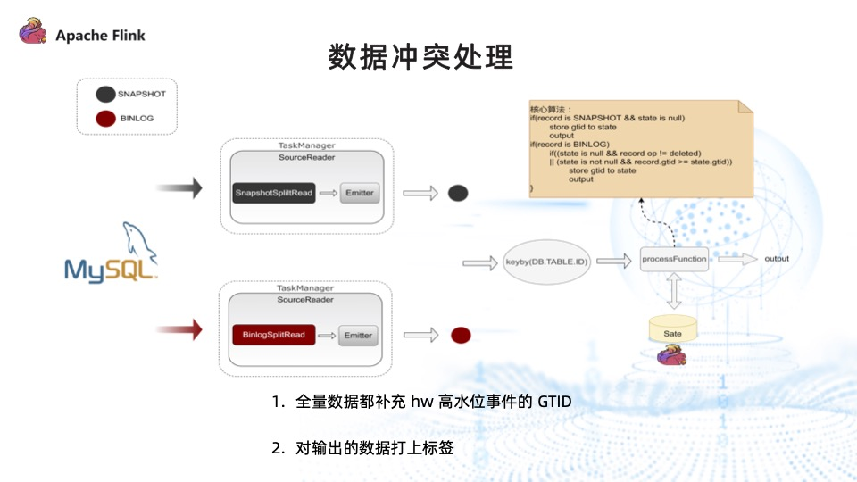

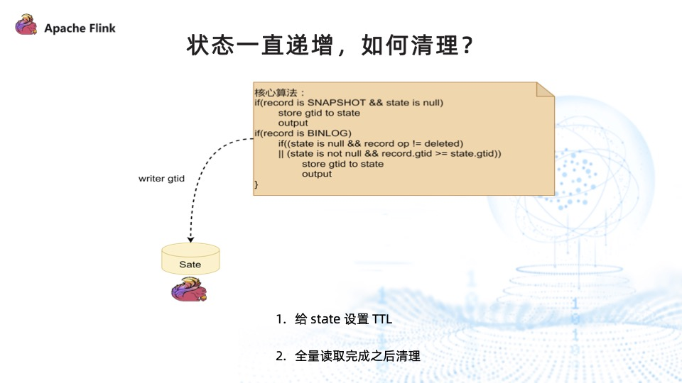

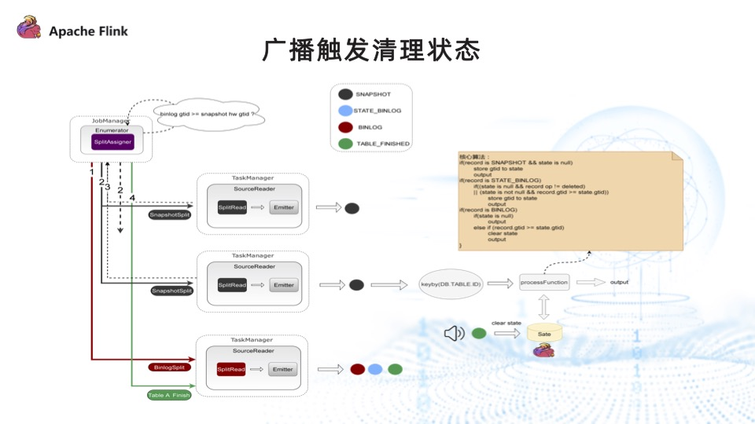

首先，给数据打上四种标签，分别代表不同的状态：

SNAPSHOT：全量采集到的数据信息。
STATE_BINLOG：还未完成全量采集， Binlog 已采集到这张表的变更数据。
BINLOG：全量数据采集完毕之后，Binlog 再采集到这张表的变更数据。
TABLE_FINISHED：全量数据采集完成之后通知下游，可以清理 state。
具体实现步骤如下：

分配 Binlog ，此时 Binlog 采集到的数据都为 STATE_BINLOG 标签；
分配 SnapshotSplit 任务，此时全量采集到的数据都为 SNAPSHOT 标签；
Enumerator 实时监控表的状态，某一张表执行完成并完成 checkpoint 后，通知 Binlog 任务。Binlog 任务收到通知后，将此表后续采集到的 Binlog 信息都打上 BINLOG 标签；此外，它还会构造一条 TABLE_FINISHED 记录发往下游做处理；
数据采集完成后，除了接上数据冲突处理算子，此处还新增了一个步骤：从主流中筛选出来的 TABLE_FINISHED 事件记录，通过广播的方式将其发往下游，下游根据具体信息清理对应表的状态信息。

### 问题二：写 Hudi 时存在数据倾斜

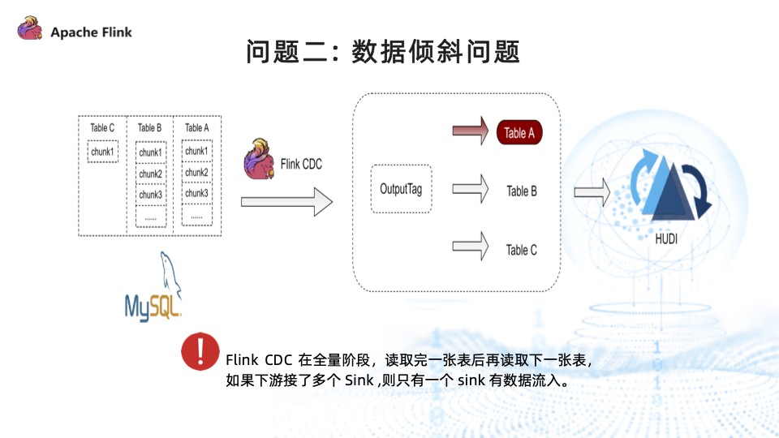

如上图，Flink CDC 采集三张表数据的时候，会先读取完 tableA 的全量数据，再读取tableB 的全量数据。读取 tableA 的过程中，下游只有 tableA 的 sink 有数据流入。

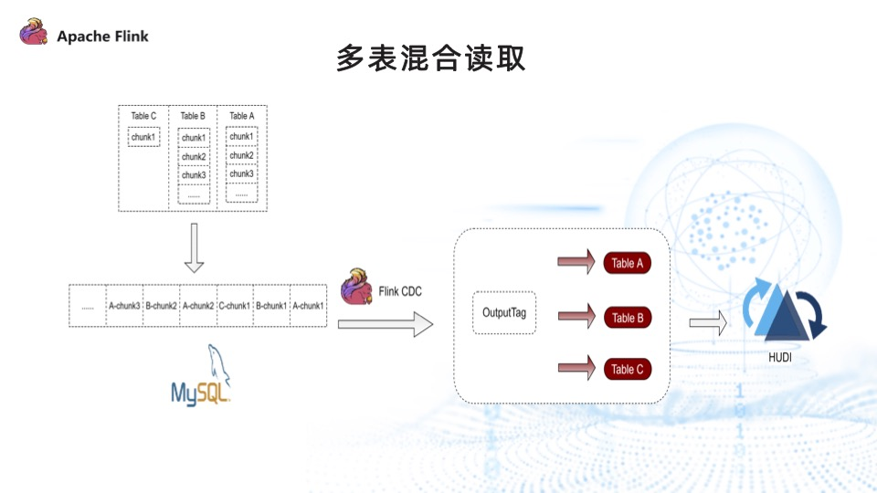

我们通过多表混合读取的方式来解决数据倾斜的问题。

引入多表混合之前，Flink CDC 读取完 tableA 的所有 chunk，再读取 tableB 的所有 chunk。实现了多表混合读取后，读取的顺序变为读取 tableA 的 chunk1、tableB 的 chunk1、tableC 的 chunk1，再读取 tableA 的 chunk2，以此类推，最终很好地解决了下游 sink 数据倾斜的问题，保证每个 sink 都有数据流入。

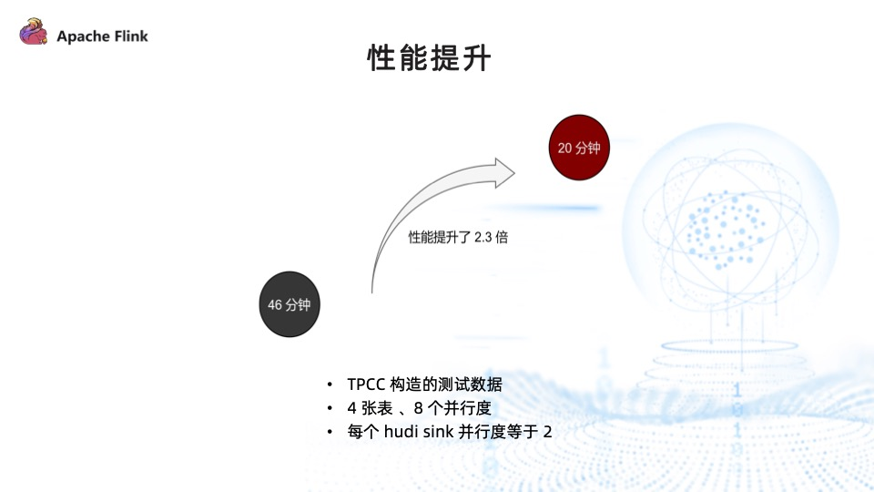

我们对多表混合读取的性能进行了测试，由 TPCC 工具构造的测试数据，读取了 4。张表，总并行度为 8，每个 sink 的并行度为 2，写入时间由原来的 46 分钟降至 20 分钟，性能提升 2.3 倍。

需要注意的是，如果 sink 的并行度和总并行度相等，则性能不会有明显提升，多表混合读取主要的作用是更快地获取到每张表下发的数据。

### 问题三：需要用户手动指定 schema 信息

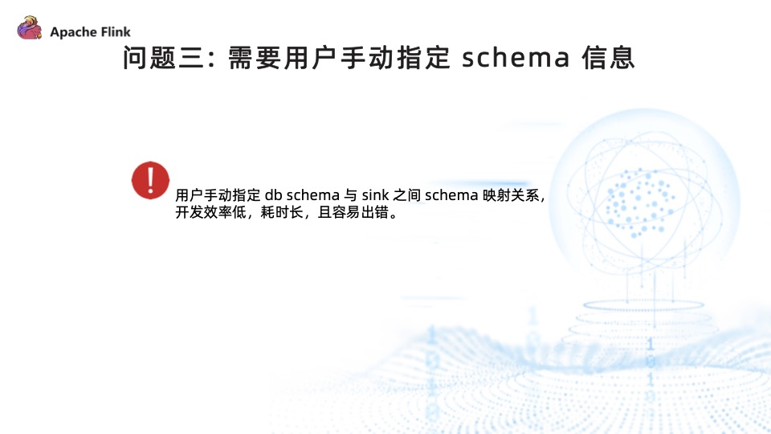

用户手动执行 DB schema 与 sink 之间 schema 映射关系，开发效率低，耗时长且容易出错。

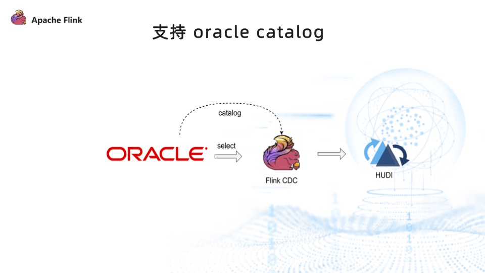

为了降低用户的使用门槛，提升开发效率，我们实现了 Oracle catalog ，让用户能以低代码的方式、无需指定 DB schema 信息与 sink schema 信息的映射关系，即可通过 Flink CDC 将数据写入到 Hudi。

## 问答

Q：断点续传采集如何处理？

A：断点续传有两种，分为全量和 Binlog。但它们都是基于 Flink state 的能力，同步的过程中会将进度存储到 state 中。如果失败了，下一次再从 state 中恢复即可。

---

Q：MySQL 在监控多表使用 SQL 写入 Hudi 表中的时候，存在多个 job，维护很麻烦，如何通过单 job 同步整库？

A：我们基于 GTID 的方式对 Flink CDC 进行了拓展,支持任务中新增表，且不影响其他表的采集进度。不考虑新增表影响到其他表进度的情况下，也可以基于 Flink CDC 2.2 做新增表的能力。

