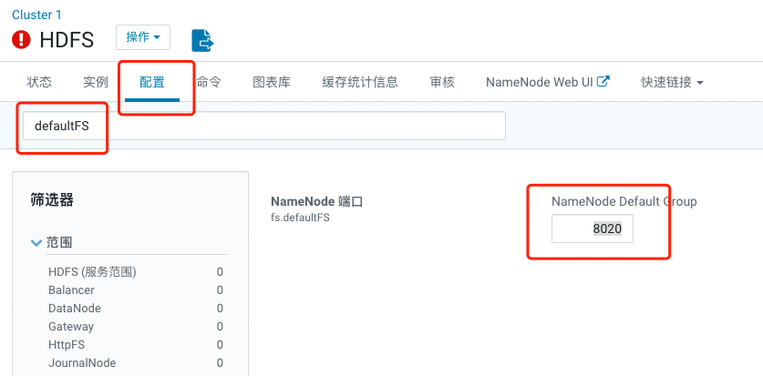

# Spark-shell 对接hudi

spark-shell启动,需要指定spark-avro模块，因为默认环境里没有，spark-avro模块版本还需要和spark版本对应，这里都是2.4.0。

## 授权

	hadoop fs -chmod 777 /user
	
## 解决版本不匹配问题

	vim /home/jumpuser/Hudi/hudi-spark-datasource/hudi-spark-common/src/main/scala/org/apache/hudi/DataSourceOptions.scala
	

## 保存数据血缘

	mkdir -p /var/log/spark2/lineage
	chown yarn:yarn /var/log/spark2/lineage

**重新编译**

## 启动

	spark-shell \
	--packages org.apache.spark:spark-avro_2.11:2.4.4 \
	--conf 'spark.serializer=org.apache.spark.serializer.KryoSerializer' \
	--jars /home/jumpuser/Hudi/packaging/hudi-spark-bundle/target/hudi-spark-bundle_2.11-0.9.0.jar
	
	
	
	

命令执行后：
  
          ---------------------------------------------------------------------
        |                  |            modules            ||   artifacts   |
        |       conf       | number| search|dwnlded|evicted|| number|dwnlded|
        ---------------------------------------------------------------------
        |      default     |   2   |   2   |   2   |   0   ||   2   |   2   |
        ---------------------------------------------------------------------
		
	:: USE VERBOSE OR DEBUG MESSAGE LEVEL FOR MORE DETAILS
	:: retrieving :: org.apache.spark#spark-submit-parent-968bf946-67a3-4b8b-a8e9-8ce6d1fbd0a2
	        confs: [default]
	        2 artifacts copied, 0 already retrieved (185kB/6ms)
	Setting default log level to "WARN".
	To adjust logging level use sc.setLogLevel(newLevel). For SparkR, use setLogLevel(newLevel).
	22/05/05 13:04:16 WARN cluster.YarnSchedulerBackend$YarnSchedulerEndpoint: Attempted to request executors before the AM has registered!
	22/05/05 13:04:16 WARN lineage.LineageWriter: Lineage directory /var/log/spark/lineage doesn't exist or is not writable. Lineage for this application will be disabled.
	Spark context Web UI available at http://cdh2:4040
	Spark context available as 'sc' (master = yarn, app id = application_1650970927739_0006).
	Spark session available as 'spark'.
	Welcome to
	      ____              __
	     / __/__  ___ _____/ /__
	    _\ \/ _ \/ _ `/ __/  '_/
	   /___/ .__/\_,_/_/ /_/\_\   version 2.4.0-cdh6.3.2
	      /_/
	         
	Using Scala version 2.11.12 (Java HotSpot(TM) 64-Bit Server VM, Java 1.8.0_202)
	Type in expressions to have them evaluated.
	Type :help for more information.
	
	scala> 

## CDH 环境下查看hdfs 连接端口

这个端口用作后面spark命令

##  测试插入数据
	
	scala> import org.apache.hudi.QuickstartUtils._
	import org.apache.hudi.QuickstartUtils._
	 
	scala> import scala.collection.JavaConversions._
	import scala.collection.JavaConversions._
	 
	scala> import org.apache.spark.sql.SaveMode._
	import org.apache.spark.sql.SaveMode._
	 
	scala> import org.apache.hudi.DataSourceReadOptions._
	import org.apache.hudi.DataSourceReadOptions._
	 
	scala> import org.apache.hudi.DataSourceWriteOptions._
	import org.apache.hudi.DataSourceWriteOptions._
	 
	scala> import org.apache.hudi.config.HoodieWriteConfig._
	import org.apache.hudi.config.HoodieWriteConfig._
	 
	scala> val tableName = "hudi_trips_cow"
	tableName: String = hudi_trips_cow
	 
	scala> val basePath = "hdfs://cdh2:8020/data/hudi_cow"
	basePath: String = basePath: String = hdfs://cdh2:8020/data/hudi_cow
	 
	scala> val dataGen = new DataGenerator
	dataGen: org.apache.hudi.QuickstartUtils.DataGenerator = org.apache.hudi.QuickstartUtils$DataGenerator@5cdd5ff9
	
	scala> val inserts = convertToStringList(dataGen.generateInserts(10))
	scala> val df = spark.read.json(spark.sparkContext.parallelize(inserts, 2))
	scala> df.write.format("hudi").
        options(getQuickstartWriteConfigs).
        option(PRECOMBINE_FIELD_OPT_KEY, "ts").
        option(RECORDKEY_FIELD_OPT_KEY, "uuid").
        option(PARTITIONPATH_FIELD_OPT_KEY, "partitionpath").
        option(TABLE_NAME, tableName).
        mode(Overwrite).
        save(basePath)

输出结果：

	[root@cdh2 bin]# hdfs dfs -ls /data/hudi_cow
	Found 3 items
	drwxr-xr-x   - root supergroup          0 2022-05-07 11:38 /data/hudi_cow/.hoodie
	drwxr-xr-x   - root supergroup          0 2022-05-07 11:38 /data/hudi_cow/americas
	drwxr-xr-x   - root supergroup          0 2022-05-07 11:38 /data/hudi_cow/asia
	
## 查询数据

	scala> val tripsSnapshotDF = spark.read.format("hudi").load(basePath + "/*/*/*/*")
	tripsSnapshotDF: org.apache.spark.sql.DataFrame = [_hoodie_commit_time: string, _hoodie_commit_seqno: string ... 13 more fields]
	 
	scala> tripsSnapshotDF.createOrReplaceTempView("hudi_trips_snapshot")
	 
	scala> spark.sql("select fare, begin_lon, begin_lat, ts from  hudi_trips_snapshot where fare > 20.0").show()
	
	+------------------+-------------------+-------------------+-------------+
	|              fare|          begin_lon|          begin_lat|           ts|
	+------------------+-------------------+-------------------+-------------+
	| 27.79478688582596| 0.6273212202489661|0.11488393157088261|1651538241935|
	| 33.92216483948643| 0.9694586417848392| 0.1856488085068272|1651534169859|
	| 64.27696295884016| 0.4923479652912024| 0.5731835407930634|1651388620516|
	| 93.56018115236618|0.14285051259466197|0.21624150367601136|1651772967777|
	|34.158284716382845|0.46157858450465483| 0.4726905879569653|1651797713461|
	| 66.62084366450246|0.03844104444445928| 0.0750588760043035|1651413861286|
	|  43.4923811219014| 0.8779402295427752| 0.6100070562136587|1651483340250|
	| 41.06290929046368| 0.8192868687714224|  0.651058505660742|1651435815407|
	+------------------+-------------------+-------------------+-------------+
	
## 修改数据

类似于插入新数据，使用数据生成器生成新数据对历史数据进行更新。将数据加载到DataFrame中并将DataFrame写入Hudi表中

	scala> val updates = convertToStringList(dataGen.generateUpdates(10))
	scala> val df = spark.read.json(spark.sparkContext.parallelize(updates, 2))
	scala> df.write.format("hudi").
	     options(getQuickstartWriteConfigs).
	     option(PRECOMBINE_FIELD_OPT_KEY, "ts").
	     option(RECORDKEY_FIELD_OPT_KEY, "uuid").
	     option(PARTITIONPATH_FIELD_OPT_KEY, "partitionpath").
	     option(TABLE_NAME, tableName).
	     mode(Append).
	     save(basePath)
	     
## 增量查询

	scala>spark.read.format("hudi").load(basePath+"/*/*/*/*").createOrReplaceTempView("hudi_trips_snapshot")
	scala> val commits = spark.sql("select distinct(_hoodie_commit_time) as commitTime from  hudi_trips_snapshot order by commitTime").map(k => k.getString(0)).take(50)
	
	# 因为提交了两次commit，所以这里length-2
	scala> val beginTime = commits(commits.length - 2). 
	beginTime: String = 20200701105144
	
	scala> val tripsIncrementalDF = spark.read.format("hudi").
	     option(QUERY_TYPE_OPT_KEY, QUERY_TYPE_INCREMENTAL_OPT_VAL).
	     option(BEGIN_INSTANTTIME_OPT_KEY, beginTime).
	     load(basePath)
	scala> tripsIncrementalDF.createOrReplaceTempView("hudi_trips_incremental")
	scala> spark.sql("select `_hoodie_commit_time`, fare, begin_lon, begin_lat, ts from  hudi_trips_incremental where fare > 20.0").show()
	
	+-------------------+------------------+-------------------+-------------------+-------------+
	|_hoodie_commit_time|              fare|          begin_lon|          begin_lat|           ts|
	+-------------------+------------------+-------------------+-------------------+-------------+
	|     20220507123523| 51.42305232303094| 0.7071871604905721|  0.876334576190389|1651561547243|
	|     20220507123523|26.636532270940915|0.12314538318119372|0.35527775182006427|1651575213541|
	|     20220507123523| 89.45841313717807|0.22991770617403628| 0.6923616674358241|1651766912795|
	|     20220507123523| 71.08018349571618| 0.8150991077375751|0.01925237918893319|1651755887882|
	+-------------------+------------------+-------------------+-------------------+-------------+
	
这将提供在beginTime提交后的数据，并且fare>20的数据

## 时间点查询

根据特定时间查询，可以将endTime指向特定时间，beginTime指向000（表示最早提交时间）

	scala> val beginTime = "000"
	beginTime: String = 000

	scala> val endTime = commits(commits.length - 2)
	endTime: String = 20200701105144
	
	scala> val tripsPointInTimeDF = spark.read.format("hudi").
	     option(QUERY_TYPE_OPT_KEY, QUERY_TYPE_INCREMENTAL_OPT_VAL).
	     option(BEGIN_INSTANTTIME_OPT_KEY, beginTime).
	     option(END_INSTANTTIME_OPT_KEY, endTime).
	     load(basePath)
	     
	scala> tripsPointInTimeDF.createOrReplaceTempView("hudi_trips_point_in_time")
	scala> spark.sql("select `_hoodie_commit_time`, fare, begin_lon, begin_lat, ts from hudi_trips_point_in_time where fare > 20.0").show()
	
	+-------------------+------------------+-------------------+-------------------+-------------+
	|_hoodie_commit_time|              fare|          begin_lon|          begin_lat|           ts|
	+-------------------+------------------+-------------------+-------------------+-------------+
	|     20220507113818| 27.79478688582596| 0.6273212202489661|0.11488393157088261|1651538241935|
	|     20220507113818| 33.92216483948643| 0.9694586417848392| 0.1856488085068272|1651534169859|
	|     20220507113818| 64.27696295884016| 0.4923479652912024| 0.5731835407930634|1651388620516|
	|     20220507113818| 93.56018115236618|0.14285051259466197|0.21624150367601136|1651772967777|
	|     20220507113818|34.158284716382845|0.46157858450465483| 0.4726905879569653|1651797713461|
	|     20220507113818| 66.62084366450246|0.03844104444445928| 0.0750588760043035|1651413861286|
	|     20220507113818|  43.4923811219014| 0.8779402295427752| 0.6100070562136587|1651483340250|
	|     20220507113818| 41.06290929046368| 0.8192868687714224|  0.651058505660742|1651435815407|
	+-------------------+------------------+-------------------+-------------------+-------------+
	
## 删除数据

	scala> spark.sql("select uuid, partitionpath from hudi_trips_snapshot").count()
	res13: Long = 16
	
	scala> val ds = spark.sql("select uuid, partitionpath from hudi_trips_snapshot").limit(2)
	scala> val deletes = dataGen.generateDeletes(ds.collectAsList())
	scala> val df = spark.read.json(spark.sparkContext.parallelize(deletes, 2));
	
	scala> df.write.format("hudi").
	    options(getQuickstartWriteConfigs).
	    option(OPERATION_OPT_KEY,"delete").
	     option(PRECOMBINE_FIELD_OPT_KEY, "ts").
	     option(RECORDKEY_FIELD_OPT_KEY, "uuid").
	     option(PARTITIONPATH_FIELD_OPT_KEY, "partitionpath").
	     option(TABLE_NAME, tableName).
	     mode(Append).
	     save(basePath)
	     
	scala> val roAfterDeleteViewDF = spark. read. format("hudi"). load(basePath + "/*/*/*/*")
	scala> roAfterDeleteViewDF.registerTempTable("hudi_trips_snapshot")
	scala> spark.sql("select uuid, partitionPath from hudi_trips_snapshot").count()	res16: Long = 14
	
只有append模式，才支持删除功能

## 覆盖数据

### 覆盖

对于一些批量etl操作，overwrite覆盖分区内的数据这种操作可能会比upsert操作效率更高，即一次重新计算目标分区内的数据。因为overwrite操作可以绕过upsert操作总需要的索引、预聚合步骤。

	scala> spark.read.format("hudi").load(basePath+"/*/*/*/*").select("uuid","partitionpath"). sort("partitionpath","uuid"). show(100, false)
	+------------------------------------+------------------------------------+     
	|uuid                                |partitionpath                       |
	+------------------------------------+------------------------------------+
	|0761850a-5a7a-4fd1-ba15-6d9b6204112f|americas/brazil/sao_paulo           |
	|4183ebdd-6670-44bc-8233-7622713e8d9d|americas/brazil/sao_paulo           |
	|4482787c-eb40-4333-ba01-620f7ba29dce|americas/brazil/sao_paulo           |
	|bc3c1016-c7f0-4fc7-853c-0762f4d47ec4|americas/brazil/sao_paulo           |
	|d1369faf-f96f-43bc-88e5-359bc6dc0311|americas/brazil/sao_paulo           |
	|30e1f8e8-d848-446b-8fa2-18edc6ede80b|americas/united_states/san_francisco|
	|4da843b9-2d0c-42cc-8cf5-5b8690940ff8|americas/united_states/san_francisco|
	|83308e19-457a-40b1-9bef-b5622ce11c4e|americas/united_states/san_francisco|
	|9c13315b-3e91-40af-9172-92f91e5ba675|americas/united_states/san_francisco|
	|c2d12d91-0551-4a00-ab5d-b3c747bfb7d8|americas/united_states/san_francisco|
	|ebbfaabb-b143-4829-9a66-5f589645e427|americas/united_states/san_francisco|
	|6aaa99cc-fcda-48ee-a0ba-53aab88737bb|asia/india/chennai                  |
	|c8698469-cb25-4169-bb8f-d9c1ceb36fcf|asia/india/chennai                  |
	|e56799b4-9e94-405b-a490-a9139048321a|asia/india/chennai                  |
	+------------------------------------+------------------------------------+
	
	scala> val inserts = convertToStringList(dataGen.generateInserts(10))
	val df = spark.
     read.json(spark.sparkContext.parallelize(inserts, 2)).
     filter("partitionpath = 'americas/united_states/san_francisco'")
     
     scala> df.write.format("hudi").
     options(getQuickstartWriteConfigs).
     option(OPERATION_OPT_KEY,"insert_overwrite").
     option(PRECOMBINE_FIELD_OPT_KEY, "ts").
     option(RECORDKEY_FIELD_OPT_KEY, "uuid").
     option(PARTITIONPATH_FIELD_OPT_KEY, "partitionpath").
     option(TABLE_NAME, tableName).
     mode(Append).
     save(basePath)
     
	scala> spark.
	     read.format("hudi").
	     load(basePath + "/*/*/*/*").
	     select("uuid","partitionpath").
	     sort("partitionpath","uuid").
	     show(100, false)     

	+------------------------------------+------------------------------------+     
	|uuid                                |partitionpath                       |
	+------------------------------------+------------------------------------+
	|0761850a-5a7a-4fd1-ba15-6d9b6204112f|americas/brazil/sao_paulo           |
	|4183ebdd-6670-44bc-8233-7622713e8d9d|americas/brazil/sao_paulo           |
	|4482787c-eb40-4333-ba01-620f7ba29dce|americas/brazil/sao_paulo           |
	|bc3c1016-c7f0-4fc7-853c-0762f4d47ec4|americas/brazil/sao_paulo           |
	|d1369faf-f96f-43bc-88e5-359bc6dc0311|americas/brazil/sao_paulo           |
	|190f7db5-b508-4a76-a709-ed71a3b7267f|americas/united_states/san_francisco|
	|24077ca1-b6bb-4b49-a945-d7912ab6f2cc|americas/united_states/san_francisco|
	|6aaa99cc-fcda-48ee-a0ba-53aab88737bb|asia/india/chennai                  |
	|c8698469-cb25-4169-bb8f-d9c1ceb36fcf|asia/india/chennai                  |
	|e56799b4-9e94-405b-a490-a9139048321a|asia/india/chennai                  |
	+------------------------------------+------------------------------------+     