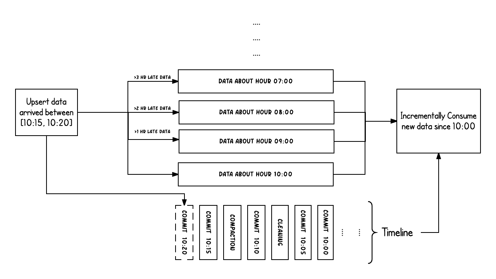

#03. IDEA 操作Spark

## 准备数据

	vi teacher.csv

插入：

	1,涛哥,40,M
	2,星哥,37,M
	3,老娜,29,F

导入hdfs

	hdfs dfs -put teacher.csv /data

## 代码

### 写hdfs

	package com.wzy
	
	import org.apache.hudi.DataSourceWriteOptions
	import org.apache.hudi.QuickstartUtils.getQuickstartWriteConfigs
	import org.apache.hudi.config.HoodieWriteConfig
	import org.apache.spark.sql.functions.lit
	import org.apache.spark.sql.{DataFrame, SaveMode, SparkSession}
	import org.apache.spark.sql.types.{DataTypes, StructType}
	
	object WriteData {
	
	  def main(args: Array[String]): Unit = {
	
	    val spark = SparkSession.builder()
	      .appName("write data to hdfs by hudi")
	      .master("spark://192.168.2.123:7077")
	      .config("spark.serializer", "org.apache.spark.serializer.KryoSerializer")
	      .getOrCreate()
	    val sc = spark.sparkContext
	    import spark.implicits._
	
	    val schema = new StructType()
	      .add("id", DataTypes.StringType)
	      .add("name", DataTypes.StringType)
	      .add("age", DataTypes.IntegerType)
	      .add("gender", DataTypes.StringType)
	
	    val commitTime = System.currentTimeMillis().toString //生成提交时间
	
	    val df: DataFrame = spark.read.schema(schema).csv("/data/teacher.csv")
	      .withColumn("ts" , lit(commitTime))
	
	    df.write.format("hudi")
	      .options(getQuickstartWriteConfigs)
	      .option(DataSourceWriteOptions.PRECOMBINE_FIELD.key(), "ts") // 提交时间
	      .option(DataSourceWriteOptions.RECORDKEY_FIELD.key(), "id") // 主键
	      .option(DataSourceWriteOptions.PARTITIONPATH_FIELD.key(), "gender")// 分区字段
	      .option(HoodieWriteConfig.TBL_NAME.key, "tb_teacher")// 表名
	      .mode(SaveMode.Append)
	      .save("hdfs://192.168.2.121:9000/hudi_wd/tbls/tb_teacher")
	
	    spark.close()
	  }
	}

### 读hdfs

	package com.wzy
	
	import org.apache.spark.sql.{DataFrame, SparkSession}
	import org.apache.spark.sql.types.{DataTypes, StructType}
	
	object ReadData {
	
	  def main(args: Array[String]): Unit = {
	
	
	    val spark = SparkSession.builder()
	      .appName("read data for hudi")
	      .master("spark://192.168.2.123:7077")
	      .config("spark.serializer", "org.apache.spark.serializer.KryoSerializer")
	      //本地测试运行需要加这一句话，部署在生产环境则删除
	      //.config("spark.jars", "/Users/zheyiwang/IdeaProjects/hudi_test/target/hudi_test-1.0-SNAPSHOT-jar-with-dependencies.jar")
	      .getOrCreate()
	    val sc = spark.sparkContext
	    import spark.implicits._
	
	    val schema = new StructType()
	      .add("id", DataTypes.StringType)
	      .add("name", DataTypes.StringType)
	      .add("age", DataTypes.IntegerType)
	      .add("gender", DataTypes.StringType)
	
	    val commitTime = System.currentTimeMillis().toString //生成提交时间
	
	    val df: DataFrame = spark.read.format("hudi")
	      .load("hdfs://192.168.2.121:9000/hudi_wd/tbls/tb_teacher")
	    df.show()
	
	  }
	}

### 运行程序

#### 写

	sh spark-submit  --class com.wzy.WriteData --master spark://192.168.2.123:7077 /home/zheyi/hudi_test-1.0-SNAPSHOT-jar-with-dependencies.jar
	
#### 读
	
	sh spark-submit  --class com.wzy.ReadData --master spark://192.168.2.123:7077 /home/zheyi/hudi_test-1.0-SNAPSHOT-jar-with-dependencies.jar
	
打印

	+-------------------+--------------------+------------------+----------------------+--------------------+---+----+---+-------------+------+
	|_hoodie_commit_time|_hoodie_commit_seqno|_hoodie_record_key|_hoodie_partition_path|   _hoodie_file_name| id|name|age|           ts|gender|
	+-------------------+--------------------+------------------+----------------------+--------------------+---+----+---+-------------+------+
	|  20230108233537463|20230108233537463...|                 1|                     M|f8737921-d900-4f9...|  1|涛哥| 40|1673192129901|     M|
	|  20230108233537463|20230108233537463...|                 2|                     M|f8737921-d900-4f9...|  2|星哥| 37|1673192129901|     M|
	|  20230108233537463|20230108233537463...|                 3|                     F|bc136072-d0c3-44e...|  3|老娜| 29|1673192129901|     F|
	+-------------------+--------------------+------------------+----------------------+--------------------+---+----+---+-------------+------+
	

### pom

	<?xml version="1.0" encoding="UTF-8"?>
	<project xmlns="http://maven.apache.org/POM/4.0.0"
	         xmlns:xsi="http://www.w3.org/2001/XMLSchema-instance"
	         xsi:schemaLocation="http://maven.apache.org/POM/4.0.0 http://maven.apache.org/xsd/maven-4.0.0.xsd">
	    <modelVersion>4.0.0</modelVersion>
	
	    <groupId>org.example</groupId>
	    <artifactId>hudi_test</artifactId>
	    <version>1.0-SNAPSHOT</version>
	
	    <properties>
	        <maven.compiler.source>8</maven.compiler.source>
	        <maven.compiler.target>8</maven.compiler.target>
	    </properties>
	    <dependencies>
	        <dependency>
	            <groupId>com.alibaba</groupId>
	            <artifactId>fastjson</artifactId>
	            <version>1.2.75</version>
	        </dependency>
	        <dependency>
	            <groupId>org.scala-lang</groupId>
	            <artifactId>scala-library</artifactId>
	            <version>2.12.10</version>
	        </dependency>
	        <dependency>
	            <groupId>org.apache.hudi</groupId>
	            <artifactId>hudi-spark-bundle_2.12</artifactId>
	            <version>0.9.0</version>
	        </dependency>
	        <!-- https://mvnrepository.com/artifact/joda-time/joda-time -->
	        <dependency>
	            <groupId>joda-time</groupId>
	            <artifactId>joda-time</artifactId>
	            <version>2.9.9</version>
	        </dependency>
	
	        <!-- https://mvnrepository.com/artifact/org.apache.spark/spark-core -->
	          <dependency>
	              <groupId>org.apache.spark</groupId>
	              <artifactId>spark-core_2.12</artifactId>
	              <version>3.0.0</version>
	          </dependency>
	
	        <!-- https://mvnrepository.com/artifact/org.apache.spark/spark-streaming -->
	        <dependency>
	            <groupId>org.apache.spark</groupId>
	            <artifactId>spark-streaming_2.12</artifactId>
	            <version>3.0.0</version>
	        </dependency>
	        <dependency>
	            <groupId>org.apache.spark</groupId>
	            <artifactId>spark-sql_2.12</artifactId>
	            <version>3.0.0</version>
	        </dependency>
	        <dependency>
	            <groupId>com.wzy</groupId>
	            <artifactId>hudi_test</artifactId>
	            <version>12</version>
	            <scope>system</scope>
	            <systemPath>${project.basedir}/lib/hudi-spark3-bundle_2.12-0.10.0.jar</systemPath>
	        </dependency>
	
	
	    </dependencies>
	    <!-- 依赖下载国内镜像库 -->
	    <repositories>
	        <repository>
	            <id>nexus-aliyun</id>
	            <name>Nexus aliyun</name>
	            <layout>default</layout>
	            <url>http://maven.aliyun.com/nexus/content/groups/public</url>
	            <snapshots>
	                <enabled>false</enabled>
	                <updatePolicy>never</updatePolicy>
	            </snapshots>
	            <releases>
	                <enabled>true</enabled>
	                <updatePolicy>never</updatePolicy>
	            </releases>
	        </repository>
	    </repositories>
	
	    <!-- maven插件下载国内镜像库 -->
	    <pluginRepositories>
	        <pluginRepository>
	            <id>ali-plugin</id>
	            <url>http://maven.aliyun.com/nexus/content/groups/public/</url>
	            <snapshots>
	                <enabled>false</enabled>
	                <updatePolicy>never</updatePolicy>
	            </snapshots>
	            <releases>
	                <enabled>true</enabled>
	                <updatePolicy>never</updatePolicy>
	            </releases>
	        </pluginRepository>
	    </pluginRepositories>
	    <build>
	        <plugins>
	            <!-- 指定编译java的插件 -->
	            <plugin>
	                <groupId>org.apache.maven.plugins</groupId>
	                <artifactId>maven-compiler-plugin</artifactId>
	                <version>3.5.1</version>
	                <configuration>
	                    <source>1.8</source>
	                    <target>1.8</target>
	                </configuration>
	            </plugin>
	
	            <!-- 指定编译scala的插件 -->
	            <plugin>
	                <groupId>net.alchim31.maven</groupId>
	                <artifactId>scala-maven-plugin</artifactId>
	                <version>3.2.2</version>
	                <executions>
	                    <execution>
	                        <goals>
	                            <goal>compile</goal>
	                            <goal>testCompile</goal>
	                        </goals>
	                        <configuration>
	                            <args>
	                                <arg>-dependencyfile</arg>
	                                <arg>${project.build.directory}/.scala_dependencies</arg>
	                            </args>
	                        </configuration>
	                    </execution>
	                </executions>
	            </plugin>
	            <plugin>
	                <groupId>org.apache.maven.plugins</groupId>
	                <artifactId>maven-compiler-plugin</artifactId>
	                <configuration>
	                    <source>1.8</source>
	                    <target>1.8</target>
	                </configuration>
	            </plugin>
	            <plugin>
	                <artifactId>maven-assembly-plugin</artifactId>
	                <configuration>
	                    <descriptorRefs>
	                        <descriptorRef>jar-with-dependencies</descriptorRef>
	                    </descriptorRefs>
	                </configuration>
	                <executions>
	                    <execution>
	                        <id>make-assembly</id>
	                        <phase>package</phase>
	                        <goals>
	                            <goal>single</goal>
	                        </goals>
	                    </execution>
	                </executions>
	            </plugin>
	        </plugins>
	    </build>
	
	</project>

## Update 数据

### 准备数据

	vi teacher2.csv

插入：

	1,大涛哥,41,M
	4,杨幂,33,F
	
导入hdfs

	hdfs dfs -put teacher2.csv /data	
	
	
### 提交代码

	sh spark-submit  --class com.wzy.UpdateData --master spark://192.168.2.123:7077 /home/zheyi/hudi_test-1.0-SNAPSHOT-jar-with-dependencies.jar

### 代码

	package com.wzy
	
	import org.apache.hudi.DataSourceWriteOptions
	import org.apache.hudi.QuickstartUtils.getQuickstartWriteConfigs
	import org.apache.hudi.config.HoodieWriteConfig
	import org.apache.spark.sql.{DataFrame, SaveMode, SparkSession}
	import org.apache.spark.sql.functions.lit
	import org.apache.spark.sql.types.{DataTypes, StructType}
	
	object UpdateData {
	
	  def main(args: Array[String]): Unit = {
	
	    val spark = SparkSession.builder()
	      .appName("update data")
	      .master("spark://192.168.2.123:7077")
	      .config("spark.serializer", "org.apache.spark.serializer.KryoSerializer")
	      .getOrCreate()
	    val sc = spark.sparkContext
	
	    val schema = new StructType().
	      add("id", DataTypes.StringType)
	      .add("name", DataTypes.StringType)
	      .add("age", DataTypes.IntegerType)
	      .add("gender", DataTypes.StringType)
	    val commitTime = System.currentTimeMillis().toString //生成提交时间
	
	    val df: DataFrame = spark.read.schema(schema)
	      .csv("/data/teacher2.csv")
	      .withColumn("ts" , lit(commitTime))
	
	    df.write.format("hudi")
	      .options(getQuickstartWriteConfigs)
	      .option(DataSourceWriteOptions.PRECOMBINE_FIELD.key(), "ts") // 提交时间
	      .option(DataSourceWriteOptions.RECORDKEY_FIELD.key(), "id") // 主键
	      .option(DataSourceWriteOptions.PARTITIONPATH_FIELD.key(), "gender")// 分区字段
	      .option(HoodieWriteConfig.TBL_NAME.key, "tb_teacher")// 表名
	      .mode(SaveMode.Append)
	      .save("/hudi_wd/tbls/tb_teacher")
	
	    spark.close()
	
	  }
	}

### 现在的数据

	+-------------------+--------------------+------------------+----------------------+--------------------+---+------+---+-------------+------+
	|_hoodie_commit_time|_hoodie_commit_seqno|_hoodie_record_key|_hoodie_partition_path|   _hoodie_file_name| id|  name|age|           ts|gender|
	+-------------------+--------------------+------------------+----------------------+--------------------+---+------+---+-------------+------+
	|  20230108234013473|20230108234013473...|                 1|                     M|f8737921-d900-4f9...|  1|大涛哥| 41|1673192407108|     M|
	|  20230108233537463|20230108233537463...|                 2|                     M|f8737921-d900-4f9...|  2|  星哥| 37|1673192129901|     M|
	|  20230108233537463|20230108233537463...|                 3|                     F|bc136072-d0c3-44e...|  3|  老娜| 29|1673192129901|     F|
	|  20230108234013473|20230108234013473...|                 4|                     F|bc136072-d0c3-44e...|  4|  杨幂| 33|1673192407108|     F|
	+-------------------+--------------------+------------------+----------------------+--------------------+---+------+---+-------------+------+
	
可以看到下面的内容产生了变化 

* _hoodie_commit_time
* hoodie_commit_seqno
* ts

##增量查询之时间点查询

### 代码

	package com.wzy
	
	import org.apache.hudi.DataSourceReadOptions
	import org.apache.spark.sql.{DataFrame, SparkSession}
	
	object QueryPointInTime {
	
	  def main(args: Array[String]): Unit = {
	
	    val spark = SparkSession.builder()
	      .appName("update data")
	      .master("spark://192.168.2.123:7077")
	      .config("spark.serializer", "org.apache.spark.serializer.KryoSerializer")
	      .getOrCreate()
	
	    val df: DataFrame = spark.read.format("hudi")
	      .load("hdfs://192.168.2.121:9000/hudi_wd/tbls/tb_teacher")
	
	    // 创建视图展示最新数据
	    df.createOrReplaceTempView("tb_teacher")
	    import org.apache.spark.sql.functions._
	    import spark.implicits._
	
	    // 获取最近几次提交的时间
	    val df2: DataFrame = spark.sql("select distinct(_hoodie_commit_time) as commitTime from tb_teacher order by commitTime")
	
	    // 最后一批导入的数据
	    val arr: Array[String] = df2.map(row => row.getAs[String]("commitTime")).take(10)
	    val beginTime: String = arr(arr.length - 2)
	
	    // 最后两次批导入的数据
	     //val beginTime: String = arr(arr.length - 3)
	
	
	    val res = spark.read.format("hudi").
	      option(DataSourceReadOptions.QUERY_TYPE.key(), DataSourceReadOptions.QUERY_TYPE_INCREMENTAL_OPT_VAL).
	      option(DataSourceReadOptions.BEGIN_INSTANTTIME.key(), beginTime).
	      load("hdfs://192.168.2.121:9000/hudi_wd/tbls/tb_teacher")
	
	    res.createOrReplaceTempView("tb_teacher_res")
	    spark.sql("select * from tb_teacher_res").show()
	
	    spark.close()
	
	  }
	}

### 提交代码

	sh spark-submit  --class com.wzy.QueryPointInTime --master spark://192.168.2.123:7077 /home/zheyi/hudi_test-1.0-SNAPSHOT-jar-with-dependencies.jar
	
#### 最后一批导入的数据 (val beginTime: String = arr(arr.length - 2))

	+-------------------+--------------------+------------------+----------------------+--------------------+---+------+---+------+-------------+
	|_hoodie_commit_time|_hoodie_commit_seqno|_hoodie_record_key|_hoodie_partition_path|   _hoodie_file_name| id|  name|age|gender|           ts|
	+-------------------+--------------------+------------------+----------------------+--------------------+---+------+---+------+-------------+
	|  20230108234013473|20230108234013473...|                 1|                     M|f8737921-d900-4f9...|  1|大涛哥| 41|     M|1673192407108|
	|  20230108234013473|20230108234013473...|                 4|                     F|bc136072-d0c3-44e...|  4|  杨幂| 33|     F|1673192407108|
	+-------------------+--------------------+------------------+----------------------+--------------------+---+------+---+------+-------------+
	

## 增量查询之时间范围查询

### 代码

	package com.wzy
	
	import org.apache.hudi.DataSourceReadOptions
	import org.apache.spark.sql.{DataFrame, SparkSession}
	
	object QueryRangeTime {
	
	  def main(args: Array[String]): Unit = {
	
	    val spark = SparkSession.builder()
	      .appName("update data")
	      .master("spark://192.168.2.123:7077")
	      .config("spark.serializer", "org.apache.spark.serializer.KryoSerializer")
	      .getOrCreate()
	
	    val df: DataFrame = spark.read.format("hudi")
	      .load("hdfs://192.168.2.121:9000/hudi_wd/tbls/tb_teacher")
	
	    // 创建视图展示最新数据
	    df.createOrReplaceTempView("tb_teacher")
	    import spark.implicits._
	    // 获取最近几次提交的时间
	    val df2: DataFrame = spark.sql("select distinct(_hoodie_commit_time) as commitTime from tb_teacher order by commitTime")
	
	    // 最后一批导入的数据
	    val arr: Array[String] = df2.map(row => row.getAs[String]("commitTime")).take(10)
	    // 最后一次提交  这个起始时间可以自己设定
	    val beginTime: String = arr(arr.length - 3)
	    // =倒数第二次提交
	    val endTime: String = arr(arr.length - 2)
	
	    val res = spark.read.format("hudi")
	      .option(DataSourceReadOptions.QUERY_TYPE.key(), DataSourceReadOptions.QUERY_TYPE_INCREMENTAL_OPT_VAL)
	      .option(DataSourceReadOptions.BEGIN_INSTANTTIME.key(), beginTime)
	      .option(DataSourceReadOptions.END_INSTANTTIME.key() ,endTime)
	      .load("hdfs://192.168.2.121:9000/hudi_wd/tbls/tb_teacher")
	    res.createOrReplaceTempView("tb_teacher_res")
	    spark.sql("select * from tb_teacher_res").show()
	    spark.close()
	  }	
	}

### 提交代码

	sh spark-submit  --class com.wzy.QueryRangeTime --master spark://192.168.2.123:7077 /home/zheyi/hudi_test-1.0-SNAPSHOT-jar-with-dependencies.jar

## 删除数据

	package com.wzy
	
	import org.apache.hudi.DataSourceWriteOptions
	import org.apache.hudi.QuickstartUtils.getQuickstartWriteConfigs
	import org.apache.hudi.config.HoodieWriteConfig
	import org.apache.spark.sql.{DataFrame, SaveMode, SparkSession}
	
	object DeleteData {
	
	  def main(args: Array[String]): Unit = {
	
	    val spark = SparkSession.builder()
	      .appName("update data")
	      .master("spark://192.168.2.123:7077")
	      .config("spark.serializer", "org.apache.spark.serializer.KryoSerializer")
	      .getOrCreate()
	
	    val df: DataFrame = spark.read.format("hudi")
	      .load("hdfs://192.168.2.121:9000/hudi_wd/tbls/tb_teacher")
	
	    val commitTime = System.currentTimeMillis().toString //生成提交时间
	    val deleteDF: DataFrame = spark.sql("select * from tb_teacher where id = 8").withColumn("ts" , lit(commitTime))
	    deleteDF.show()
	    deleteDF
	      .write
	      .format("hudi")
	      .options(getQuickstartWriteConfigs())
	      .option(DataSourceWriteOptions.OPERATION.key(),"delete")
	      .option(DataSourceWriteOptions.PRECOMBINE_FIELD.key() , "ts")
	      .option(DataSourceWriteOptions.RECORDKEY_FIELD.key(), "id")
	      .option(DataSourceWriteOptions.PARTITIONPATH_FIELD.key(), "gender")// 分区字段
	      .option(HoodieWriteConfig.TBL_NAME.key,"tb_teacher")
	      .mode(SaveMode.Append)
	      .save("hdfs://doit01:8020/hudi_wd/tbls/tb_teacher")
	
	    spark.close()
	  }
	
	}

关键option：

	.option(DataSourceWriteOptions.OPERATION.key(),"delete")

## 时间轴

Hudi内部对每个表都维护了一个Timeline，用于记录不同时刻对表的所有操作。Timeline有助于提供表的瞬时的视图查询，同时还能根据数据的到达顺序支持高效的数据检索。

TimeLine是由一组instant对象组成。Instant表示在某一时刻对表执行操作后到达的一种状态，

* Instant action (动作)：对Hudi表的操作。
* Instant time (时间)：时间戳，按照action开始执行的时间单调递增。
* Instant state (状态)：表示在指定的时间点（Instant time）对Hudi表执行操作（Instant action）后，表所处的状态。

Instant action (动作) 主要有以下几种：

* COMMITS：表明一批数据原子写入到表中；
* CLEANS：后台进程，清理不再需要的旧版本数据；
* DELTA_COMMIT：增量提交是指将一批记录原子写入MergeOnRead 类型的表，其中部分/全部数据可以仅写入增量日志；
* COMPACTION：后台进程，在 Hudi 中协调差异数据结构，例如：将更新从基于行的日志文件移动到列格式。在内部，压缩表现为时间线上的特殊提交；
* ROLLBACK：表明 commit/delta commit 失败并回滚，删除不完整的文件；
* SAVEPOINT - 对文件标记为“saved”,清理程序就不会删除这些文件，在遇到故障或者数据需要修复时，可以把表恢复到时间线的这个保存点

Instant state (状态)有以下三种：

* REQUESTED - 表明 Instant action 已在排队中，但还没有初始化；
* INFLIGHT - 表明 Instant action 正在执行中；
* COMPLETED - 表明 Instant action 上时间线执行完毕。

### 官方Timeline示例图

上图的例子展示了10:00至10:20，每5分钟在 Hudi 表的 upsert 操作，时间线有 commit，clean 和 compact。同时还可以观察到 commit time 记录的是数据到达时间（如，10:20AM）,而实际是按 event time (事件时间) 从7:00每小时一个分区来组织数据的。最终生成COMMIT的时间才是Upsert的到达时间。通过使用Timeline来管理，当增量查询10:00之后的最新数据时，可以非常高效的找到10:00之后发生过更新的文件，而不必去扫描更早时间的文件，比如这里，就不需要扫描7:00、8:00或9:00这些时刻对应的文件

