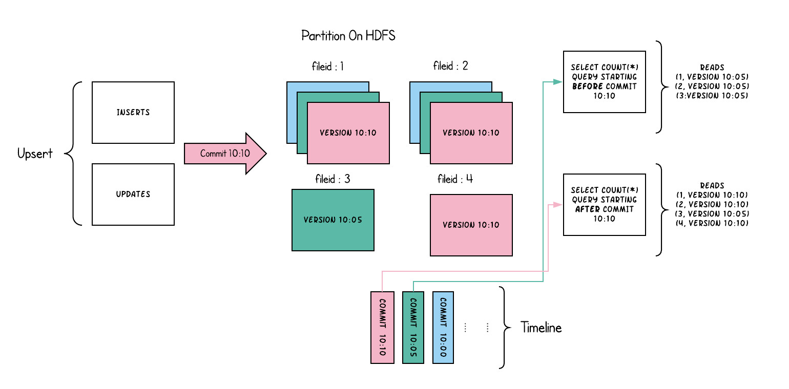
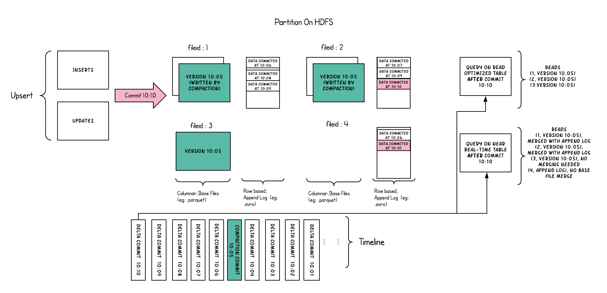

# COW和MOR

## 场景

1）COW适用写少读多的场景 ,MOR 适用写多读少的场景;

2）MOR适合CDC场景，更新延迟要求较低，COW目前不支持 changelog mode 不适合处理cdc场景；

## Copy On Write Table

（写时复制）,快照查询+增量查询

简称COW。顾名思义，他是在数据写入的时候，复制一份原来的拷贝，在其基础上添加新数据。正在读数据的请求，读取的是是近的完整副本，这类似Mysql 的MVCC的思想。

上图中，每一个颜色都包含了截至到其所在时间的所有数据。老的数据副本在超过一定的个数限制后，将被删除。这种类型的表，没有compact instant，因为写入时相当于已经compact了。

- 优点： 读取时，只读取对应分区的一个数据文件即可，较为高效
- 缺点： 数据写入的时候，需要复制一个先前的副本再在其基础上生成新的数据文件，这个过程比较耗时。且由于耗时，读请求读取到的数据相对就会滞后

前从很多公司的反馈来看，是比较推荐 copy on write 模式的，因为它的内存管理比较直观，只在写入那一步 buffer 的内存以及 merge 时的 merge map 使用的内存，因此我们在启动作业时配置内存是十分明确的，job 也更加稳定，如果对吞吐要求不高，推荐使用 copy on write 模式。

## Merge On Read Table

（读时合并），快照查询+增量查询+读取优化查询（近实时）

简称MOR。新插入的数据存储在delta log 中。定期再将delta log合并进行parquet数据文件。读取数据时，会将delta log跟老的数据文件做merge，得到完整的数据返回。当然，MOR表也可以像COW表一样，忽略delta log，只读取最近的完整数据文件。下图演示了MOR的两种数据读写方式

- 优点： 由于写入数据先写delta log，且delta log较小，所以写入成本较低
- 缺点： 需要定期合并整理compact，否则碎片文件较多。读取性能较差，因为需要将delta log 和 老数据文件合并