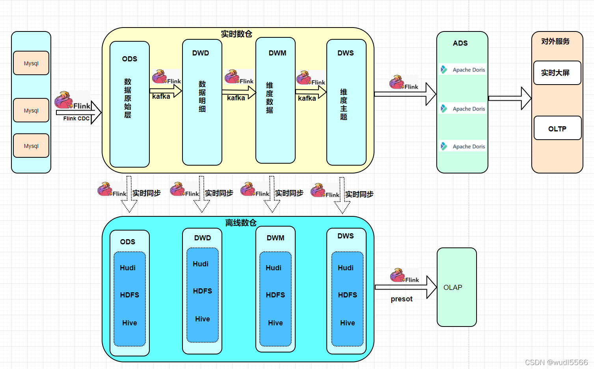
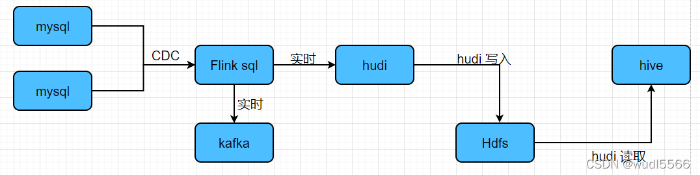

# Flink 版本数据湖(hudi)实时数仓

参考：https://blog.csdn.net/wudonglianga/article/details/123034634

## 架构图

## 实现实例

通过flink cdc 的两张表 合并 成一张视图， 同时写入到数据湖(hudi) 中 同时写入到kafka

### 实现思路

	1.在flinksql 中创建flink cdc 表
	2.创建视图(用两张表关联后需要的列的结果显示为一张速度)
	3.创建输出表，关联Hudi表，并且自动同步到Hive表
	4.查询视图数据，插入到输出表 -- flink  后台实时执行