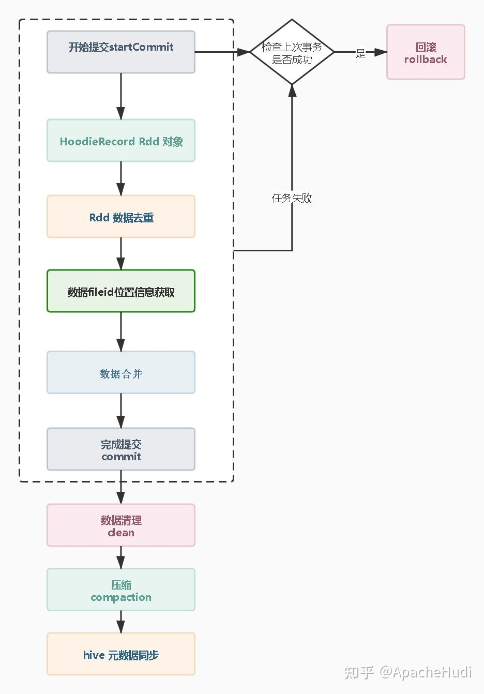
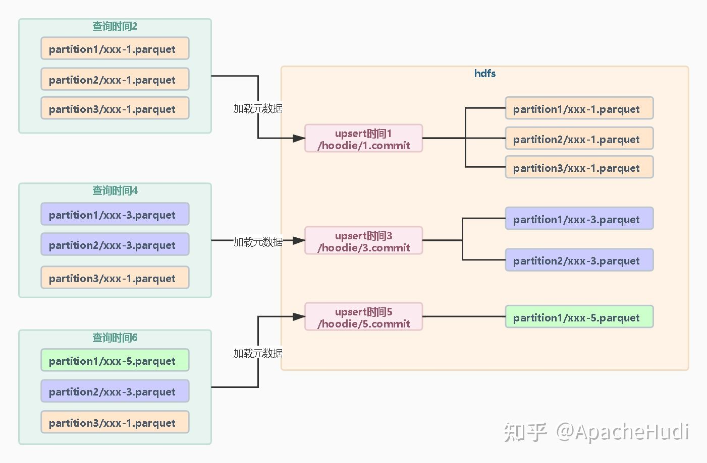
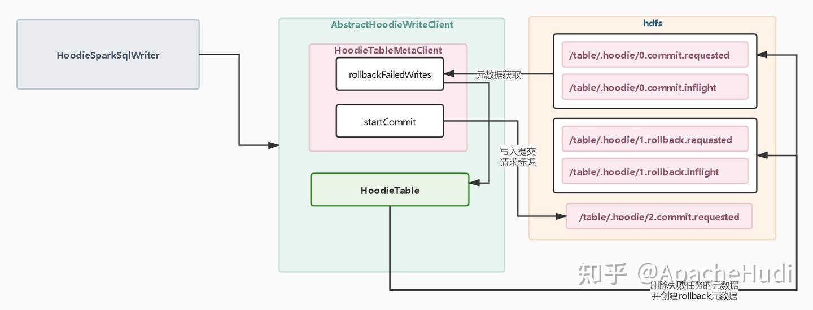
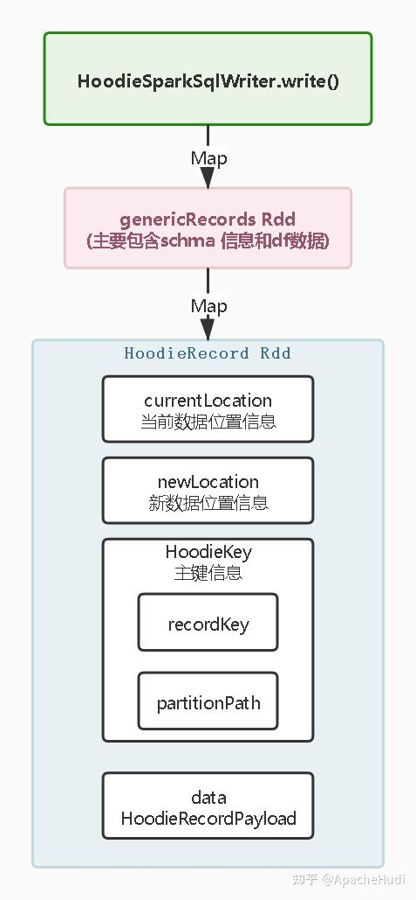
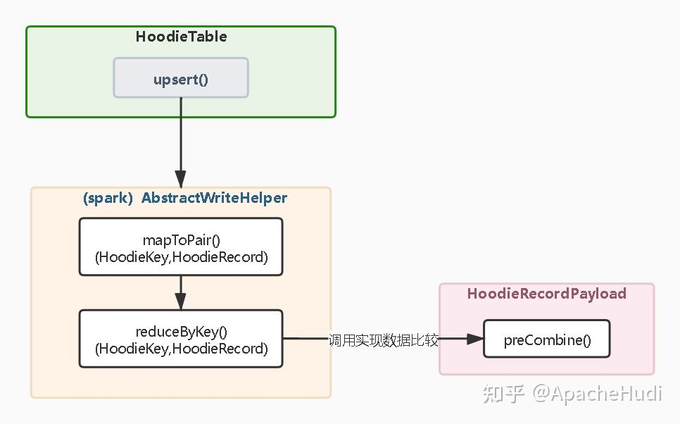
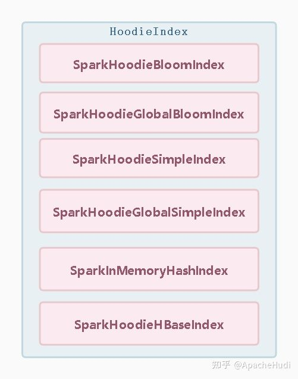
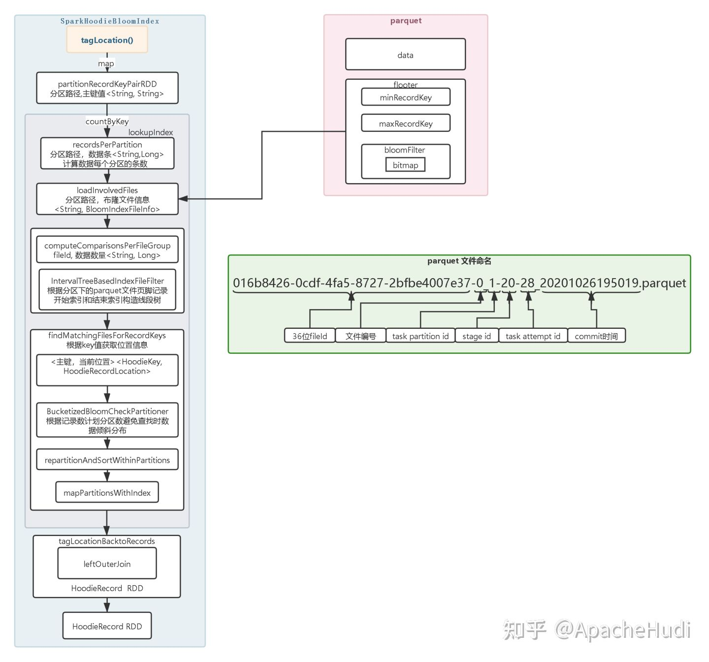
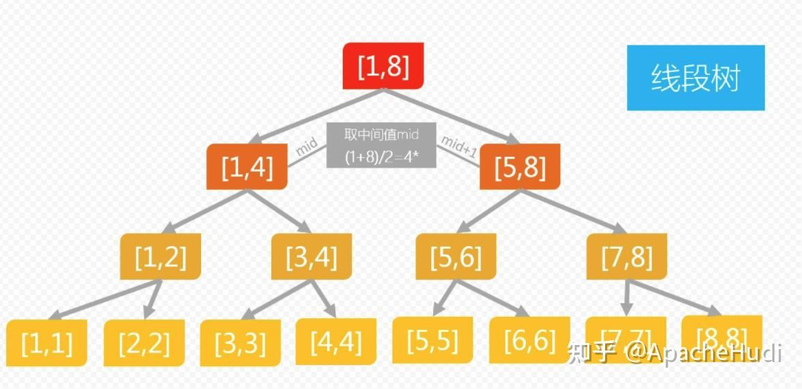

# Hudi Upsert原理

https://zhuanlan.zhihu.com/p/380943820

## 简介

主要完成增量数据在HDFS/对象存储上的修改，并可以支持事务。upsert支持两种模式的写入Copy On Write和Merge On Read ，下面本文将介绍Apache Hudi 在Spark中Upsert的内核原理。

## Upsert场景执行流程介绍

* 开始提交：判断上次任务是否失败，如果失败会触发回滚操作。 然后会根据当前时间生成一个事务开始的请求标识元数据。
* 构造HoodieRecord Rdd对象：Hudi 会根据元数据信息构造HoodieRecord Rdd 对象，方便后续数据去重和数据合并。
* 数据去重:一批增量数据中可能会有重复的数据，Hudi会根据主键对数据进行去重避免重复数据写入Hudi 表。
* 数据fileId位置信息获取:在修改记录中可以根据索引获取当前记录所属文件的fileid，在数据合并时需要知道数据update操作向那个fileId文件写入新的快照文件。
* 数据合并：Hudi 有两种模式cow和mor。在cow模式中会重写索引命中的fileId快照文件；在mor 模式中根据fileId 追加到分区中的log 文件。
* 完成提交：在元数据中生成xxxx.commit文件，只有生成commit 元数据文件，查询引擎才能根据元数据查询到刚刚upsert 后的数据。
* compaction压缩：主要是mor 模式中才会有，他会将mor模式中的xxx.log 数据合并到xxx.parquet 快照文件中去。
* hive元数据同步：hive 的元素数据同步这个步骤需要配置非必需操作，主要是对于hive 和presto 等查询引擎，需要依赖hive 元数据才能进行查询，所以hive元数据同步就是构造外表提供查询。

## 如何保证事务

###时间1

初始化写入三个分区文件分别是xxx-1.parquet；

###时间3
场景如果会修改分区1和分区2xxx-1.parquet的数据，那么写入完成后会生成新的快照文件分别是分区1和分区2xxx-3.parquet文件。（上述是COW模式的过程，而对于MOR模式的更新会生成log文件，如果log文件存在并且可追加则继续追加数据）。

###时间5
修改分区1的数据那么同理会生成分区1下的新快照文件。

### 结论

可以看出对于Hudi 每次修改都是会在文件级别重新写入数据快照。查询的时候就会根据最后一次快照元数据加载每个分区小于等于当前的元数据的parquet文件。Hudi事务的原理就是通过元数据mvcc多版本控制写入新的快照文件，在每个时间阶段根据最近的元数据查找快照文件。因为是重写数据所以同一时间只能保证一个事务去重写parquet 文件。不过当前Hudi版本加入了并发写机制，原理是Zookeeper分布锁控制或者HMS提供锁的方式， 会保证同一个文件的修改只有一个事务会写入成功。

## 开始提交&数据回滚

在构造好spark 的rdd 后会调用 

	df.write.format("hudi") 

执行数据的写入，实际会调用Hudi源码中的HoodieSparkSqlWriter#write方法实现。在执行任务前Hudi 会创建HoodieWriteClient 对象，并构造HoodieTableMetaClient调用startCommitWithTime方法开始一次事务。在开始提交前会获取hoodie 目录下的元数据信息，判断上一次写入操作是否成功，判断的标准是上次任务的快照元数据有xxx.commit后缀的元数据文件。如果不存在那么Hudi 会触发回滚机制，回滚是将不完整的事务元数据文件删除，并新建xxx.rollback元数据文件。如果有数据写入到快照parquet 文件中也会一起删除。

## 构造HoodieRecord Rdd 对象

HoodieRecord Rdd 对象的构造先是通过map 算子提取spark dataframe中的schema和数据，构造avro的GenericRecords Rdd，然后Hudi会在使用map算子封装为HoodierRecord Rdd。对于HoodileRecord Rdd 主要由currentLocation,newLocation,hoodieKey,data 组成。HoodileRecord数据结构是为后续数据去重和数据合并时提供基础。

* currentLocation 当前数据位置信息：只有数据在当前Hudi表中存在才会有，主要存放parquet文件的fileId，构造时默认为空，在查找索引位置信息时被赋予数据。
* newLocation 数据新位置信息：与currentLocation不同不管是否存在都会被赋值，newLocation是存放当前数据需要被写入到那个fileID文件中的位置信息，构造时默认为空，在merge阶段会被赋予位置信息。
* HoodieKey 主键信息：主要包含recordKey 和patitionPath 。recordkey 是由hoodie.datasource.write.recordkey.field 配置项根据列名从记录中获取的主键值。patitionPath 是分区路径。Hudi 会根据hoodie.datasource.write.partitionpath.field 配置项的列名从记录中获取的值作为分区路径。
* data 数据：data是一个泛型对象，泛型对象需要实现HoodieRecordPayload类，主要是实现合并方法和比较方法。默认实现OverwriteWithLatestAvroPayload类，需要配置hoodie.datasource.write.precombine.field配置项获取记录中列的值用于比较数据大小，去重和合并都是需要保留值最大的数据。

## 数据去重

在upsert 场景中数据去重是默认要做的操作，如果不进行去重会导致数据重复写入parquet文件中。当然upsert 数据中如果没有重复数据是可以关闭去重操作。配置是否去重参数为

	hoodie.combine.before.upsert，

默认为true开启。

在Spark client调用upsert 操作是Hudi会创建HoodieTable对象，并且调用upsert 方法。对于HooideTable 的实现分别有COW和MOR两种模式的实现。但是在数据去重阶段和索引查找阶段的操作都是一样的。调用HoodieTable#upsert方法底层的实现都是SparkWriteHelper。

在去重操作中，会先使用map 算子提取HoodieRecord中的HoodieatestAvroPayload的实现是保留时间戳最大的记录。这里要注意如果我们配置的是全局类型的索引，map 中的key 值是 HoodieKey 对象中的recordKey。因为全局索引是需要保证所有分区中的主键都是唯一的，避免不同分区数据重复。当然如果是非分区表，没有必要使用全局索引。

## 数据位置信息索引查找

对于Hudi 索引主要分为两大类：

* 非全局索引：索引在查找数据位置信息时，只会检索当前分区的索引，索引只保证当前分区内数据做upsert。如果记录的分区值发生变更就会导致数据重复。
* 全局索引：顾名思义在查找索引时会加载所有分区的索引，用于定位数据位置信息，即使发生分区值变更也能定位数据位置信息。这种方式因为要加载所有分区文件的索引，对查找性能会有影响（HBase索引除外）。

Spark 索引实现主要有如下几种

* 布隆索引（BloomIndex）
* 全局布隆索引（GlobalBloomIndex）
* 简易索引（SimpleIndex）
* 简易全局索引（GlobalSimpleIndex）
* 全局HBase 索引(HbaseIndex)
* 内存索引(InMemoryHashIndex)。

###  布隆索引（BloomIndex）

Spark 布隆索引的实现类是SparkHoodieBloomIndex，要想知道布隆索引需要了解下布隆算法一般用于判断数据是否存在的场景，在Hudi中用来判断数据在parquet 文件中是否存在。其原理是计算RecordKey的hash值然后将其存储到bitmap中去，key值做hash可能出现hash 碰撞的问题，为了较少hash 值的碰撞使用多个hash算法进行计算后将hash值存入BitMap，一般三次hash最佳，

索引实现类调用tagLocation开始查找索引记录存在哪个parquet 文件中，步骤如下

* 提取所有的分区路径和主键值，然后计算每个分区路径中需要根据主键查找的索引的数量。
* 有了需要加载的分区后，调用LoadInvolvedFiles 方法加载分区下所有的parquet 文件。在加载paquet文件只是加载文件中的页脚信息，页脚存放的有布隆过滤器、记录最小值、记录最大值。对于布隆过滤器其实是存放的是bitmap序列化的对象。
* 加载好parquet 的页脚信息后会根据最大值和最小值构造线段树。
* 根据Rdd 中RecordKey 进行数据匹配查找数据属于那个parqeut 文件中，对于RecordKey查找只有符合最大值和最小值范围才会去查找布隆过滤器中的bitmap ，RecordKey小于最小值找左子树，RecordKey大于最大值的key找右子树。递归查询后如果查找到节点为空说明RecordKey在当前分区中不存在，当前Recordkey是新增数据。查找索引时spark会自定义分区避免大量数据在一个分区查找导致分区数据倾斜。查找到RecordKey位置信息后会构造 Rdd 对象。

##（其他索引省略）

## 索引的选择

###普通索引：
主要用于非分区表和分区不会发生分区列值变更的表。当然如果你不关心多分区主键重复的情况也是可以使用。他的优势是只会加载upsert数据中的分区下的每个文件中的索引，相对于全局索引需要扫描的文件少。并且索引只会命中当前分区的fileid 文件，需要重写的快照也少相对全局索引高效。但是某些情况下我们的设置的分区列的值就是会变那么必须要使用全局索引保证数据不重复，这样upsert 写入速度就会慢一些。其实对于非分区表他就是个分区列值不会变且只有一个分区的表，很适合普通索引，如果非分区表硬要用全局索引其实和普通索引性能和效果是一样的。

###全局索引：
分区表场景要考虑分区值变更，需要加载所有分区文件的索引比普通索引慢。

###布隆索引：
加载fileid 文件页脚布隆过滤器，加载少量数据数据就能判断数据是否在文件存在。缺点是有一定的误判，但是merge机制可以避免重复数据写入。parquet文件多会影响索引加载速度。适合没有分区变更和非分区表。主键如果是类似自增的主键布隆索引可以提供更高的性能，因为布隆索引记录的有最大key和最小key加速索引查找。

###全局布隆索引：
解决分区变更场景，原理和布隆索引一样，在分区表中比普通布隆索引慢。

###简易索引：
直接加载文件里的数据不会像布隆索引一样误判，但是加载的数据要比布隆索引要多，left join 关联的条数也要比布隆索引多。大多数场景没布隆索引高效，但是极端情况命中所有的parquet文件，那么此时还不如使用简易索引加载所有文件里的数据进行判断。

###全局简易索引：
解决分区变更场景，原理和简易索引一样，在分区表中比普通简易索引慢。建议优先使用全局布隆索引。

###HBase索引：
不受分区变跟场景的影响，操作算子要比布隆索引少，在大量的分区和文件的场景中比布隆全局索引高效。因为每条数据都要查询hbase ，upsert数据量很大会对hbase有负载的压力需要考虑hbase集群承受压力，适合微批分区表的写入场景 。在非分区表中数量不大文件也少，速度和布隆索引差不多，这种情况建议用布隆索引。

###内存索引：
用于测试不适合生产环境

## 数据合并

COW模式和MOR模式在前面的操作都是一样的，不过在合并的时候Hudi构造的执行器不同。对于COW会根据位置信息中fileId 重写parquet文件，在重写中如果数据是更新会比较parquet文件的数据和当前的数据的大小进行更新，完成更新数据和插入数据。而MOR模式会根据fileId 生成一个log 文件，将数据直接写入到log文件中，如果fileID的log文件已经存在，追加数据写入到log 文件中。与COW 模式相比少了数据比较的工作所以性能要好，但是在log 文件中可能保存多次写有重复数据在读log数据时候就不如cow模式了。还有在mor模式中log文件和parquet 文件都是存在的，log 文件的数据会达到一定条件和parqeut 文件合并。所以mor有两个视图，ro后缀的视图是读优化视图（read-optimized）只查询parquet 文件的数据。rt后缀的视图是实时视图（real-time）查询parquet 和log 日志中的内容。