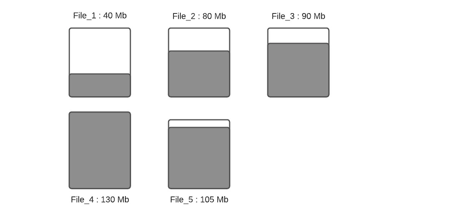
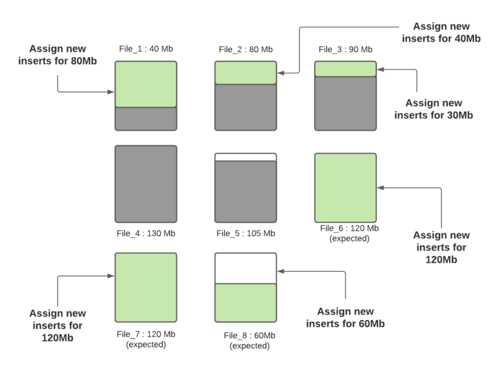

# Hudi小文件问题处理和生产调优
参考：https://cloud.tencent.com/developer/article/1979171

## 小文件处理

Apache Hudi提供的一个关键特性是自我管理文件大小，这样用户就不需要担心手动维护表。

拥有大量的小文件将使计算更难获得良好的查询性能，因为查询引擎不得不多次打开/读取/关闭文件以执行查询。

但是对于流数据湖用例来说，可能每次都只会写入很少的数据，如果不进行特殊处理，这可能会导致大量小文件。

## 写期间VS写入后小文件优化

常见解决小文件的方法是写的时候就产生了大量小文件，事后再把这些文件合并到一起可以解决小文件带来的系统可扩展性问题；但是可能会影响查询的 SLA，因为我们把很多小文件暴露给它们。实际上，我们可以利用 Hudi 的 clustering 操作很轻松的实现小文件合并。

在进行insert/upsert操作时，Hudi可以指定文件大小。

## 核心配置

为了便于说明，本文只考虑 COPY_ON_WRITE 表的小文件自动合并功能。在阅读下文之前，我们先来看看几个相关的参数：

	 hoodie.parquet.max.file.size：数据文件的最大大小。Hudi 会尝试将文件大小保持在此配置值;
	 hoodie.parquet.small.file.limit：文件大小小于这个配置值的均视为小文件；
	 hoodie.copyonwrite.insert.split.size：单分区插入的数据条数，这个值应该和单个文件的记录条数相同。可以根据 hoodie.parquet.max.file.size 和单条记录的大小进行调整。

例如，如果你的第一个配置值是120MB，第二个配置值是100MB，那么任何小于100MB的文件都被认为是小文件。如果你想关闭自动文件大小功能，可以将 

	hoodie.parquet.small.file.limit 设置为0。

### 举例说明

假设下面是给定分区的数据文件布局。

假设配置的

	hoodie.parquet.max.file.size为120MB，
	hoodie.parquet.small.file.limit为100MB。

* File_1大小为40MB，
* File_2大小为80MB，
* File_3是90MB，
* File_4是130MB，
* File_5是105MB，

当有新写入时其流程如下：

#### 步骤一：

将更新分配到指定文件，这一步将查找索引来找到相应的文件，假设更新会增加文件的大小，会导致文件变大。当更新减小文件大小时（例如使许多字段无效），则随后的写入将文件将越来越小。

####步骤二：
 
 根据hoodie.parquet.small.file.limit决定每个分区下的小文件，我们的示例中该配置为100MB，所以小文件为File_1、File_2和File_3；
 
####步骤三：
 
确定小文件后，新插入的记录将分配给小文件以便使其达到120MB，File_1将会插入80MB大小的记录数，File_2将会插入40MB大小的记录数，File_3将插入30MB大小的记录数。

####步骤四：

一旦所有小文件写到最大容量，并且如果还有未分配的插入，就会创建新的文件组/数据文件，并把剩下的数据写到这些新创建的文件组/数据文件中。每个新数据文件的记录数量由
 
	hoodie.copyonwrite.insert.split.size配置确定。假设
	hoodie.copyonwrite.insert.split.size配置为120k，

如果有剩余 300k 条记录，那么将创建3个新文件，其中2个（File_6 和 File_7）将填充 120k 条记录，最后一个（File_8）将填充 60k 条记录（假设每条记录为 1000 字节）。在未来的摄取中，第三个新文件（File_8）将被视为是一个小文件，用于存储更多的数据。

Hudi 利用自定义分区等机制来优化记录分发到不同的文件，执行上述算法。在这一轮摄取完成后，除 File_8 之外的所有文件都被很好地调整到最佳大小。在每次摄取期间都遵循此过程，以确保 Hudi 表中没有小文件。

## Spark+Hudi优化 

通过Spark作业将数据写入Hudi时，需要注意的调优手段如下：

#### 输入并行性： 

Hudi对输入进行分区默认并发度为1500，以确保每个Spark分区都在2GB的限制内（在Spark2.4.0版本之后去除了该限制），如果有更大的输入，则相应地进行调整。我们建议设置shuffle的并发度，配置项为：

	hoodie.[insert|upsert|bulkinsert].shuffle.parallelism,
	
以使其至少达到

	input_data_size/500MB
	
	
####Off-heap（堆外）内存：

Hudi写入parquet文件，需要使用一定的堆外内存，如果遇到此类故障，请考虑设置类似
	
	spark.yarn.executor.memoryOverhead

或

	spark.yarn.driver.memoryOverhead

的值

#### Spark 内存：

 通常Hudi需要能够将单个文件读入内存以执行合并或压缩操作，因此执行程序的内存应足以容纳此文件。另外，Hudi会缓存输入数据以便能够智能地放置数据，因此预留一些
 
 	spark.memory.storageFraction
 
 通常有助于提高性能。
 

#### 调整文件大小：

设置limitFileSize以平衡接收/写入延迟与文件数量，并平衡与文件数据相关的元数据开销。

#### 时间序列/日志数据：

对于单条记录较大的数据库/nosql变更日志，可调整默认配置。另一类非常流行的数据是时间序列/事件/日志数据，它往往更加庞大，每个分区的记录更多。在这种情况下，请考虑通过

	bloomFilterFPP()/bloomFilterNumEntries()

来调整Bloom过滤器的精度，以加速目标索引查找时间，另外可考虑一个以事件时间为前缀的键，这将使用范围修剪并显着加快索引查找的速度。

#### GC调优：

请确保遵循Spark调优指南中的垃圾收集调优技巧，以避免OutOfMemory错误。使用G1 / CMS收集器，其中添加到spark.executor.extraJavaOptions的示例如下：

	-XX:NewSize=1g -XX:SurvivorRatio=2 -XX:+UseCompressedOops -XX:+UseConcMarkSweepGC -XX:+UseParNewGC -XX:CMSInitiatingOccupancyFraction=70 -XX:+PrintGCDetails -XX:+PrintGCTimeStamps -XX:+PrintGCDateStamps -XX:+PrintGCApplicationStoppedTime -XX:+PrintGCApplicationConcurrentTime -XX:+PrintTenuringDistribution -XX:+HeapDumpOnOutOfMemoryError -XX:HeapDumpPath=/tmp/hoodie-heapdump.hprof
	
	
#### OutOfMemory错误

	spark.memory.fraction = 0.2
	spark.memory.storageFraction = 0.2
	
以下是可以参考的完整的生产配置：

	spark.driver.extraClassPath /etc/hive/conf
	spark.driver.extraJavaOptions -XX:+PrintTenuringDistribution -XX:+PrintGCDetails -XX:+PrintGCDateStamps -XX:+PrintGCApplicationStoppedTime -XX:+PrintGCApplicationConcurrentTime -XX:+PrintGCTimeStamps -XX:+HeapDumpOnOutOfMemoryError -XX:HeapDumpPath=/tmp/hoodie-heapdump.hprof
	spark.driver.maxResultSize 2g
	spark.driver.memory 4g
	spark.executor.cores 1
	spark.executor.extraJavaOptions -XX:+PrintFlagsFinal -XX:+PrintReferenceGC -verbose:gc -XX:+PrintGCDetails -XX:+PrintGCTimeStamps -XX:+PrintAdaptiveSizePolicy -XX:+UnlockDiagnosticVMOptions -XX:+HeapDumpOnOutOfMemoryError -XX:HeapDumpPath=/tmp/hoodie-heapdump.hprof
	spark.executor.id driver
	spark.executor.instances 300
	spark.executor.memory 6g
	spark.rdd.compress true
	 
	spark.kryoserializer.buffer.max 512m
	spark.serializer org.apache.spark.serializer.KryoSerializer
	spark.shuffle.service.enabled true
	spark.sql.hive.convertMetastoreParquet false
	spark.submit.deployMode cluster
	spark.task.cpus 1
	spark.task.maxFailures 4
	 
	spark.yarn.driver.memoryOverhead 1024
	spark.yarn.executor.memoryOverhead 3072
	spark.yarn.max.executor.failures 100