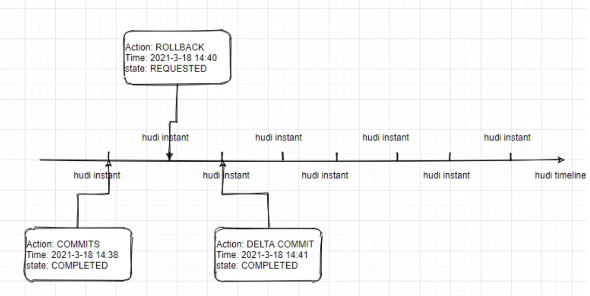

# Hudi是什么

参考：https://mp.weixin.qq.com/s?__biz=MzIyMzQ0NjA0MQ==&mid=2247486287&idx=2&sn=e206a0f4bcae2b306b3171c674d25ef8&chksm=e81f5e39df68d72f656ca64b97a7e8ecd1a4ad45c42addbfdc805ca8cf49a0791cfe3cd8aa0e&scene=21#wechat_redirect

## 概念

Hudi是Hadoop Upserts anD Incrementals的缩写，用于管理HDFS上的大型分析数据集存储。 Hudi的主要目的是高效的减少入库延时。 Hudi是Uber开发的一个开源项目。存储于HDFS上的分析数据集一般通过两种类型的表来提供，即读取优化的表（Read Optimized Table）和近实时表（Near-Realtime Table）。

Read Optimized Table的首要目的是通过列式存储来提升查询性能，而近实时表提供近乎实时的查询（基于行储和列储的组合）。

Hudi是一个开源Spark三方库，支持在Hadoop上执行upserts/insert/delete操作。Hudu允许用户只获取已更改的增量数据，从而提高查询效率。Hudi可以像任何作业一样进行水平扩展，并直接在HDFS上存储数据。

## 核心概念

### Timeline

Hudi的核心是维护一个timeline，在不同时刻对某个Hudi表的操作都会记录在Timeline中，或者这样说：

* Hudi的timeline是由一个个的Hudi Instant组成。

相当于提供了对该表的一个即时视图。通过这个timeline，我们可以按照数据的到达顺序进行检索。

如上图所示，Hudi Instant由以下几个组件组成：

#### Instant Action

记录在表上的一系列操作

#### Instant Time

按Action的开始时间单调递增，通常是一个时间戳，例如：20210318143839

#### state

当前instant的状态

Hudi可以保证基于Timeline的操作是具备原子性的，而且Timeline和Instant是一致的。

### Instant Action

Instant重要的Action有以下几个：

* COMMITS: 表示将一批原子写入提交到一个表中。
* CLEANS:后台Action，它会删除表中比较旧的、不再需要的版本。
* DELTA_COMMIT:增量提交，表示将一批原子写入到MOR（Merge On Read）类型的表中，数据可以只写入到Delta Log（增量日志中）。
* COMPACTION:后台Action，它用于确保一致的数据结构，例如：将基于行的Detla Log文件中的更新合并到列式文件结构。
* ROLLBACK:表示COMMIT或者DELTA COMMIT不成功，并且已经回滚，删除在写入过程中产生的所有文件。
* SAVEPOINT:将某些文件标记为"saved"，这样清理程序就不会清除它们。在出现故障或者进行数据恢复时，可以用于在某个时间点进行还原。
* REPLACE:使用FileGroup替换另一些FileGroup，使用InsertOverwrite或者Clustering        时对应REPLACE。

### Instant State

* REQUESTED:表示已经被准备调度执行，但还未启动
* INFLIGHT:表示正在执行操作
* COMPLETED:表示在timeline已经完成Action