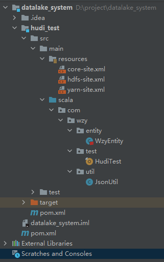
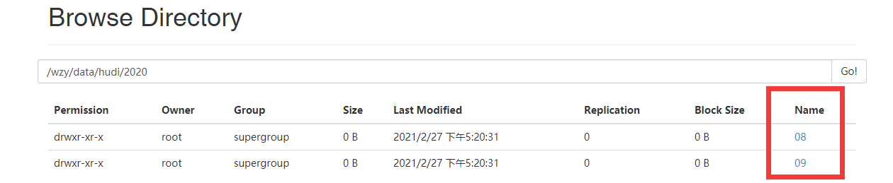

# 07Hudi 插入数据

## 准备测试文档

vim test11

	{'uid':1,'uname':'xiaobai','dt':'2020/08'}
	{'uid':2,'uname':'xiaohong','dt':'2020/09'}

**注意：文件不能有空的行**

导入hadoop

	hdfs dfs -mkdir /test
	hdfs dfs -put test11 /test/ 

## 代码

### core-site.xml

	<?xml version="1.0" encoding="UTF-8"?>
	<?xml-stylesheet type="text/xsl" href="configuration.xsl"?>
	
	<configuration>
	<property>
	  <name>fs.default.name</name>
	  <value>hdfs://192.168.195.150:9000</value>
	</property>
	<property>
	  <name>hadoop.tmp.dir</name>
	  <value>/usr/local/hadoop/tmp</value>
	</property>
	</configuration>

### hdfs-site.xml

	<?xml version="1.0" encoding="UTF-8"?>
	<?xml-stylesheet type="text/xsl" href="configuration.xsl"?>
	
	<configuration>
	<property>
	  <name>dfs.replication</name>
	  <value>1</value>
	</property>
	 <property>
	        <name>dfs.permissions</name>
	        <value>false</value>
	    </property>
	</configuration>

###　yarn-site.xml

	<?xml version="1.0"?>
	<configuration>
	</configuration>

### WzyEntity

	package com.wzy.entity
	
	case class WzyEntity(
	
	  uid: Int,
	  uname: String,
	  dt: String
	
	  )

### HudiTest

	package com.wzy.test
	
	import com.wzy.entity.WzyEntity
	import com.wzy.util.JsonUtil
	import org.apache.spark.SparkConf
	import org.apache.spark.sql.{SaveMode, SparkSession}
	
	object HudiTest {
	
	  def main(args: Array[String]): Unit = {
	    System.setProperty("HADOOP_USER_NAME", "root")
	    val sparkConf = new SparkConf().setAppName("HudiTest")
	      .set("spark.serializer", "org.apache.spark.serializer.KryoSerializer")
	      .setMaster("local[*]")
	    val sparkSession = SparkSession.builder().config(sparkConf).enableHiveSupport().getOrCreate()
	    val ssc = sparkSession.sparkContext
	
	    ssc.hadoopConfiguration.set("dfs.client.use.datanode.hostname","true");
	    insertData(sparkSession)
	  }
	
	  /**
	   * @param sparkSession
	   * @return
	   */
	  def insertData(sparkSession: SparkSession) = {
	    import org.apache.spark.sql.functions._
	    import sparkSession.implicits._
	
	    val commitTime = System.currentTimeMillis().toString //生成提交时间
	
	    val df = sparkSession.read.text("/test/test11")
	      .mapPartitions(partitions => {
	        partitions.map(item => {
	          val jsonObject = JsonUtil.getJsonData(item.getString(0))
	          System.out.println("--------------------"+jsonObject)
	          WzyEntity(jsonObject.getIntValue("uid"), jsonObject.getString("uname"), jsonObject.getString("dt"))
	        })
	      })
	
	    val result = df.withColumn("ts", lit(commitTime)) //添加ts 时间戳列
	      .withColumn("uuid", col("uid"))
	      .withColumn("hudipart", col("dt")) //增加hudi分区列
	
	    result.write.format("org.apache.hudi")
	      .option("hoodie.insert.shuffle.parallelism", 2)
	      .option("hoodie.upsert.shuffle.parallelism", 2)
	      .option("PRECOMBINE_FIELD_OPT_KEY", "ts") //指定提交时间列
	      .option("RECORDKEY_FIELD_OPT_KEY", "uuid") //指定uuid唯一标示列
	      .option("hoodie.table.name", "wzyTable")
	      .option("hoodie.datasource.write.partitionpath.field", "hudipart") //分区列
	      .mode(SaveMode.Overwrite)
	      .save("/wzy/data/hudi")
	  }
	
	}

###　JsonUtil

	package com.wzy.util;
	
	import com.alibaba.fastjson.JSONObject;
	
	public class JsonUtil {
	
	    public static JSONObject getJsonData(String data) {
	        try {
	            return JSONObject.parseObject(data);
	        } catch (Exception e) {
	            return null;
	        }
	    }
	}

### 父项目的 pom.xml

	<?xml version="1.0" encoding="UTF-8"?>
	<project xmlns="http://maven.apache.org/POM/4.0.0"
	         xmlns:xsi="http://www.w3.org/2001/XMLSchema-instance"
	         xsi:schemaLocation="http://maven.apache.org/POM/4.0.0 http://maven.apache.org/xsd/maven-4.0.0.xsd">
	    <modelVersion>4.0.0</modelVersion>
	
	    <groupId>org.example</groupId>
	    <artifactId>datalake</artifactId>
	    <packaging>pom</packaging>
	    <version>1.0-SNAPSHOT</version>
	    <modules>
	        <module>hudi_test</module>
	    </modules>
	
	</project>

### hudi_test 的 pom.xml

	<?xml version="1.0" encoding="UTF-8"?>
	<project xmlns="http://maven.apache.org/POM/4.0.0"
	         xmlns:xsi="http://www.w3.org/2001/XMLSchema-instance"
	         xsi:schemaLocation="http://maven.apache.org/POM/4.0.0 http://maven.apache.org/xsd/maven-4.0.0.xsd">
	    <parent>
	        <artifactId>datalake</artifactId>
	        <groupId>org.example</groupId>
	        <version>1.0-SNAPSHOT</version>
	    </parent>
	    <modelVersion>4.0.0</modelVersion>
	
	    <artifactId>hudi_test</artifactId>
	
	    <dependencies>
	        <dependency>
	            <groupId>org.apache.hudi</groupId>
	            <artifactId>hudi-client</artifactId>
	            <version>0.5.3</version>
	        </dependency>
	        <dependency>
	            <groupId>org.apache.hudi</groupId>
	            <artifactId>hudi-hive</artifactId>
	            <version>0.5.3</version>
	        </dependency>
	
	        <dependency>
	            <groupId>org.apache.hudi</groupId>
	            <artifactId>hudi-spark-bundle_2.11</artifactId>
	            <version>0.5.3</version>
	        </dependency>
	        <dependency>
	            <groupId>org.apache.hudi</groupId>
	            <artifactId>hudi-common</artifactId>
	            <version>0.5.3</version>
	        </dependency>
	        <dependency>
	            <groupId>org.apache.hudi</groupId>
	            <artifactId>hudi-hadoop-mr-bundle</artifactId>
	            <version>0.5.3</version>
	        </dependency>
	
	        <!-- Spark的依赖引入 -->
	        <dependency>
	            <groupId>org.apache.spark</groupId>
	            <artifactId>spark-core_2.11</artifactId>
	            <version>2.4.5</version>
	        </dependency>
	        <dependency>
	            <groupId>org.apache.spark</groupId>
	            <artifactId>spark-sql_2.11</artifactId>
	            <version>2.4.5</version>
	        </dependency>
	        <dependency>
	            <groupId>org.apache.spark</groupId>
	            <artifactId>spark-hive_2.11</artifactId>
	            <version>2.4.5</version>
	        </dependency>
	        <dependency>
	            <groupId>org.apache.spark</groupId>
	            <artifactId>spark-avro_2.11</artifactId>
	            <version>2.4.5</version>
	        </dependency>
	        <dependency>
	            <groupId>org.scala-lang</groupId>
	            <artifactId>scala-library</artifactId>
	            <version>2.11.8</version>
	        </dependency>
	        <dependency>
	            <groupId>org.apache.hadoop</groupId>
	            <artifactId>hadoop-client</artifactId>
	            <version>2.7.2</version>
	        </dependency>
	        <dependency>
	            <groupId>com.alibaba</groupId>
	            <artifactId>fastjson</artifactId>
	            <version>1.2.76</version>
	        </dependency>
	        <dependency>
	            <groupId>org.apache.spark</groupId>
	            <artifactId>spark-hive_2.11</artifactId>
	            <version>2.4.5</version>
	        </dependency>
	        <dependency>
	            <groupId>org.spark-project.hive</groupId>
	            <artifactId>hive-jdbc</artifactId>
	            <version>1.2.1.spark2</version>
	        </dependency>
	
	        <dependency>
	            <groupId>org.apache.spark</groupId>
	            <artifactId>spark-streaming-kafka-0-10_2.11</artifactId>
	            <version>2.4.5</version>
	        </dependency>
	        <dependency>
	            <groupId>org.apache.spark</groupId>
	            <artifactId>spark-streaming_2.11</artifactId>
	            <version>2.4.5</version>
	        </dependency>
	    </dependencies>
	
	
	</project>

## 结果

