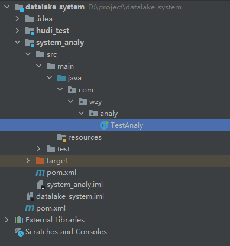

# 09 Flink 实时分析服务器构建

## 作用

使用微服务从Kafka中获取信息

## 启动producer

### 创建topic

	cd /usr/local/kafka/bin/
 	./kafka-topics.sh --zookeeper 127.0.0.1:2181 --topic test11 --partitions 1 --replication-factor 1 --create

### 启动命令行输入

	./kafka-console-producer.sh --broker-list 127.0.0.1:9092 --topic test1

## 启动consumer

### TestAnaly

	package com.wzy.analy;
	
	import org.apache.flink.api.common.serialization.SimpleStringSchema;
	import org.apache.flink.streaming.api.datastream.DataStream;
	import org.apache.flink.streaming.api.environment.StreamExecutionEnvironment;
	import org.apache.flink.streaming.connectors.kafka.FlinkKafkaConsumer;
	
	import java.util.Properties;
	
	public class TestAnaly {
	    public static void main(String[] args) {
	        final StreamExecutionEnvironment env = StreamExecutionEnvironment.getExecutionEnvironment();
	
	        Properties properties = new Properties();
	        properties.setProperty("bootstrap.servers", "192.168.195.150:9092");
	        properties.setProperty("group.id", "wzy");
	        //构建FlinkKafkaConsumer
	        FlinkKafkaConsumer<String> myConsumer = new FlinkKafkaConsumer<String>("test11", new SimpleStringSchema(), properties);
	        //        //指定偏移量
	        myConsumer.setStartFromLatest();
	
	        final DataStream<String> stream = env.addSource(myConsumer);
	
	        env.enableCheckpointing(5000);
	        stream.print();
	
	        try {
	            env.execute("TestAnaly");
	        } catch (Exception e) {
	            e.printStackTrace();
	        }
	    }
	}

### pom.xml

	<?xml version="1.0" encoding="UTF-8"?>
	<project xmlns="http://maven.apache.org/POM/4.0.0"
	         xmlns:xsi="http://www.w3.org/2001/XMLSchema-instance"
	         xsi:schemaLocation="http://maven.apache.org/POM/4.0.0 http://maven.apache.org/xsd/maven-4.0.0.xsd">
	    <parent>
	        <artifactId>datalake_system</artifactId>
	        <groupId>org.example</groupId>
	        <version>1.0-SNAPSHOT</version>
	    </parent>
	    <modelVersion>4.0.0</modelVersion>
	
	    <artifactId>system_analy</artifactId>
	
	
	    <dependencies>
	        <dependency>
	            <groupId>org.apache.flink</groupId>
	            <artifactId>flink-core</artifactId>
	            <version>1.9.0</version>
	        </dependency>
	        <dependency>
	            <groupId>org.apache.flink</groupId>
	            <artifactId>flink-streaming-java_2.11</artifactId>
	            <version>1.9.0</version>
	        </dependency>
	        <dependency>
	            <groupId>org.apache.flink</groupId>
	            <artifactId>flink-connector-kafka_2.11</artifactId>
	            <version>1.9.0</version>
	        </dependency>
	        <dependency>
	            <groupId>org.apache.flink</groupId>
	            <artifactId>flink-connector-filesystem_2.11</artifactId>
	            <version>1.9.0</version>
	        </dependency>
	    </dependencies>
	
	</project>

## 验证

生产者发送信息后，消费者端即可收到对应信息