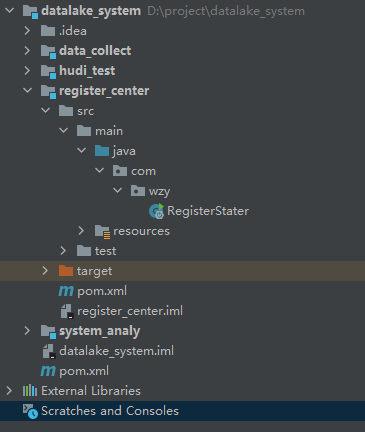

# 10 搭建注册中心

## 代码

### RegisterStater

	package com.wzy;
	
	import org.springframework.boot.SpringApplication;
	import org.springframework.boot.autoconfigure.SpringBootApplication;
	import org.springframework.cloud.netflix.eureka.server.EnableEurekaServer;
	
	@SpringBootApplication
	@EnableEurekaServer
	public class RegisterStater {
	    public static void main(String[] args) {
	        SpringApplication.run(RegisterStater.class,args);
	    }
	}

### application.yml

	server:
	  port: 8761
	
	eureka:
	  instance:
	    hostname: localhost
	  client:
	    registerWithEureka: false
	    fetchRegistry: false
	    serviceUrl:
	      defaultZone: http://${eureka.instance.hostname}:${server.port}/eureka/
	
	spring:
	  application:
	    name: youfanRegisterCenter

## 验证

	http://localhost:8761/