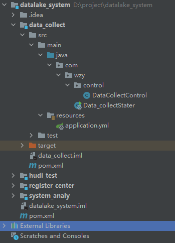
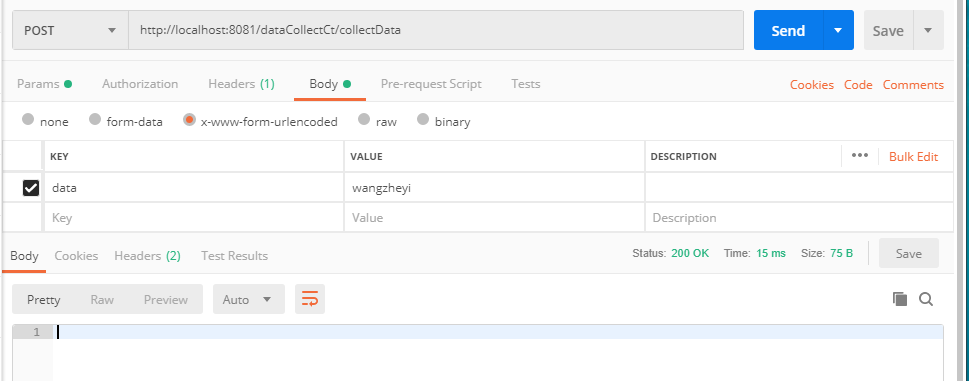

# 11 搭建数据搜集服务

## 作用

将信息打入kafka

## 代码

### Data_collectStater

	package com.wzy;
	
	import org.springframework.boot.SpringApplication;
	import org.springframework.boot.autoconfigure.SpringBootApplication;
	
	@SpringBootApplication
	public class Data_collectStater {
	
	    public static void main(String[] args) {
	        SpringApplication.run(Data_collectStater.class,args);
	    }
	}

### application.yml

	server:
	  port: 8081
	
	spring:
	  application:
	    name: dataCollectService
	  kafka:
	    bootstrap-servers: 192.168.195.150:9092
	    consumer:
	      group-id:  wzyDataCollect
	
	eureka:
	  client:
	    service-url:
	      defaultZone:  http://localhost:8761/eureka/

### DataCollectControl

	package com.wzy.control;
	
	import org.springframework.beans.factory.annotation.Autowired;
	import org.springframework.kafka.core.KafkaTemplate;
	import org.springframework.web.bind.annotation.RequestBody;
	import org.springframework.web.bind.annotation.RequestMapping;
	import org.springframework.web.bind.annotation.RequestMethod;
	import org.springframework.web.bind.annotation.RestController;
	
	@RestController
	@RequestMapping("dataCollectCt")
	public class DataCollectControl {
	
	    @Autowired
	    private KafkaTemplate kafkaTemplate;
	
	    @RequestMapping(value = "collectData",method = RequestMethod.POST)
	    public void collectData(@RequestBody String data){
	        System.out.println(data);
	        kafkaTemplate.send("test11",data);
	
	    }
	}

### pom.xml

	<?xml version="1.0" encoding="UTF-8"?>
	<project xmlns="http://maven.apache.org/POM/4.0.0"
	         xmlns:xsi="http://www.w3.org/2001/XMLSchema-instance"
	         xsi:schemaLocation="http://maven.apache.org/POM/4.0.0 http://maven.apache.org/xsd/maven-4.0.0.xsd">
	    <parent>
	        <artifactId>datalake_system</artifactId>
	        <groupId>org.example</groupId>
	        <version>1.0-SNAPSHOT</version>
	    </parent>
	    <modelVersion>4.0.0</modelVersion>
	
	    <artifactId>data_collect</artifactId>
	
	    <dependencies>
	        <dependency>
	            <groupId>org.springframework.boot</groupId>
	            <artifactId>spring-boot-starter-test</artifactId>
	        </dependency>
	        <dependency>
	            <groupId>org.springframework.boot</groupId>
	            <artifactId>spring-boot-starter-web</artifactId>
	        </dependency>
	        <dependency>
	            <groupId>org.springframework.cloud</groupId>
	            <artifactId>spring-cloud-starter-netflix-eureka-client</artifactId>
	        </dependency>
	        <dependency>
	            <groupId>org.springframework.kafka</groupId>
	            <artifactId>spring-kafka</artifactId>
	        </dependency>
	    </dependencies>
	</project>

## 测试请求

	http://localhost:8081/dataCollectCt/collectData