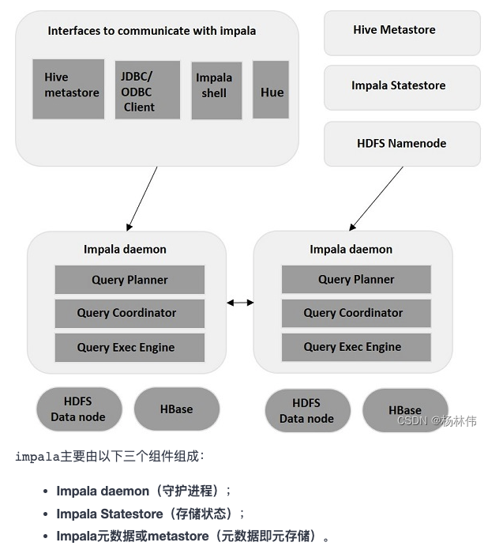

# Impala 介绍

## 背景

* Impala是一个分布式，大规模并行处理（MPP）的服务引擎
* 提供高性能、低延迟交互式SQL查询功能

## 架构

## 组件

### Impalad（守护进程）
daemon安装在Impala的每个节点上运行，它接受来自各种接口的查询，然后将工作分发到Impala集群中的其它Impala节点来并行化查询，结果返回到中央协调节。

`可以将查询提交到专用Impalad或以负载平衡方式提交到集群中的另一Impalad`

### Statestore（存储状态）
Statestore负责检查每个Impalad的运行状况，然后经常将每个Impala Daemon运行状况中继给其他守护程序，如果由于任何原因导致节点故障的情况下，Statestore将更新所有其他节点关于此故障，并且一旦此类通知可用于其他Impalad，则其他Impala守护程序不会向受影响的节点分配任何进一步的查询。

###metadata（元数据）/metastore（元存储）
Impala使用传统的MySQL或PostgreSQL数据库来存储表定义和列信息这些元数据。

当表定义或表数据更新时，其它Impala后台进程必须通过检索最新元数据来更新其元数据缓存，然后对相关表发出新查询。

