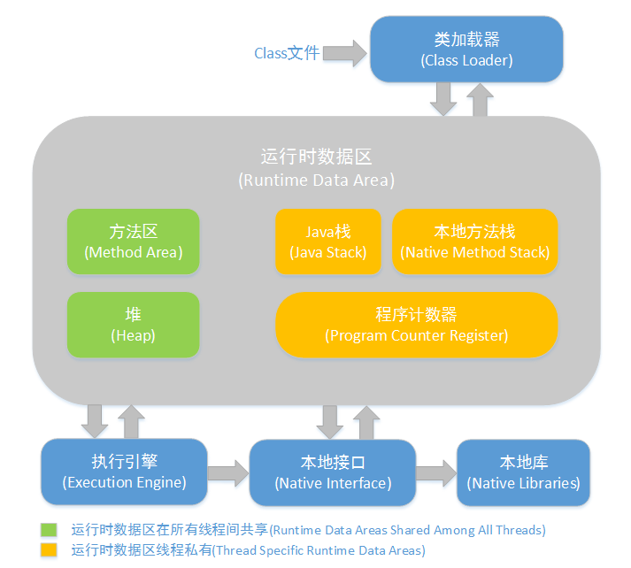

# JVM面试题

参考：https://blog.csdn.net/qq_41701956/article/details/100074023

---

## Java内存结构

### Java堆（Heap）

java内存最大的一块，所有对象实例、数组都存放在java堆，GC回收的地方，线程共享。

### 方法区（Method Area）

存放已被加载的类信息、常量、静态变量、即时编译器编译后的代码数据等。（即永久带），回收目标主要是常量池的回收和类型的卸载，各线程共享 

### 程序计数器（Program Counter Register）

当前线程所执行的字节码的行号指示器，用于记录正在执行的虚拟机字节指令地址，线程私有。

### JVM栈（JVM Stacks）

存放基本数据类型、对象的引用、方法出口等，线程私有。

### 本地方法栈（Native Method Stacks）

和虚拟栈相似，只不过它服务于Native方法，线程私有。

## 什么情况下会发生内存溢出？

内存溢出是由于没被引用的对象（垃圾）过多造成JVM没有及时回收，造成的内存溢出。如果出现这种现象可行代码排查：

是否App中的类中和引用变量过多使用了Static修饰 

是否App中使用了大量的递归或无限递归（递归中用到了大量的建新的对象）

是否App中使用了大量循环或死循环（循环中用到了大量的新建的对象）

检查App中是否使用了向数据库查询所有记录的方法。即一次性全部查询的方法，如果数据量超过10万多条了，就可能会造成内存溢出。所以在查询时应采用“分页查询”。

检查是否有数组，List，Map中存放的是对象的引用而不是对象，因为这些引用会让对应的对象不能被释放。会大量存储在内存中。
检查是否使用了“非字面量字符串进行+”的操作。因为String类的内容是不可变的，每次运行"+"就会产生新的对象，如果过多会造成新String对象过多，从而导致JVM没有及时回收而出现内存溢出。

##　新生代，老年代，持久代是什么

### 年轻代:

所有新生成的对象首先都是放在年轻代的。年轻代的目标就是尽可能快速的收集掉那些生命周期短的对象。年轻代分三个区。一个Eden区，两个Survivor区(一般而言)。大部分对象在Eden区中生成。当Eden区满时，还存活的对象将被复制到Survivor区（两个中的一个），当这个Survivor区满时，此区的存活对象将被复制到另外一个Survivor区，当这个Survivor去也满了的时候，从第一个Survivor区复制过来的并且此时还存活的对象，将被复制“年老区(Tenured)”。需要注意，Survivor的两个区是对称的，没先后关系，所以同一个区中可能同时存在从Eden复制过来 对象，和从前一个Survivor复制过来的对象，而复制到年老区的只有从第一个Survivor去过来的对象。而且，Survivor区总有一个是空的。同时，根据程序需要，Survivor区是可以配置为多个的（多于两个），这样可以增加对象在年轻代中的存在时间，减少被放到年老代的可能。

### 老年代:

在年轻代中经历了N次垃圾回收后仍然存活的对象，就会被放到年老代中。因此，可以认为年老代中存放的都是一些生命周期较长的对象。

### 持久代:

用于存放静态文件，如今Java类、方法等。持久代对垃圾回收没有显著影响，但是有些应用可能动态生成或者调用一些class，例如Hibernate等，在这种时候需要设置一个比较大的持久代空间来存放这些运行过程中新增的类。持久代大小通过-XX:MaxPermSize=<N>进行设置。

## JVM中一次完整的GC流程是怎样的，对象如何晋升到老年代

当 Eden 区的空间满了， Java虚拟机会触发一次 Minor GC，以收集新生代的垃圾，存活下来的对象，则会转移到 Survivor区。

大对象（需要大量连续内存空间的Java对象，如那种很长的字符串）直接进入老年态；

如果对象在Eden出生，并经过第一次Minor GC后仍然存活，并且被Survivor容纳的话，年龄设为1，每熬过一次Minor GC，年龄+1，若年龄超过一定限制（15），则被晋升到老年态。即长期存活的对象进入老年态。

老年代满了而无法容纳更多的对象，Minor GC 之后通常就会进行Full GC，Full GC 清理整个内存堆 – 包括年轻代和年老代。

## 你知道哪几种垃圾收集器，各自的优缺点，重点讲下cms和G1，包括原理，流程，优缺点

### 几种垃圾收集器：

#### Serial收集器： 

单线程的收集器，收集垃圾时，必须stop the world，使用复制算法。

####ParNew收集器： 

Serial收集器的多线程版本，也需要stop the world，复制算法

#### CMS(Concurrent Mark Sweep) 收集器

是一种以获得最短回收停顿时间为目标的收集器，标记清除算法，运作过程：初始标记，并发标记，重新标记，并发清除，收集结束会产生大量空间碎片。

#### G1收集器

标记整理算法实现，运作流程主要包括以下：初始标记，并发标记，最终标记，筛选标记。不会产生空间碎片，可以精确地控制停顿。

## JVM内存模型的相关知识了解多少
### Java内存模型图

## 说说你知道的几种主要的JVM参数

###堆栈配置相关

	java -Xmx3550m -Xms3550m -Xmn2g -Xss128k 
	
	-XX:MaxPermSize=16m -XX:NewRatio=4 -XX:SurvivorRatio=4 -XX:MaxTenuringThreshold=0

-Xmx3550m： 最大堆大小为3550m。

-Xms3550m： 设置初始堆大小为3550m。

-Xmn2g： 设置年轻代大小为2g。

-Xss128k： 每个线程的堆栈大小为128k。

-XX:MaxPermSize： 设置持久代大小为16m

-XX:NewRatio=4: 设置年轻代（包括Eden和两个Survivor区）与年老代的比值（除去持久代）。

-XX:SurvivorRatio=4： 设置年轻代中Eden区与Survivor区的大小比值。设置为4，则两个Survivor区与一个Eden区的比值为2:4，一个Survivor区占整个年轻代的1/6

-XX:MaxTenuringThreshold=0： 设置垃圾最大年龄。如果设置为0的话，则年轻代对象不经过Survivor区，直接进入年老代。

### 垃圾收集器相关

	-XX:+UseParallelGC
	-XX:ParallelGCThreads=20
	-XX:+UseConcMarkSweepGC 
	-XX:CMSFullGCsBeforeCompaction=5
	-XX:+UseCMSCompactAtFullCollection：

-XX:+UseParallelGC： 选择垃圾收集器为并行收集器。

-XX:ParallelGCThreads=20： 配置并行收集器的线程数

-XX:+UseConcMarkSweepGC： 设置年老代为并发收集。

-XX:CMSFullGCsBeforeCompaction：由于并发收集器不对内存空间进行压缩、整理，所以运行一段时间以后会产生“碎片”，使得运行效率降低。此值设置运行多少次GC以后对内存空间进行压缩、整理。

-XX:+UseCMSCompactAtFullCollection： 打开对年老代的压缩。可能会影响性能，但是可以消除碎片

###　辅助信息相关

	-XX:+PrintGC
	-XX:+PrintGCDetails

-XX:+PrintGC 输出形式:

	[GC 118250K->113543K(130112K), 0.0094143 secs] [Full GC 121376K->10414K(130112K), 0.0650971 secs]

-XX:+PrintGCDetails 输出形式:

	[GC [DefNew: 8614K->781K(9088K), 0.0123035 secs] 118250K->113543K(130112K), 0.0124633 secs] [GC [DefNew: 8614K->8614K(9088K), 0.0000665 secs][Tenured: 112761K->10414K(121024K), 0.0433488 secs] 121376K->10414K(130112K), 0.0436268 secs

## 强引用、软引用、弱引用、虚引用的区别？

### 强引用

我们平时new了一个对象就是强引用，例如 Object obj = new Object();即使在内存不足的情况下，JVM宁愿抛出OutOfMemory错误也不会回收这种对象。

### 软引用

如果一个对象只具有软引用，则内存空间足够，垃圾回收器就不会回收它；如果内存空间不足了，就会回收这些对象的内存。

	SoftReference<String> softRef=new SoftReference<String>(str);     // 软引用

**用处：** 软引用在实际中有重要的应用，例如浏览器的后退按钮。按后退时，这个后退时显示的网页内容是重新进行请求还是从缓存中取出呢？这就要看具体的实现策略了。

（1）如果一个网页在浏览结束时就进行内容的回收，则按后退查看前面浏览过的页面时，需要重新构建

（2）如果将浏览过的网页存储到内存中会造成内存的大量浪费，甚至会造成内存溢出

### 弱引用

有弱引用的对象拥有更短暂的生命周期。在垃圾回收器线程扫描它所管辖的内存区域的过程中，一旦发现了只具有弱引用的对象，不管当前内存空间足够与否，都会回收它的内存。

	String str=new String("abc");    	
	WeakReference<String> abcWeakRef = new WeakReference<String>(str);
	str=null;
	
	等价于
	
	str = null;
	System.gc();

### 虚引用

如果一个对象仅持有虚引用，那么它就和没有任何引用一样，在任何时候都可能被垃圾回收器回收。虚引用主要用来跟踪对象被垃圾回收器回收的活动。

## 调优工具 

用调优工具分为两类,jdk自带监控工具：jconsole和jvisualvm，第三方有：MAT(Memory Analyzer Tool)、GChisto。 

jconsole，Java Monitoring and Management Console是从java5开始，在JDK中自带的java监控和管理控制台，用于对JVM中内存，线程和类等的监控 

jvisualvm，jdk自带全能工具，可以分析内存快照、线程快照；监控内存变化、GC变化等。 

MAT，Memory Analyzer Tool，一个基于Eclipse的内存分析工具，是一个快速、功能丰富的Java heap分析工具，它可以帮助我们查找内存泄漏和减少内存消耗 

GChisto，一款专业分析gc日志的工具 

## 类的加载阶段

类加载阶段分为**加载、连接、初始化**三个阶段

### 加载

”加载“是”类加机制”的第一个过程，在加载阶段，虚拟机主要完成三件事：

（1）通过一个类的全限定名来获取其定义的二进制字节流

（2）将这个字节流所代表的的静态存储结构转化为方法区的运行时数据结构

（3）在堆中生成一个代表这个类的Class对象，作为方法区中这些数据的访问入口。

相对于类加载的其他阶段而言，加载阶段是可控性最强的阶段，因为程序员可以使用系统的类加载器加载，还可以使用自己的类加载器加载。我们在最后一部分会详细介绍这个类加载器。在这里我们只需要知道类加载器的作用就是上面虚拟机需要完成的三件事，仅此而已就好了。

### 连接

包含验证、准备、解析。

### 初始化

这是类加载机制的最后一步，在这个阶段，java程序代码才开始真正执行。我们知道，在准备阶段已经为类变量赋过一次值。在初始化阶端，程序员可以根据自己的需求来赋值了。一句话描述这个阶段就是执行类构造器< clinit >()方法的过程。

## 双亲委派原则

 当一个类加载器收到类加载任务，会先交给其父类加载器去完成，因此最终加载任务都会传递到顶层的启动类加载器，只有当父类加载器无法完成加载任务时，才会尝试执行加载任务。这个理解起来就简单了，比如说，另外一个人给小费，自己不会先去直接拿来塞自己钱包，我们先把钱给领导，领导再给领导，一直到公司老板，老板不想要了，再一级一级往下分。老板要是要这个钱，下面的领导和自己就一分钱没有了。（例子不好，理解就好）

采用双亲委派的一个好处是比如加载位于rt.jar包中的类java.lang.Object，不管是哪个加载器加载这个类，最终都是委托给顶层的启动类加载器进行加载，这样就保证了使用不同的类加载器最终得到的都是同样一个Object对象。双亲委派原则归纳一下就是：

1、可以避免重复加载，父类已经加载了，子类就不需要再次加载

2、更加安全，很好的解决了各个类加载器的基础类的统一问题，如果不使用该种方式，那么用户可以随意定义类加载器来加载核心api，会带来相关隐患。

3、自定义类加载器