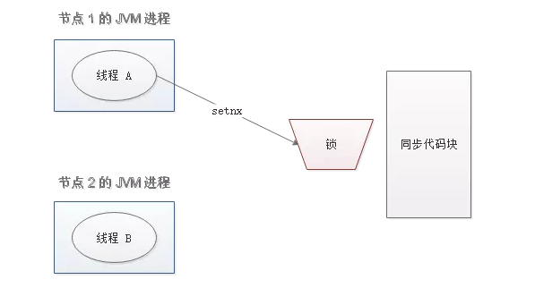
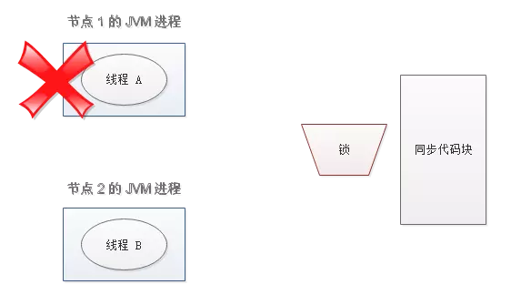
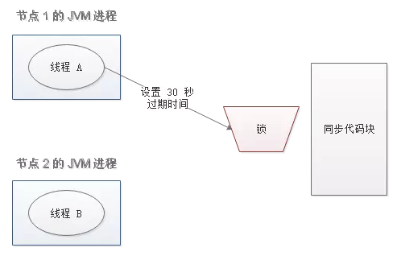
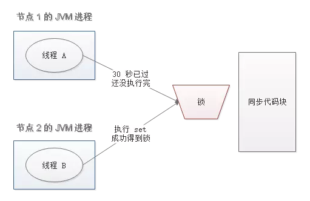
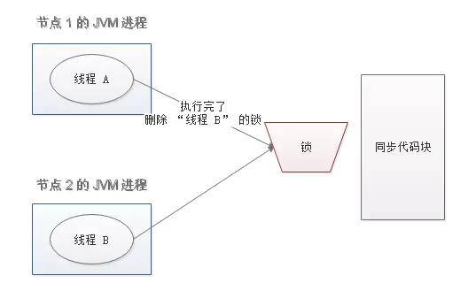

# 分布式锁

## 实现方式

**Memcached：**利用 Memcached 的 add 命令。此命令是原子性操作，只有在 key 不存在的情况下，才能 add 成功，也就意味着线程得到了锁。

**Redis：**和 Memcached 的方式类似，利用 Redis 的 setnx 命令。此命令同样是原子性操作，只有在 key 不存在的情况下，才能 set 成功。

**Zookeeper：**利用 Zookeeper 的顺序临时节点，来实现分布式锁和等待队列。Zookeeper 设计的初衷，就是为了实现分布式锁服务的。

**Chubby：**Google 公司实现的粗粒度分布式锁服务，底层利用了 Paxos 一致性算法。

## 通过Redis 分布式锁的实现理解基本概念

### 分布式锁实现的三个核心要素：

#### 加锁

最简单的方法是使用 setnx 命令。key 是锁的唯一标识，按业务来决定命名。比如想要给一种商品的秒杀活动加锁，可以给 key 命名为 “lock_sale_商品ID” 。而 value 设置成什么呢？我们可以姑且设置成 1。加锁的伪代码如下：

	setnx（lock_sale_商品ID，1）

当一个线程执行 setnx 返回 1，说明 key 原本不存在，该线程成功得到了锁；当一个线程执行 setnx 返回 0，说明 key 已经存在，该线程抢锁失败。

#### 解锁
有加锁就得有解锁。当得到锁的线程执行完任务，需要释放锁，以便其他线程可以进入。释放锁的最简单方式是执行 del 指令，伪代码如下：

	del（lock_sale_商品ID）

释放锁之后，其他线程就可以继续执行 setnx 命令来获得锁。

#### 锁超时
锁超时是什么意思呢？如果一个得到锁的线程在执行任务的过程中挂掉，来不及显式地释放锁，这块资源将会永远被锁住（死锁），别的线程再也别想进来。所以，setnx 的 key 必须设置一个超时时间，以保证即使没有被显式释放，这把锁也要在一定时间后自动释放。setnx 不支持超时参数，所以需要额外的指令，伪代码如下：

	expire（lock_sale_商品ID， 30）

综合伪代码如下：

	if（setnx（lock_sale_商品ID，1） == 1）{
	    expire（lock_sale_商品ID，30）
	    try {
	        do something ......
	    } finally {
	        del（lock_sale_商品ID）
	    }
	}

## 存在什么问题

存在什么问题

以上伪代码中存在三个致命问题

### setnx 和 expire 的非原子性
设想一个极端场景，当某线程执行 setnx，成功得到了锁：

setnx 刚执行成功，还未来得及执行 expire 指令，节点 1 挂掉了。

这样一来，这把锁就没有设置过期时间，变成死锁，别的线程再也无法获得锁了。

怎么解决呢？setnx 指令本身是不支持传入超时时间的，set 指令增加了可选参数，伪代码如下：

	set（lock_sale_商品ID，1，30，NX）

这样就可以取代 setnx 指令。

###  导致误删

又是一个极端场景，假如某线程成功得到了锁，并且设置的超时时间是 30 秒。

如果某些原因导致线程 A 执行的很慢很慢，过了 30 秒都没执行完，这时候锁过期自动释放，线程 B 得到了锁。

随后，线程 A 执行完了任务，线程 A 接着执行 del 指令来释放锁。但这时候线程 B 还没执行完，线程A实际上 删除的是线程 B 加的锁。

怎么避免这种情况呢？可以在 del 释放锁之前做一个判断，验证当前的锁是不是自己加的锁。至于具体的实现，可以在加锁的时候把当前的线程 ID 当做 value，并在删除之前验证 key 对应的 value 是不是自己线程的 ID。

加锁：

	String threadId = Thread.currentThread().getId()
	set（key，threadId ，30，NX）

解锁：

	if（threadId .equals(redisClient.get(key))）{
	    del(key)
	}

但是，这样做又隐含了一个新的问题，判断和释放锁是两个独立操作，不是原子性。

