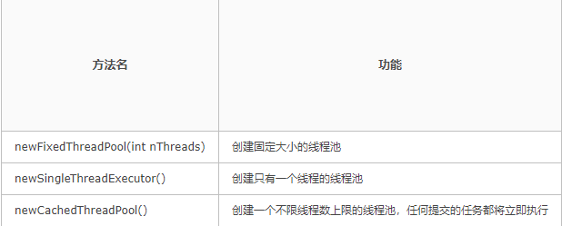

# 多线程之线程池

参考资料：https://www.cnblogs.com/CarpenterLee/p/9558026.html

## Executors创建线程池

## 测试项目

### Process

	public class Process implements  Runnable {
	
	    private String name;
	
	    public Process(String name) {
	        this.name = name;
	    }
	
	    @Override
	    public void run() {
	        System.out.println(name+"运行中");
	    }
	}

### newCachedThreadPool 所有线程立即被执行

	import java.util.concurrent.Executor;
	import java.util.concurrent.ExecutorService;
	import java.util.concurrent.Executors;
	
	public class Test {
	
	    public static void main(String[] args) {
	
	        Thread thread1 = new Thread(new Process("线程1"));
	        Thread thread2 = new Thread(new Process("线程2"));
	        Thread thread3 = new Thread(new Process("线程3"));
	        Thread thread4 = new Thread(new Process("线程4"));
	
	        ExecutorService pool = Executors.newCachedThreadPool();
	        pool.submit(thread1);
	        pool.submit(thread2);
	        pool.submit(thread3);
	        pool.submit(thread4);
	        pool.shutdown();
	
	    }
	
	}

​	
执行结果：

	线程1运行中
	线程2运行中
	线程3运行中
	线程4运行中

所有线程**立即依次**被执行。

### newCachedThreadPool

	import java.util.concurrent.ExecutorService;
	import java.util.concurrent.Executors;
	
	public class Test {
	
	    public static void main(String[] args) {
	
	        Thread thread1 = new Thread(new Process("线程1"));
	        Thread thread2 = new Thread(new Process("线程2"));
	        Thread thread3 = new Thread(new Process("线程3"));
	        Thread thread4 = new Thread(new Process("线程4"));
	
	        ExecutorService pool = Executors.newFixedThreadPool(3);
	        pool.submit(thread1);
	        pool.submit(thread2);
	        pool.submit(thread3);
	        pool.submit(thread4);
	        pool.shutdown();
	
	    }

}

执行结果：

	线程1运行中
	线程2运行中
	线程3运行中
	线程4运行中

乱序被执行，且每次只执行3个线程。

### newSingleThreadExecutor 单线程执行

	import java.util.concurrent.ExecutorService;
	import java.util.concurrent.Executors;
	
	public class Test {
	
	    public static void main(String[] args) {
	
	        Thread thread1 = new Thread(new Process("线程1"));
	        Thread thread2 = new Thread(new Process("线程2"));
	        Thread thread3 = new Thread(new Process("线程3"));
	        Thread thread4 = new Thread(new Process("线程4"));
	
	        ExecutorService pool = Executors.newSingleThreadExecutor();
	        pool.submit(thread1);
	        pool.submit(thread2);
	        pool.submit(thread3);
	        pool.submit(thread4);
	        pool.shutdown();
	
	    }
	
	}

执行后：

	线程1运行中
	线程2运行中
	线程3运行中
	线程4运行中

顺序被执行，且每次只执行1个线程。

## ThreadPoolExecutor构造方法

	import java.util.concurrent.*;
	
	public class Test {
	
	    public static void main(String[] args) {
	
	        Thread thread1 = new Thread(new Process("线程1"));
	        Thread thread2 = new Thread(new Process("线程2"));
	        Thread thread3 = new Thread(new Process("线程3"));
	        Thread thread4 = new Thread(new Process("线程4"));

​	
	        ThreadPoolExecutor threadPoolExecutor = new ThreadPoolExecutor(2, 3, 10, TimeUnit.SECONDS, new LinkedBlockingDeque<>(3));
	        threadPoolExecutor.submit(thread1);
	        threadPoolExecutor.submit(thread2);
	        threadPoolExecutor.submit(thread3);
	        threadPoolExecutor.submit(thread4);
	
	        threadPoolExecutor.shutdown();

​	
	    }
	
	}

构造器内的参数分别为：

    public ThreadPoolExecutor(int corePoolSize,
                              int maximumPoolSize,
                              long keepAliveTime,
                              TimeUnit unit,
                              BlockingQueue<Runnable> workQueue) {

6、 workQueue    使用有界队列，避免OOM

## 三种提交任务的方式

## 获取单个任务结果

	Future<?> r1=threadPoolExecutor.submit(thread1);
	
	r1.isDone();  //判断是否完成

## 使用ExecutorCompletionService

### Process

	import java.util.concurrent.Callable;
	import java.util.concurrent.ThreadPoolExecutor;
	
	public class Process implements Callable {
	
	    private String name;
	
	    public Process(String name) {
	        this.name = name;
	    }

​	
	    @Override
	    public Object call() throws Exception {
	
	        System.out.println(name+"执行中......");
	        return name+"成功！";
	    }
	}

### Test

	import java.util.concurrent.*;
	
	public class Test {
	
	    public static void main(String[] args) throws ExecutionException, InterruptedException {
	
	        ExecutorService service = Executors.newSingleThreadExecutor();
	
	        ExecutorCompletionService<String> ece = new ExecutorCompletionService<String>(service);
	
	        Process process1 = new Process("步骤1");
	        Process process2 = new Process("步骤2");
	        Process process3 = new Process("步骤3");
	
	        //提交所有任务
	        ece.submit(process1);
	        ece.submit(process2);
	        ece.submit(process3);
	
	        //按顺序，获取返回值
	        System.out.println(ece.take().get());
	        System.out.println(ece.take().get());
	        System.out.println(ece.take().get());
	
	    }
	
	}

### 测试结果

	步骤1执行中......
	步骤1成功！
	步骤2执行中......
	步骤2成功！
	步骤3执行中......
	步骤3成功！

由此可知，take().get() 可以获取到Callable返回值。

