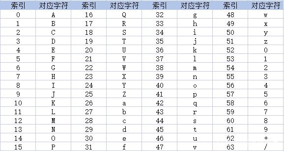

# base64

## 定义

base64是一种传输编码方式，说到底其实就是一种非常简单的转换算法

## 逻辑
先将三个byte（1byte=8bit）的数据转换为ascll码二进制值，按序放入一个24bit的缓冲区中。若数据不足3byte，缓冲区中剩下的bit用0补足。

## 举例

M的ascll码是77，二进制就是01001101，取前六位就是010011=19，19在索引表中对应T，那么就输出T。M剩余的两个bit（01）就和后面的bit结合为六位010110=22，对应W，如此往复。

Base64是一种索引编码，每个字符都对应一个索引，具体的关系图，如下：

