# 红黑树

参考资料：https://www.jianshu.com/p/e136ec79235c

## 定义

红黑树是一种含有红黑结点并能自平衡的二叉查找树。它必须满足下面性质：

- 性质1：每个节点要么是黑色，要么是红色。
- 性质2：根节点是黑色。
- 性质3：每个叶子节点（NIL）是黑色。
- 性质4：每个红色结点的两个子结点一定都是黑色。
- 性质5：任意一结点到每个叶子结点的路径都包含数量相同的黑结点。

从性质5又可以推出：

- 性质5.1：如果一个结点存在黑子结点，那么该结点肯定有两个子结点
图1就是一颗简单的红黑树。其中Nil为叶子结点，并且它是黑色的。(值得提醒注意的是，在Java中，叶子结点是为null的结点。)

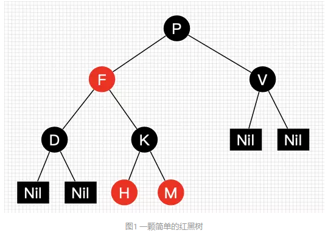

红黑树并不是一个完美平衡二叉查找树，从图1可以看到，根结点P的左子树显然比右子树高，但左子树和右子树的黑结点的层数是相等的，也即任意一个结点到到每个叶子结点的路径都包含数量相同的黑结点(性质5)。所以我们叫红黑树这种平衡为**黑色完美平衡**。

介绍到此，为了后面讲解不至于混淆，我们还需要来约定下红黑树一些结点的叫法，如图2所示

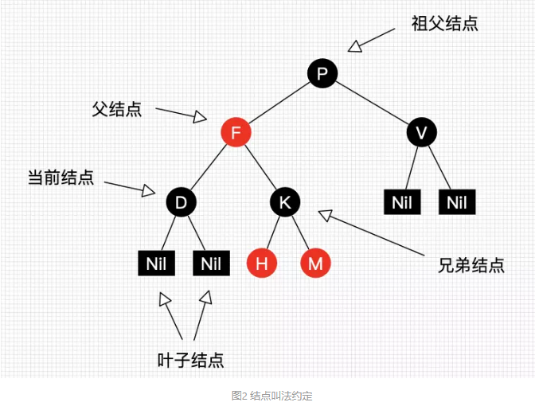

我们把正在处理(遍历)的结点叫做当前结点，如图2中的D，它的父亲叫做父结点，它的父亲的另外一个子结点叫做兄弟结点，父亲的父亲叫做祖父结点。

前面讲到红黑树能自平衡，它靠的是什么？三种操作：左旋、右旋和变色。

- **左旋:**以某个结点作为支点(旋转结点)，其右子结点变为旋转结点的父结点，右子结点的左子结点变为旋转结点的右子结点，左子结点保持不变。如图3。
- **右旋：**以某个结点作为支点(旋转结点)，其左子结点变为旋转结点的父结点，左子结点的右子结点变为旋转结点的左子结点，右子结点保持不变。如图4。
- **变色：**结点的颜色由红变黑或由黑变红。

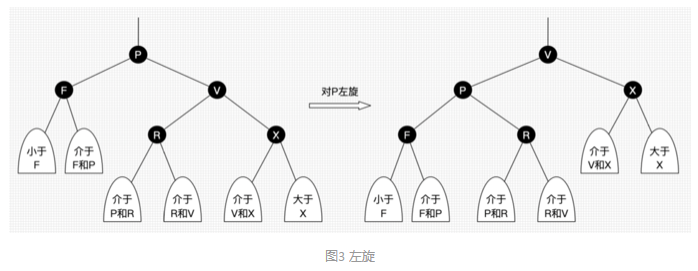

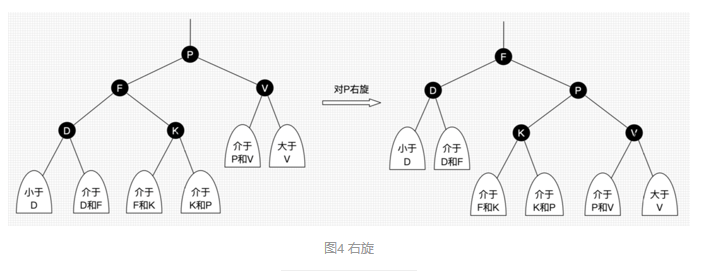

上面所说的旋转结点也即旋转的支点，图4和图5中的P结点。

我们先忽略颜色，可以看到旋转操作不会影响旋转结点的父结点，父结点以上的结构还是保持不变的。

左旋只影响旋转结点和其右子树的结构，把右子树的结点往左子树挪了。

右旋只影响旋转结点和其左子树的结构，把左子树的结点往右子树挪了。

所以旋转操作是局部的。另外可以看出旋转能保持红黑树平衡的一些端详了：当一边子树的结点少了，那么向另外一边子树“借”一些结点；当一边子树的结点多了，那么向另外一边子树“租”一些结点。

但要保持红黑树的性质，结点不能乱挪，还得靠变色了。怎么变？具体情景又不同变法，后面会具体讲到，现在只需要记住红黑树总是通过旋转和变色达到自平衡。

## 红黑树查找

因为红黑树是一颗二叉平衡树，并且查找不会破坏树的平衡，所以查找跟二叉平衡树的查找无异：
从根结点开始查找，把根结点设置为当前结点；

1. 若当前结点为空，返回null；
1. 若当前结点不为空，用当前结点的key跟查找key作比较；
1. 若当前结点key等于查找key，那么该key就是查找目标，返回当前结点；
1. 若当前结点key大于查找key，把当前结点的左子结点设置为当前结点，重复步骤2；
1. 若当前结点key小于查找key，把当前结点的右子结点设置为当前结点，重复步骤2；

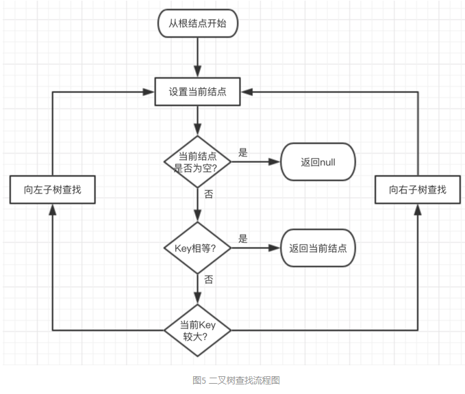

##红黑树插入

插入操作包括两部分工作：一查找插入的位置；二插入后自平衡。查找插入的父结点很简单，跟查找操作区别不大：

1. 从根结点开始查找；
1. 若根结点为空，那么插入结点作为根结点，结束。
1. 若根结点不为空，那么把根结点作为当前结点；
1. 若当前结点为null，返回当前结点的父结点，结束。
1. 若当前结点key等于查找key，那么该key所在结点就是插入结点，更新结点的值，结束。
1. 若当前结点key大于查找key，把当前结点的左子结点设置为当前结点，重复步骤4；
1. 若当前结点key小于查找key，把当前结点的右子结点设置为当前结点，重复步骤4；

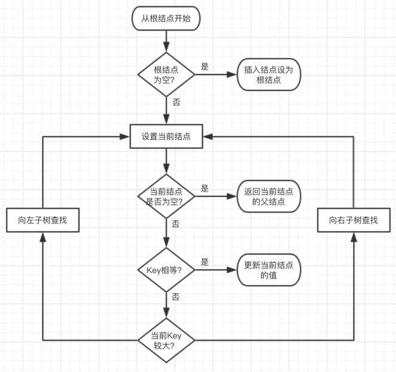

ok，插入位置已经找到，把插入结点放到正确的位置就可以啦，但插入结点是应该是什么颜色呢？答案**是红色**。理由很简单，红色在父结点（如果存在）为黑色结点时，红黑树的黑色平衡没被破坏，不需要做自平衡操作。但如果插入结点是黑色，那么插入位置所在的子树黑色结点总是多1，必须做自平衡。

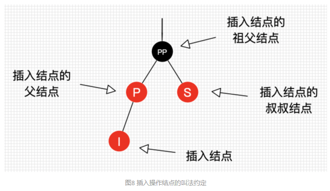

图8的字母并不代表结点Key的大小。I表示插入结点，P表示插入结点的父结点，S表示插入结点的叔叔结点，PP表示插入结点的祖父结点。

好了，下面让我们一个一个来分析每个插入的情景以其处理。

### 插入情景1：红黑树为空树

最简单的一种情景，直接把插入结点作为根结点就行，但注意，根据红黑树性质2：根节点是黑色。还需要把插入结点设为黑色。

####处理：

把插入结点作为根结点，并把结点设置为黑色。

---

### 插入情景2：插入结点的Key已存在

插入结点的Key已存在，既然红黑树总保持平衡，在插入前红黑树已经是平衡的，那么把插入结点设置为将要替代结点的颜色，再把结点的值更新就完成插入。

####处理：

把I设为当前结点的颜色

更新当前结点的值为插入结点的值

---

### 插入情景3：插入结点的父结点为黑结点

由于插入的结点是红色的，当插入结点的黑色时，并不会影响红黑树的平衡，直接插入即可，无需做自平衡。

####处理：

直接插入。

---

### 插入情景4：插入结点的父结点为红结点

再次回想下红黑树的性质2：根结点是黑色。如果插入的父结点为红结点，那么该父结点不可能为根结点，所以插入结点总是存在祖父结点。这点很重要，因为后续的旋转操作肯定需要祖父结点的参与。

情景4又分为很多子情景，下面将进入重点部分，各位看官请留神了。

#### 插入情景4.1：叔叔结点存在并且为红结点

从红黑树性质4可以，祖父结点肯定为黑结点，因为不可以同时存在两个相连的红结点。那么此时该插入子树的红黑层数的情况是：

黑红红。显然最简单的处理方式是把其改为：红黑红。如图9和图10所示。

##### 处理：

将P和S设置为黑色

将PP设置为红色

把PP设置为当前插入结点

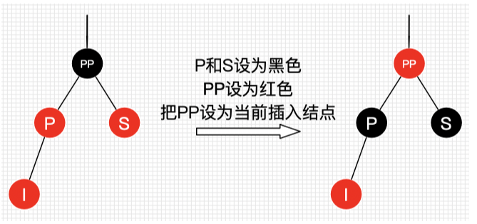

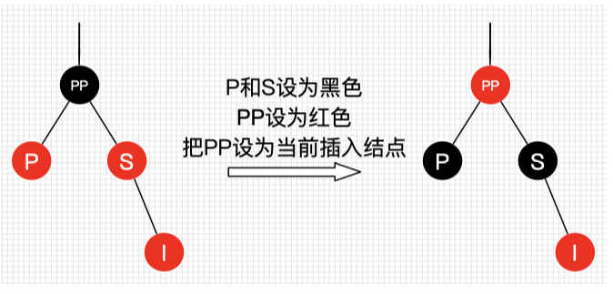

可以看到，我们把PP结点设为红色了，如果PP的父结点是黑色，那么无需再做任何处理；但如果PP的父结点是红色，根据性质4，此时红黑树已不平衡了，所以还需要把PP当作新的插入结点，继续做插入操作自平衡处理，直到平衡为止。

试想下PP刚好为根结点时，那么根据性质2，我们必须把PP重新设为黑色，那么树的红黑结构变为：黑黑红。换句话说，从根结点到叶子结点的路径中，黑色结点增加了。这也是唯一一种会增加红黑树黑色结点层数的插入情景。

我们还可以总结出另外一个经验：**红黑树的生长是自底向上的。这点不同于普通的二叉查找树，普通的二叉查找树的生长是自顶向下的。**

####　插入情景4.2：叔叔结点不存在或为黑结点，并且插入结点的父亲结点是祖父结点的左子结点

单纯从插入前来看，也即不算情景4.1自底向上处理时的情况，叔叔结点非红即为叶子结点(Nil)。因为如果叔叔结点为黑结点，而父结点为红结点，那么叔叔结点所在的子树的黑色结点就比父结点所在子树的多了，这不满足红黑树的性质5。后续情景同样如此，不再多做说明了。

前文说了，需要旋转操作时，肯定一边子树的结点多了或少了，需要租或借给另一边。插入显然是多的情况，那么把多的结点租给另一边子树就可以了

插入情景4.2.1：插入结点是其父结点的左子结点

##### 处理：

将P设为黑色

将PP设为红色

对PP进行右旋

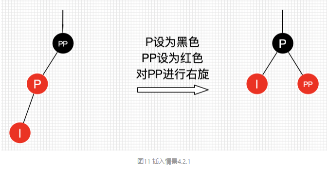

由图11可得，左边两个红结点，右边不存在，那么一边一个刚刚好，并且因为为红色，肯定不会破坏树的平衡。

咦，可以把P设为红色，I和PP设为黑色吗？答案是可以！看过《算法：第4版》的同学可能知道，书中讲解的就是把P设为红色，I和PP设为黑色。但把P设为红色，显然又会出现情景4.1的情况，需要自底向上处理，做多了无谓的操作，既然能自己消化就不要麻烦祖辈们啦～

#### 插入情景4.2.2：插入结点是其父结点的右子结点

种情景显然可以转换为情景4.2.1，如图12所示，不做过多说明了。

#####处理：

对P进行左旋

把P设置为插入结点，得到情景4.2.1

进行情景4.2.1的处理

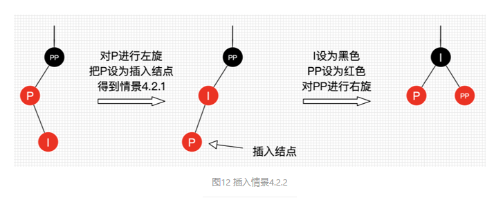

### 插入情景4.3：叔叔结点不存在或为黑结点，并且插入结点的父亲结点是祖父结点的右子结点

该情景对应情景4.2，只是方向反转，不做过多说明了，直接看图。

插入情景4.3.1：插入结点是其父结点的右子结点

##### 处理：

将P设为黑色

将PP设为红色

对PP进行左旋

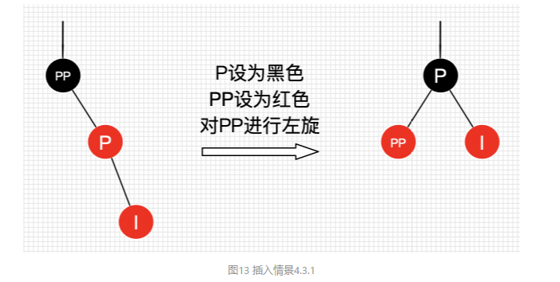

### 插入情景4.3.2：插入结点是其父结点的右子结点

处理：

对P进行右旋

把P设置为插入结点，得到情景4.3.1

进行情景4.3.1的处理

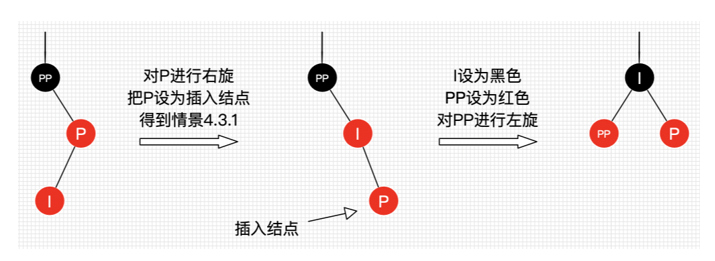

## 红黑树删除

红黑树的删除操作也包括两部分工作：一查找目标结点；而删除后自平衡。查找目标结点显然可以复用查找操作，当不存在目标结点时，忽略本次操作；当存在目标结点时，删除后就得做自平衡处理了。删除了结点后我们还需要找结点来替代删除结点的位置，不然子树跟父辈结点断开了，除非删除结点刚好没子结点，那么就不需要替代。

二叉树删除结点找替代结点有3种情情景：

- 情景1：若删除结点无子结点，直接删除
- 情景2：若删除结点只有一个子结点，用子结点替换删除结点
- 情景3：若删除结点有两个子结点，用后继结点（大于删除结点的最小结点）替换删除结点

补充说明下，情景3的后继结点是大于删除结点的最小结点，也是删除结点的右子树种最左结点。那么可以拿前继结点（删除结点的左子树最左结点）替代吗？可以的。但习惯上大多都是拿后继结点来替代，后文的讲解也是用后继结点来替代。另外告诉大家一种找前继和后继结点的直观的方法（不知为何没人提过，大家都知道？）：**把二叉树所有结点投射在X轴上，所有结点都是从左到右排好序的，所有目标结点的前后结点就是对应前继和后继结点。**如图16所示。

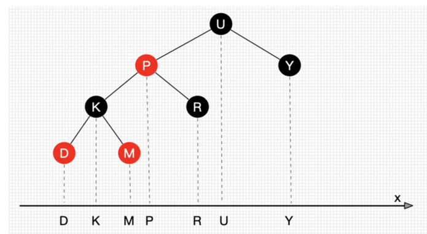

接下来，讲一个重要的思路：**删除结点被替代后，在不考虑结点的键值的情况下，对于树来说，可以认为删除的是替代结点！**话很苍白，我们看图17。在不看键值对的情况下，图17的红黑树最终结果是删除了Q所在位置的结点！这种思路非常重要，大大简化了后文讲解红黑树删除的情景！

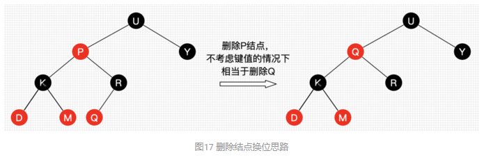

(未完待续)