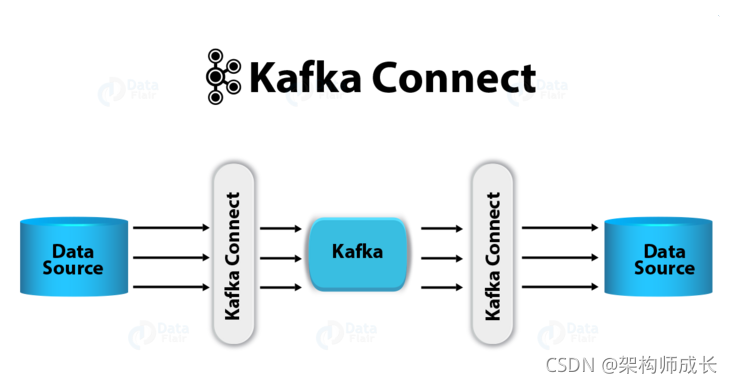

# Kafka Connect使用教程

https://blog.csdn.net/sinat_39809957/article/details/121017220

## kafka connect是什么

根据官方介绍，Kafka Connect是一种用于在Kafka和其他系统之间可扩展的、可靠的流式传输数据的工具。它使得能够快速定义将大量数据集合移入和移出Kafka的连接器变得简单。 Kafka Connect可以获取整个数据库或从所有应用程序服务器收集指标到Kafka主题，使数据可用于低延迟的流处理。导出作业可以将数据从Kafka topic传输到二次存储和查询系统，或者传递到批处理系统以进行离线分析。

* Kafka connector是一种处理数据的通用框架：kafka连接器制定了一种标准，用来约束kafka系统与其他系统的集成，简化了kafka连接器的开发、部署和管理过程。
* 同时支持分布式模式和单机模式：kafka连接器支持两种模式，既能扩展到支持大型集群，也可以缩小到开发和测试小规模的集群。
* 提供REST 接口：使用REST API来提交请求并管理kafka集群。
* 自动化的offset管理：通过连接器的少量信息，kafka连接器可以自动管理偏移量，开发人员不必担心错误处理的影响。
* 分布式和可扩展：kafka连接器建立在现有的组管理协议基础上，可以通过添加更多的连接器实例来实现水平扩展，实现分布式服务。
* 流/批处理集成：利用kafka系统已有的能力，kafka连接器是桥接数据流和批处理系统的一种理想解决方案。

## kafka connect如何工作

(待续)