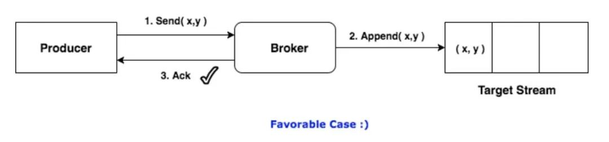

# Kafka 幂等性

在正常情况下，Producer向Broker投递消息，Broker将消息追加写到对应的流（即某一Topic的某一Partition）中，并向Producer返回ACK信号，表示确认收到。

但是Producer和Broker之间的通信总有可能出现异常，如果消息已经写入，但ACK在半途丢失了，Producer就会再次发送该消息，造成重复。

## 方法一：application.yml中增加enable.idempotence: true

0.11版本引入幂等性之后

	server:
	  port: 8888
	spring:
	  kafka:
	    producer:
	      bootstrap-servers: 47.112.142.231:9092 #服务器ip+端口
	      properties:
	        enable.idempotence: true

## 方法二：为producer增加pid

为了实现Producer的幂等性，Kafka引入了Producer ID（即PID）和Sequence Number。在后续插入redis或者数据库的时候采用唯一索引可以去重。

