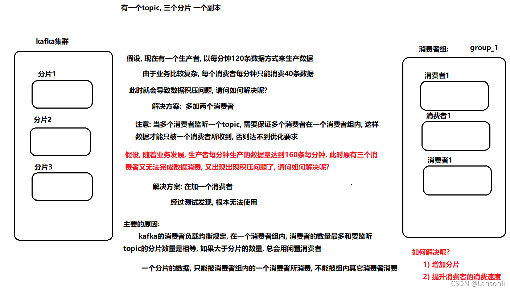
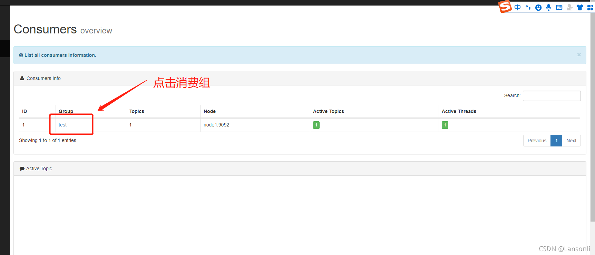
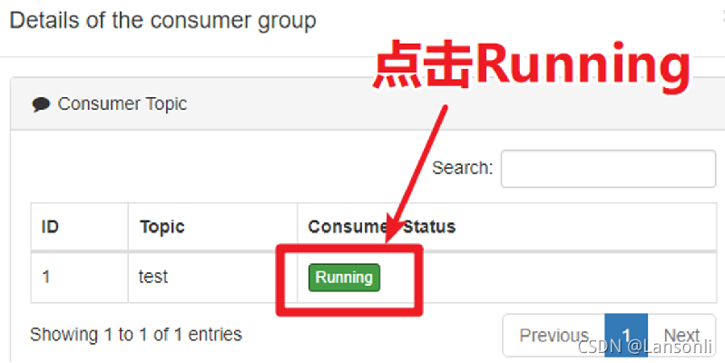
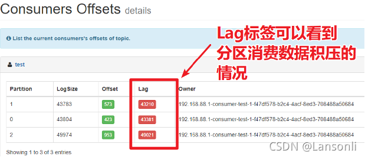

# Kafka的消费者负载均衡机制和数据积压问题

## 核心问题描述

消费者的数量最多和要监听topic的分片数量是相等的。如果大于分片数量，则会闲置消费者。

## kafka的消费者负载均衡机制

请问如何通过kafka模拟点对点和发布订阅模式呢?

* 点对点: 让所有监听这个topic的消费者, 都属于同一个消费者组即可或者监听这个topic消费者, 保证唯一
* 发布订阅:定义多个消费者, 让多个消费者属于不同组即可

## 数据积压问题

Kafka消费者消费数据的速度是非常快的，但如果由于处理Kafka消息时，由于有一些外部IO、或者是产生网络拥堵，就会造成Kafka中的数据积压（或称为数据堆积）。如果数据一直积压，会导致数据出来的实时性受到较大影响。

### 第一步: 使用kafka-eagle查看数据积压情况

### 第二步: 解决数据积压问题

####出现积压的原因:  

* 因为数据写入目的容器失败,从而导致消费失败
* 因为网络延迟消息消费失败
* 消费逻辑过于复杂, 导致消费过慢,出现积压问题

####解决方案:

* 对于第一种, 我们常规解决方案, 处理目的容器,保证目的容器是一直可用状态
* 对于第二种, 如果之前一直没问题, 只是某一天出现, 可以调整消费的超时时间
* 对于第三种, 一般解决方案,调整消费代码, 消费更快即可, 利于消费者的负载均衡策略,提升消费者数量