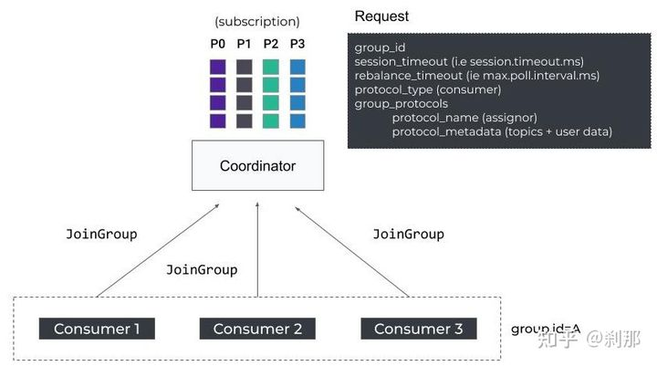
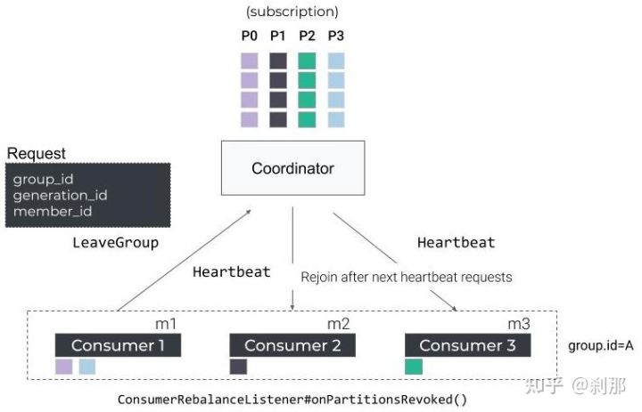
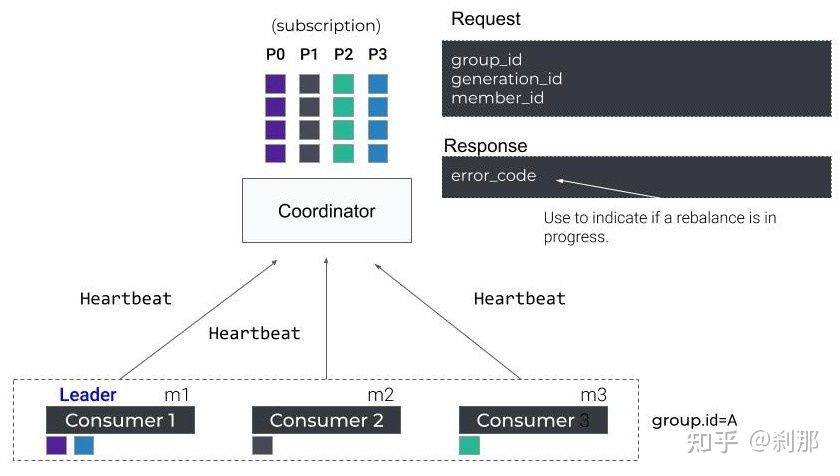
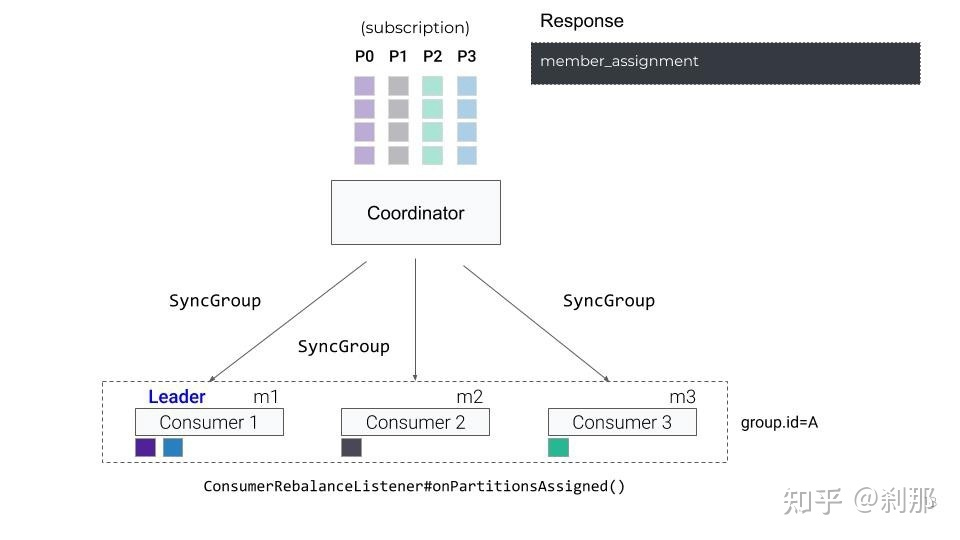

# kafka的rebalance机制

## 原理

###组成员发生变更

(1. 新consumer加入组、2. 已有consumer主动离开组或已有consumer崩溃了)

注意：Fetch线程执行时间不能过长，假如超过max.poll.interval.ms，则Consumer会发出leave group请求，导致Kafka coordinator进行rebalance操作

Client被动被rebalance：Consumer节点heartbeat时间超过session timeout，则会触发Kafka broker进行rebalance操作

### 订阅topic分区数发生变更

订阅topic的partition数发生变更

### 订阅topic个数发生变化

## 线上问题

rebalance时，kafka会重新consumer分配的partition,有些consumer会离线，有些consumer接管其他consumer的partition, 表面的现象就是一直有消费者离线

* java程序虚拟机内存配置过小：在内存数据被撑满以后，jvm会进行gc，频繁的gc尤其是full gc会导致工作线程被长时间停止，心跳线程无法工作，导致没有在超时时间内发送，被动rebalance
* hbase region server压力过大：之前java程序在接收kafka消息时，会向hbase写入数据。案发时hbase region server存在问题，导致hbase client写入时 ，占用的cpu过高，导致consumer没有在超时时间内发送心跳信息，被动rebalance
* SparkStreaming kafka消息积压：查询日志如下

	Container [pid=6263,containerID=container_1494900155967_0001_02_000001] is running beyondphysical memorylimits. Current usage: 2.5GB of 2.5 GB physical memory used; 4.5 GB of 5.3 GB virtual memory used. Killing container.  
	
### 解决方法：

调整driver和executor内存

	--conf spark.yarn.driver.memoryOverhead
	--conf spark.yarn.executor.memoryOverhead
	--spark.driver.memroy
	--spark.executor.memory

开启Spark推测执行(仅作为保护机制)

	--conf "spark.speculation=true" \
	--conf "spark.speculation.quantile=0.90" \
	--conf "spark.speculation.interval=100ms" \
	--conf "spark.speculation.multiplier=4" \

分析程序内存泄露的原因，后来分析是因为redis穿透引起的问题。
