# Keycloak与Spring boot整合

参考：https://blog.csdn.net/q64261750/article/details/108263280

## 需求说明

假设有一个Spring Boot微服务：

名为：ms-content-sample

首页是http://localhost:8081

它有个路径http://localhost:8081/articles ，只有user-role 角色的用户才能访问，test-role 角色的用户不允许访问。

## 准备工作

### 创建Realm

首先，我们需要创建一个Realm。Realm是一个隔离的概念，Realm A中的用户与Realm B中的用户完全隔离。当然，也可以不创建Realm，直接用 Master 这个Realm，不过一般来说，为了资源的隔离，以及更好的安全性不太建议与管理员共用Realm。

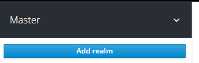

输入Realm名称，这里，如图所示，我们创建了一个名为realm 的Realm。

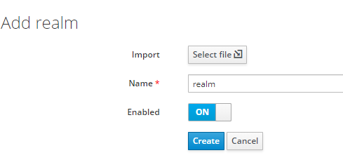

### 修改访问限制

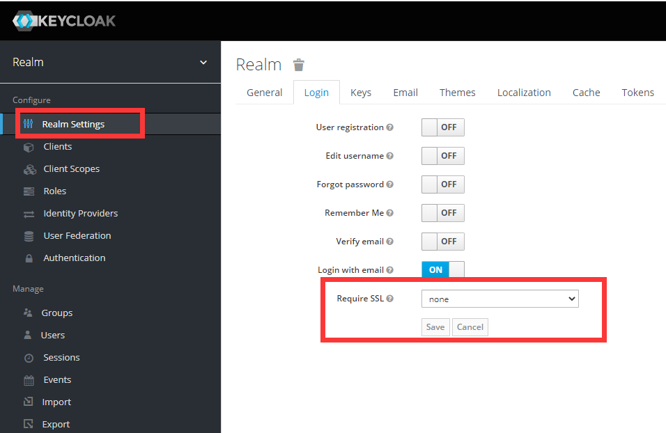

将require SSL 修改为 none 

###创建Client

创建完realm后，我们来为ms-content-sample 创建Client ，点击下图的Create按钮。

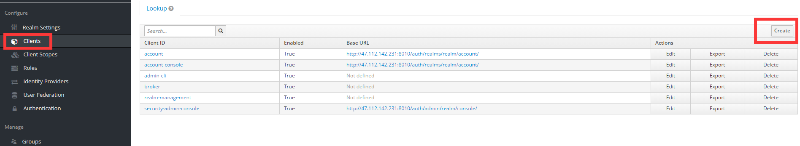

填写Client信息，这边我们创建一个名为ms-content-sample 的Client。

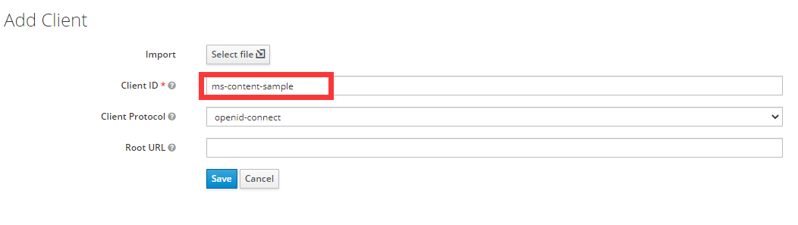

### 设置Client

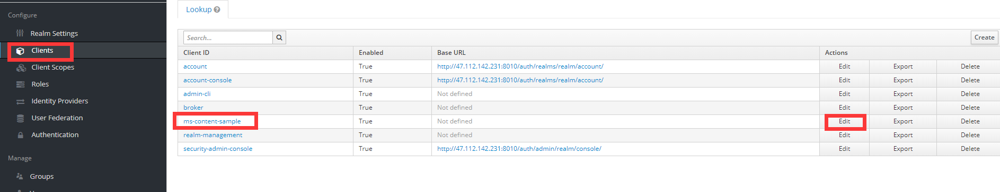

设置Client

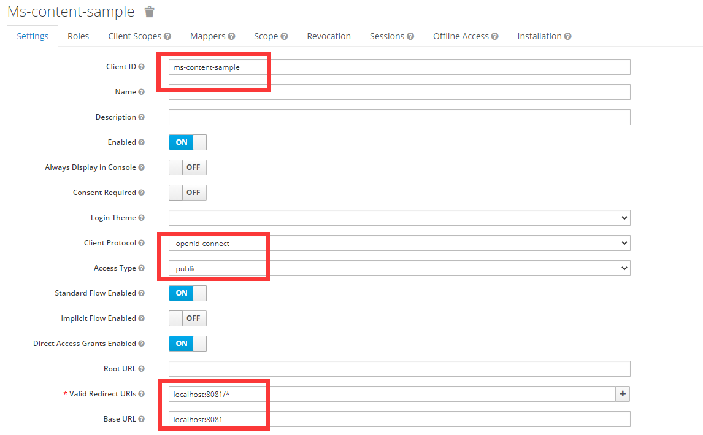

	Valid Redirect URIs：  http://47.112.142.231:8010/*
	
	Base URL： http://47.112.142.231:8010

如图，我们配置了Access Type为public，配置了Valid Redirect URLS，这是认证成功后跳转到的页面地址，其中我们使用了通配符；配置了Base URL，一般配置成微服务首页即可。

### 创建角色

创建了两个角色，user-role 以及test-role 

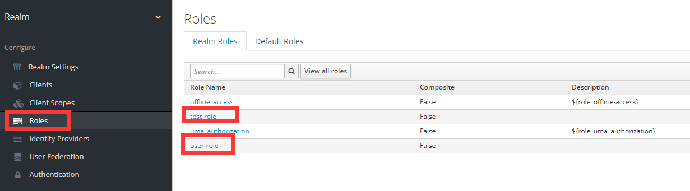

### 创建用户并分配角色

#### 创建用户

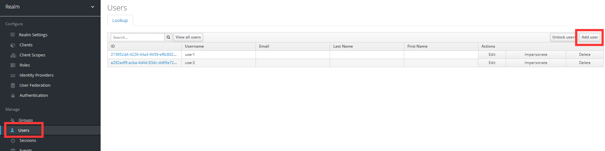

#### 分配角色

为user1用户分配user-role角色；为user2用户分配test-role角色。

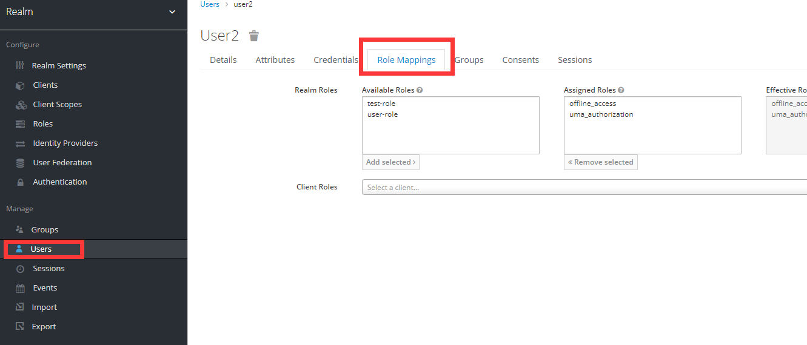

#### 为用户设置登录密码

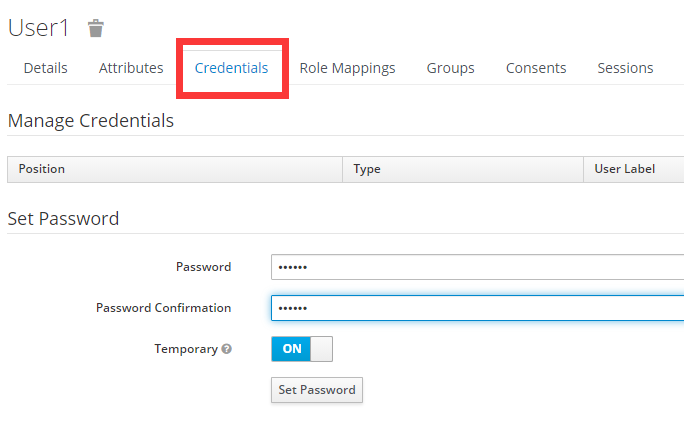

给user1设置111111，user2设置222222

## 测试代码

### pom

	<?xml version="1.0" encoding="UTF-8"?>
	<project xmlns="http://maven.apache.org/POM/4.0.0" xmlns:xsi="http://www.w3.org/2001/XMLSchema-instance"
	         xsi:schemaLocation="http://maven.apache.org/POM/4.0.0 https://maven.apache.org/xsd/maven-4.0.0.xsd">
	    <modelVersion>4.0.0</modelVersion>
	    <parent>
	        <groupId>org.springframework.boot</groupId>
	        <artifactId>spring-boot-starter-parent</artifactId>
	        <version>2.4.3</version>
	        <relativePath/> <!-- lookup parent from repository -->
	    </parent>
	    <groupId>com.wzy</groupId>
	    <artifactId>springboot_keycloak</artifactId>
	    <version>0.0.1-SNAPSHOT</version>
	    <name>springboot_keycloak</name>
	    <description>Demo project for Spring Boot</description>
	    <properties>
	        <java.version>1.8</java.version>
	    </properties>
	
	
	    <dependencies>
	
	        <dependency>
	            <groupId>org.springframework.boot</groupId>
	            <artifactId>spring-boot-starter-test</artifactId>
	            <scope>test</scope>
	        </dependency>
	
	        <dependency>
	            <groupId>org.keycloak</groupId>
	            <artifactId>keycloak-spring-boot-starter</artifactId>
	            <version>12.0.3</version>
	        </dependency>
	
	        <dependency>
	            <groupId>org.springframework.boot</groupId>
	            <artifactId>spring-boot-starter-web</artifactId>
	        </dependency>
	
	    </dependencies>
	
	
	    <build>
	        <plugins>
	            <plugin>
	                <groupId>org.springframework.boot</groupId>
	                <artifactId>spring-boot-maven-plugin</artifactId>
	            </plugin>
	        </plugins>
	    </build>
	
	</project>

### testController

	package com.wzy.springboot_keycloak;
	
	import org.springframework.web.bind.annotation.GetMapping;
	import org.springframework.web.bind.annotation.RestController;
	
	
	@RestController
	public class testController {
	
	    @GetMapping("/test")
	    public String test() {
	
	    return "11";
	    }
	
	}

### application.yml

	keycloak:
	  # 表示是一个public的client
	  public-client: true
	  # keycloak的地址
	  auth-server-url: http://47.112.142.231:8010/auth/
	  # keycloak中的realm
	  realm: realm
	  resource: ms-content-sample
	  securityConstraints:
	    - authRoles:
	        # 以下路径需要user-role角色才能访问
	        - user-role
	      securityCollections:
	        # name可以随便写
	        - name: user-role-mappings
	          patterns:
	            - /test
	server:
	  port: 8081
