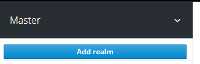
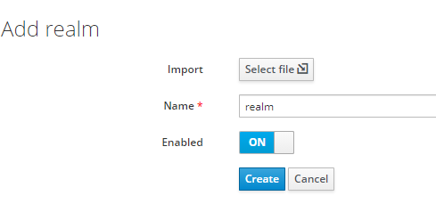
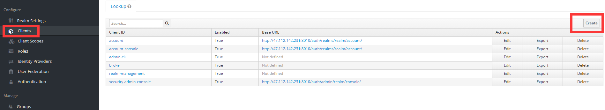
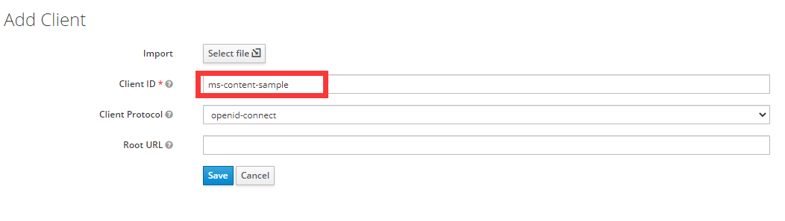
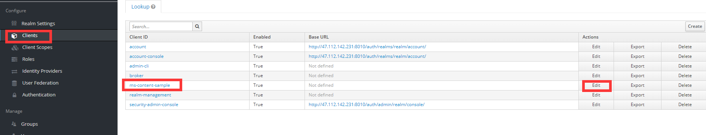
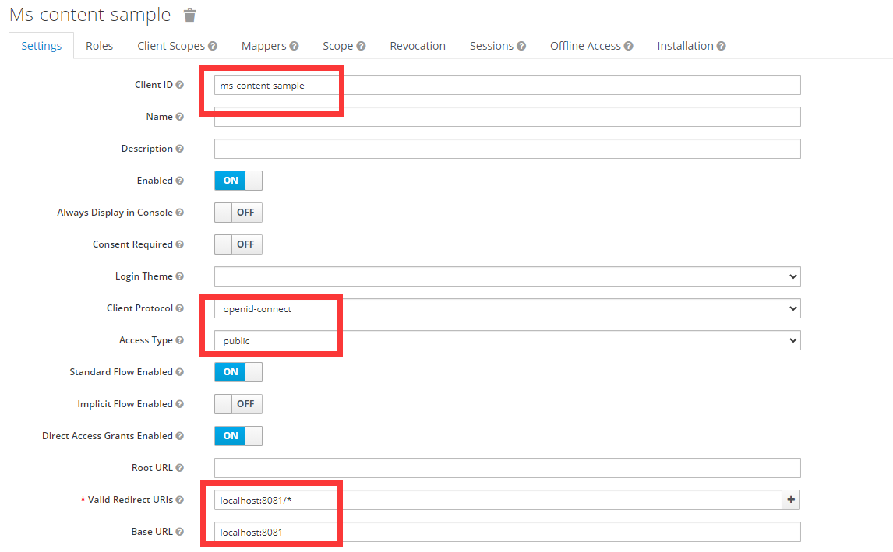
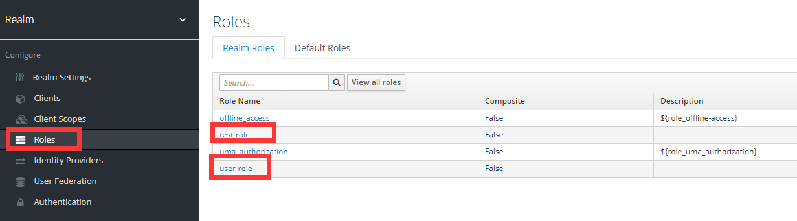
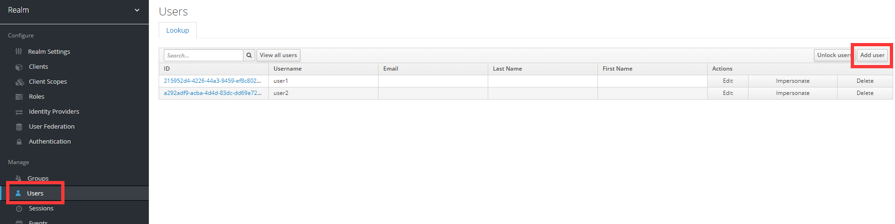
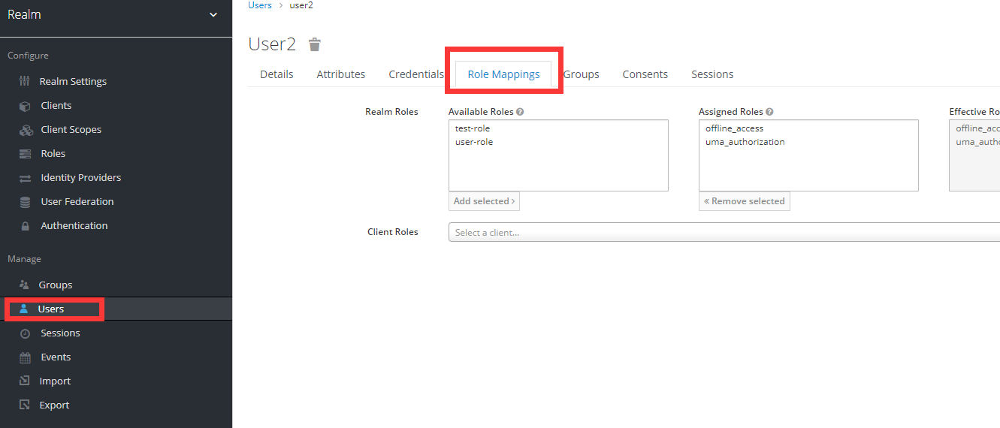
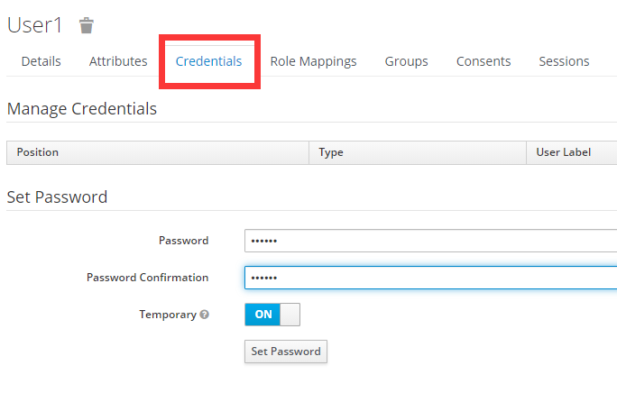

# Keyloak与Spring boot整合

参考：https://blog.csdn.net/q64261750/article/details/108263280

## 需求说明

假设有一个Spring Boot微服务：

名为：ms-content-sample

首页是http://localhost:8081

它有个路径http://localhost:8081/articles ，只有user-role 角色的用户才能访问，test-role 角色的用户不允许访问。

## 准备工作

### 创建Realm

首先，我们需要创建一个Realm。Realm是一个隔离的概念，Realm A中的用户与Realm B中的用户完全隔离。当然，也可以不创建Realm，直接用 Master 这个Realm，不过一般来说，为了资源的隔离，以及更好的安全性不太建议与管理员共用Realm。

输入Realm名称，这里，如图所示，我们创建了一个名为realm 的Realm。

###创建Client

创建完realm后，我们来为ms-content-sample 创建Client ，点击下图的Create按钮。

填写Client信息，这边我们创建一个名为ms-content-sample 的Client。

### 设置Client

设置Client

	Valid Redirect URIs：  http://localhost:8081/*
	
	Base URL： http://localhost:8081

如图，我们配置了Access Type为public，配置了Valid Redirect URLS，这是认证成功后跳转到的页面地址，其中我们使用了通配符；配置了Base URL，一般配置成微服务首页即可。

### 创建角色

创建了两个角色，user-role 以及test-role 

### 创建用户并分配角色

#### 创建用户

#### 分配角色

为user1用户分配user-role角色；为user2用户分配test-role角色。

#### 为用户设置登录密码

给user1设置111111，user2设置222222
