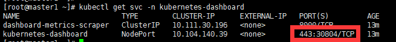

# K8S 搭建 Mysql主从

参考：https://zhuanlan.zhihu.com/p/113003682

## 版本

kubernetes: 1.17.3
mysql: 5.7

## yaml文件

### 创建mysql-master-rc.yaml文件

	vi mysql-master-rc.yaml 

插入：

	apiVersion: v1
	kind: ReplicationController
	metadata:
	  name: mysql-master-rc
	  namespace: mysql-space
	  labels:
	    name: mysql-master-rc
	spec:
	  replicas: 1
	  selector:
	    name: mysql-master-pod
	  template:
	    metadata:
	      labels: 
	        name: mysql-master-pod #该pod拥有的标签，对应上面的spec.selector.name，否则匹配不上
	    spec:
	      containers:
	      - name: mysql
	        image: mysql:5.7
	        imagePullPolicy: IfNotPresent
	        ports:
	        - containerPort: 3306
	        env:
	        - name: MYSQL_ROOT_PASSWORD
	          value: "root"
	        - name: MYSQL_REPLICATION_USER  
	          value: "repl"
	        - name: MYSQL_REPLICATION_PASSWORD  
	          value: "repl123" 
	        args:
	        - --log-bin=mysql-bin
	        - --binlog-ignore-db=mysql
	        - --server-id=1001
	        - --symbolic-links=0
	        - --sql_mode=STRICT_TRANS_TABLES,NO_ZERO_IN_DATE,NO_ZERO_DATE,ERROR_FOR_DIVISION_BY_ZERO,NO_AUTO_CREATE_USER,NO_ENGINE_SUBSTITUTION

### 创建mysql-master-svc.yaml

	vi mysql-master-svc.yaml

插入：

	apiVersion: v1
	kind: Service
	metadata:
	  name: mysql-master-svc
	  namespace: mysql-space
	  labels: 
	    name: mysql-master-svc
	spec:
	  type: NodePort
	  ports:
	  - port: 3306
	    protocol: TCP
	    targetPort: 3306
	    name: http
	    nodePort: 32306
	  selector:
	    name: mysql-master-pod

### 创建 mysql-slave-rc.yaml

	vi mysql-slave-rc.yaml 

插入：

	apiVersion: v1
	kind: ReplicationController
	metadata:
	  name: mysql-slave-rc
	  namespace: mysql-space
	  labels:
	    name: mysql-slave-rc
	spec:
	  replicas: 1
	  selector:
	    name: mysql-slave-pod
	  template:
	    metadata:
	      labels: 
	        name: mysql-slave-pod
	    spec:
	      containers:
	      - name: mysql
	        image: mysql:5.7
	        imagePullPolicy: IfNotPresent
	        ports:
	        - containerPort: 3306
	        env:
	        - name: MYSQL_ROOT_PASSWORD  
	          value: "root"  
	        - name: MYSQL_REPLICATION_USER  
	          value: "repl"  
	        - name: MYSQL_REPLICATION_PASSWORD  
	          value: "repl123"  
	        args:
	        - --server-id=2001
	        - --symbolic-links=0
	        - --sql_mode=STRICT_TRANS_TABLES,NO_ZERO_IN_DATE,NO_ZERO_DATE,ERROR_FOR_DIVISION_BY_ZERO,NO_AUTO_CREATE_USER,NO_ENGINE_SUBSTITUTION
	        - --default-authentication-plugin=mysql_native_password

### 创建mysql-slave-svc.yaml

	vi mysql-slave-svc.yaml

插入

	apiVersion: v1
	kind: Service
	metadata:
	  name: mysql-slave-svc
	  namespace: mysql-space
	  labels: 
	    name: mysql-slave-svc
	spec:
	  type: NodePort
	  ports:
	  - port: 3306
	    protocol: TCP
	    targetPort: 3306
	    name: http
	    nodePort: 32307
	  selector:
	    name: mysql-slave-pod

##  创建namespace

	kubectl create namespace mysql-space

## 分别创建mysql master slave服务

	 kubectl create -f  mysql-master-rc.yaml
	 kubectl create -f  mysql-master-svc.yaml
	 kubectl create -f  mysql-slave-rc.yaml
	 kubectl create -f  mysql-slave-svc.yaml

## 验证服务是否正常

	kubectl get pod -n mysql-space

验证：

	[root@master1 ~]# kubectl get pod -n mysql-space
	NAME                    READY   STATUS    RESTARTS   AGE
	mysql-master-rc-dpvs8   1/1     Running   0          2m14s
	mysql-slave-rc-mgp4h    1/1     Running   0          113s

## 进入master给slave库授权

	kubectl exec -ti -n mysql-space mysql-master-rc-dpvs8 -- mysql -u root -proot

	
	mysql> GRANT REPLICATION SLAVE ON *.* to 'repl'@'%' IDENTIFIED  by 'repl123';
	
	mysql> show master status;
	+------------------+----------+--------------+------------------+-------------------+
	| File             | Position | Binlog_Do_DB | Binlog_Ignore_DB | Executed_Gtid_Set |
	+------------------+----------+--------------+------------------+-------------------+
	| mysql-bin.000003 |      437 |              | mysql            |                   |
	+------------------+----------+--------------+------------------+-------------------+
	1 row in set (0.00 sec)

## 进入slave库启动同步功能

下面的master_host参考上图中红框中

进入slave 

	kubectl exec -ti -n mysql-space mysql-slave-rc-mgp4h -- mysql -u root -proot

	mysql> change master to master_host='mysql-master-svc.mysql-space',master_user='repl',master_password='repl123',master_log_file='mysql-bin.000003',master_log_pos=437 ;

	mysql>  start slave;

	#查看状态是否正常，如果没有错误信息，那就ok
	show slave status \G; 

显示：

	mysql> show slave status \G; 
	*************************** 1. row ***************************
	               Slave_IO_State: Waiting for master to send event
	                  Master_Host: mysql-master-svc.mysql-space
	                  Master_User: repl
	                  Master_Port: 3306
	                Connect_Retry: 60
	              Master_Log_File: mysql-bin.000003
	          Read_Master_Log_Pos: 437
	               Relay_Log_File: mysql-slave-rc-mgp4h-relay-bin.000002
	                Relay_Log_Pos: 320
	        Relay_Master_Log_File: mysql-bin.000003
	             Slave_IO_Running: Yes
	            Slave_SQL_Running: Yes
	              Replicate_Do_DB: 
	          Replicate_Ignore_DB: 
	           Replicate_Do_Table: 
	       Replicate_Ignore_Table: 
	      Replicate_Wild_Do_Table: 
	  Replicate_Wild_Ignore_Table: 
	                   Last_Errno: 0
	                   Last_Error: 
	                 Skip_Counter: 0
	          Exec_Master_Log_Pos: 437
	              Relay_Log_Space: 542
	              Until_Condition: None
	               Until_Log_File: 
	                Until_Log_Pos: 0
	           Master_SSL_Allowed: No
	           Master_SSL_CA_File: 
	           Master_SSL_CA_Path: 
	              Master_SSL_Cert: 
	            Master_SSL_Cipher: 
	               Master_SSL_Key: 
	        Seconds_Behind_Master: 0
	Master_SSL_Verify_Server_Cert: No
	                Last_IO_Errno: 0
	                Last_IO_Error: 
	               Last_SQL_Errno: 0
	               Last_SQL_Error: 
	  Replicate_Ignore_Server_Ids: 
	             Master_Server_Id: 1001
	                  Master_UUID: 22e15a88-9451-11ea-90c1-2ad5e6135ddc
	             Master_Info_File: /var/lib/mysql/master.info
	                    SQL_Delay: 0
	          SQL_Remaining_Delay: NULL
	      Slave_SQL_Running_State: Slave has read all relay log; waiting for more updates
	           Master_Retry_Count: 86400
	                  Master_Bind: 
	      Last_IO_Error_Timestamp: 
	     Last_SQL_Error_Timestamp: 
	               Master_SSL_Crl: 
	           Master_SSL_Crlpath: 
	           Retrieved_Gtid_Set: 
	            Executed_Gtid_Set: 
	                Auto_Position: 0
	         Replicate_Rewrite_DB: 

## 验证

### 进入Master

	kubectl exec -ti -n mysql-space mysql-master-rc-dpvs8 -- mysql -u root -proot

### 进入Slave

	kubectl exec -ti -n mysql-space mysql-slave-rc-mgp4h -- mysql -u root -proot

### 在Master和Slave中操作

	show databases;

### 在master操作

	create database test
	show databases;

### 在slave操作

	show databases;

发现有test 数据库存在即表示同步成功

	
	

