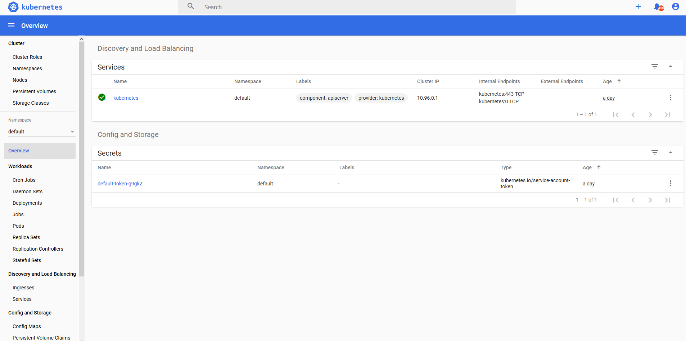

# kubernetes之service负载均衡实现

参考：https://zhuanlan.zhihu.com/p/114001441

**Service可以多个相同功能的pod提供统一的入口地址，并将请求负载均衡到各个pod容器上。下面以mysql实现个简单的例子（当然生产中不能这样部署mysql，一个容器挂了就好丢数据）**

## 版本

	kubernetes: 1.17.3
	mysql: 5.7

## 配置yaml文件

rc的副本数replicas是两个，代表两个同功能的pod容器，如果要在一个文件配置多个kind，用--- 分割

	vi mysql-loadblance.yaml                

插入：

	# ------------------- rc ------------------- #
	
	apiVersion: v1
	kind: ReplicationController
	metadata:
	  name: mysql-balance-rc
	  namespace: mysql-space
	  labels:
	    name: mysql-balance-rc
	spec:
	  replicas: 2
	  selector:
	    name: mysql-balance-pod
	  template:
	    metadata:
	      labels: 
	        name: mysql-balance-pod
	    spec:
	      containers:
	      - name: mysql
	        image: mysql:5.7
	        imagePullPolicy: IfNotPresent
	        ports:
	        - containerPort: 3308
	        env:
	        - name: MYSQL_ROOT_PASSWORD
	          value: "mysql123"
	
	---
	# ------------------- Service ------------------- #
	apiVersion: v1
	kind: Service
	metadata:
	  name: mysql-balance-svc
	  namespace: mysql-space
	  labels:
	    name: mysql-balance-svc
	spec:
	  type: NodePort
	  ports:
	  - port: 3308
	    protocol: TCP
	    targetPort: 3306
	  selector:
	    name: mysql-balance-pod

##  创建

	kubectl create -f mysql-loadblance.yaml

### 验证是否成功

	[root@master1 ~]# kubectl get pod -n mysql-space
	NAME                     READY   STATUS    RESTARTS   AGE
	mysql-balance-rc-72br4   1/1     Running   0          8s
	mysql-balance-rc-zzc8j   1/1     Running   0          8s

	[root@master1 ~]# kubectl get rc -n mysql-space 
	NAME               DESIRED   CURRENT   READY   AGE
	mysql-balance-rc   2         2         2       46s

	[root@master1 ~]# kubectl get svc -n mysql-space
	NAME                TYPE       CLUSTER-IP       EXTERNAL-IP   PORT(S)          AGE
	mysql-balance-svc   NodePort   10.103.230.105   <none>        3308:31862/TCP   68s

###通过servce暴露出来的端口访问mysql

使用navicat：

主机ip： 宿主机ip

端口：get svc -n mysql-space 得到的

创建database： loadbalancer

### 分别进入pod

	kubectl exec -ti -n mysql-space mysql-balance-rc-72br4  -- mysql -u root -pmysql123 
	kubectl exec -ti -n mysql-space mysql-balance-rc-zzc8j  -- mysql -u root -pmysql123 

#### pod1

	mysql> show databases;
	+--------------------+
	| Database           |
	+--------------------+
	| information_schema |
	| mysql              |
	| performance_schema |
	| sys                |
	+--------------------+

#### pod2

	mysql> show databases;
	+--------------------+
	| Database           |
	+--------------------+
	| information_schema |
	| loadbalancer       |
	| mysql              |
	| performance_schema |
	| sys                |
	+--------------------+

可以看到pod2里面有loadbalancer数据库了。

通过上面显示service负载均衡到pod1中，如果把pod1的容器删除，则数据会删除，本文只是个例子

	

