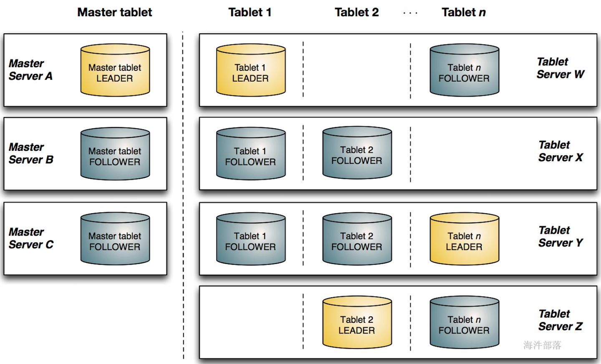
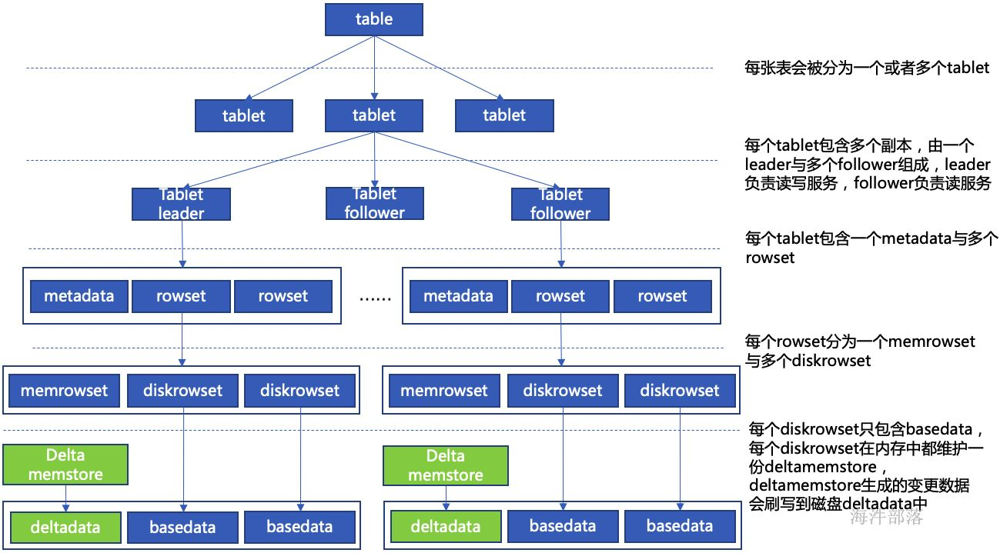
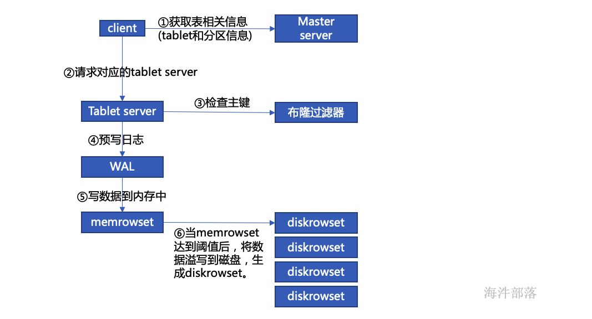
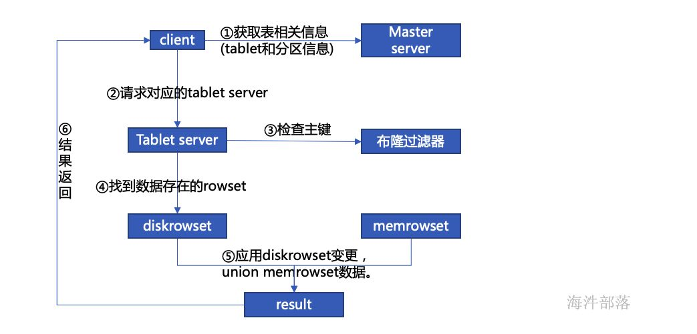
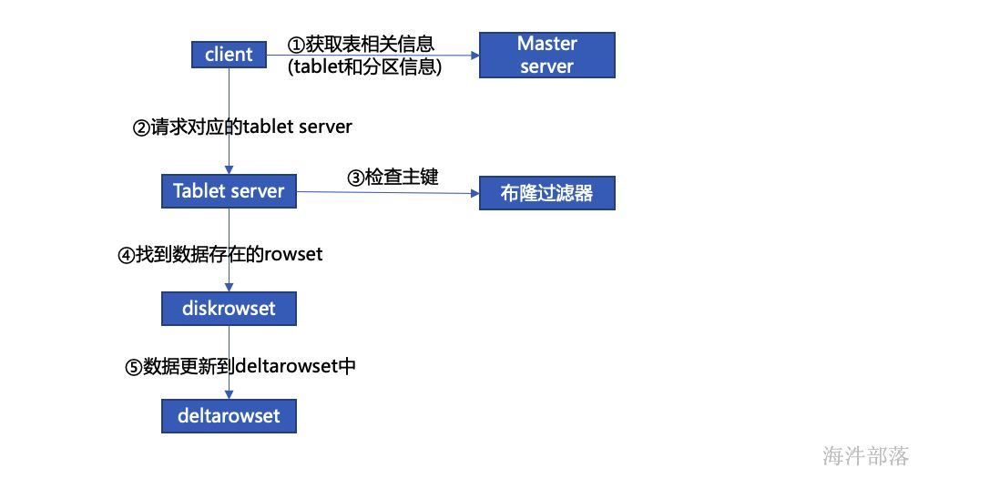
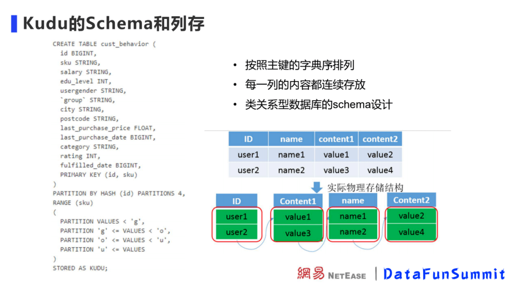
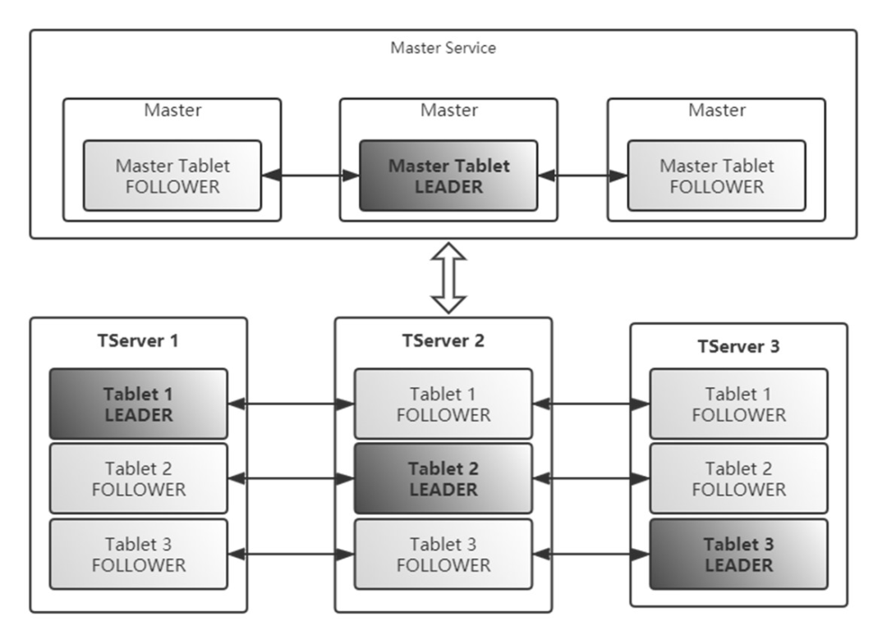
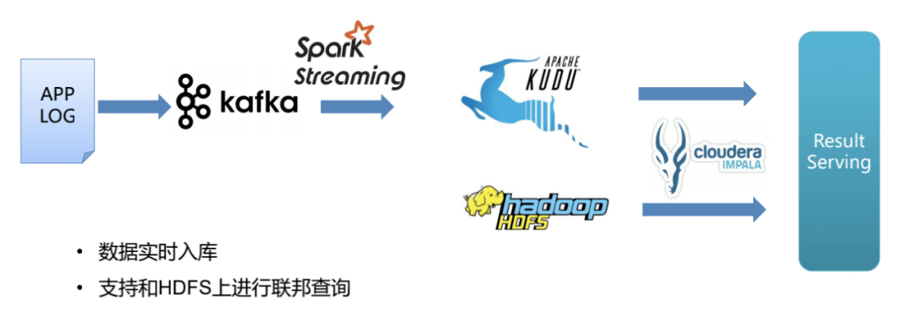
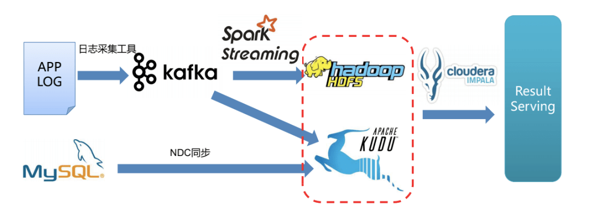
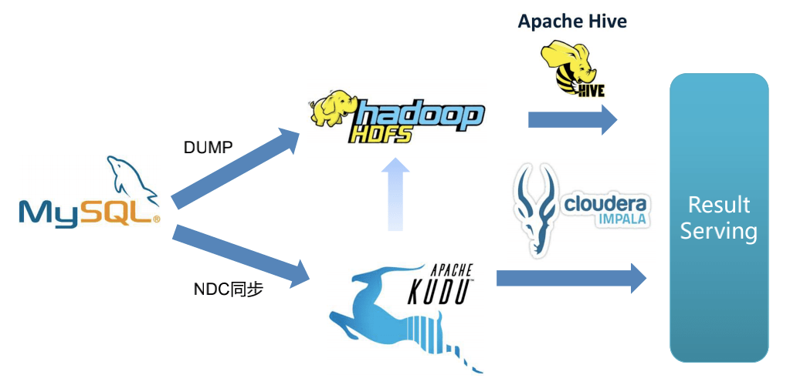

# Kudu 介绍

## 简介

Kudu定位与架构 Kudu是一个存储引擎，可以接入Impala、Presto、Spark等Olap计算引擎进行数据分析,容易融入Hadoop社区。

Kudu 是为 Apache Hadoop 平台开发的列式存储管理器。Kudu 具有 Hadoop 生态系统应用程序的共同技术属性：它在商品硬件上运行，具有水平可扩展性，并支持高可用操作。简单来说：kudu是一个与Hbase类似的列式存储分布式数据库。

## 为什么需要kudu？

HDFS 与HBase的数据存储的缺点目前数据存储有了HDFS与HBase，为什么还要额弄一个kudu呢？

### HDFS

使用列式存储格式Apache Parquet , Apache ORC，适合离线分析，不支持单条记录级别的update操作，随机读写能力差

### HBase

可以进行高效读写，却并不是适合基于SQL的数据分析方向，大批量数据获取的性能差。

### Kudu

kudu较好的解决了HDFS与HBase的这些特点，它不及HDFS批处理快，也不及HBase随机读写能力强，但反过来它比HBase批处理快,而且比HDFS随机读写能力强（适合实时写入或这更新场景频繁的场景）.这就是他能解决的问题。

## Kudu 架构

tablet分为leader与follower多副本机制，其中leader负责写服务，follower与leader一起提供读服务。

### kudu写数据流程

### kudu读数据流程

### kudu更新数据流程

## 向量化操作

Kudu数据存储在Table中，Tablet是Kudu的读写单元，Table内的数据会划分到各个Tablet进行管理。

建Table时，需要指定Table的分区方式。Kudu 提供了两种类型的分区方式range partitioning ( 范围分区 ) 、hash partitioning ( 哈希分区 )，这两种分区方式可以组合使用。分区的目的是把Table内的数据预先定义好分散到指定的片数量内，方便Kudu集群均匀写入数据和查询数据。范围分区支持查询时快速定位数据，哈希分区可以在写入时避免数据热点，可以适应各个场景下的数据。

Kudu有管理节点（Master）和数据节点（Tablet Server）。管理节点管理元数据，管理表到分片映射关系、分片在数据节点内的位置的映射关系，Kudu客户端最终会直接链接数据节点。

## Kudu的应用场景

### 实时数据采集场景

实时数据分析中，一些用户行为数据有更新的需求。没有引入Kudu前，用户行为数据会首先通过流式计算引擎写入HBase，但HBase不能支撑聚合分析。为了支撑分析和查询需求，还需要把HBase上的数据通过Spark读取后写入其他OLAP引擎。使用Kudu后，用户行为数据会通过流式计算引擎写入Kudu，由Kudu完成数据更新操作。Kudu可以支持单点查询，也可以配合计算引擎做数据分析。

### 维表数据关联应用

有些场景中，日志的事件表还需要和MySQL内维度表做关联后进行查询。使用Kudu，可以利用NDC同步工具，将MySQL中数据实时同步导入Kudu，使Kudu内数据表和MySQL中的表保持数据一致。这时Kudu配合计算引擎就可以直接对外提供结果数据，如产生报表和做在线分析等。省去了MySQL中维度表和数据合并的一步，大大提升了效率。

### 实时数仓ETL

