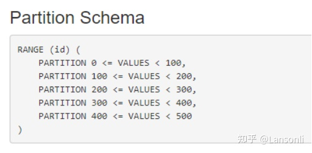

# Kudu 分区策略
参考：https://zhuanlan.zhihu.com/p/594134054

## 背景

Kudu表分为多个tablet，理想情况下，tablets应该相对平等地拆分表的数据，Kudu目前没有自动拆分预先存在的 tablets 的机制。所以在创建Kudu表时必须指定分区。Kudu表的分区分为范围分区、hash分区、高级分区三种，分区字段必须来自于主键字段。使用Impala创建表时，可以使用 PARTITION BY 子句指定分区。

## ​​​​​​​Partition By Range - 范围分区

Range分区需要指定分区键的范围，当向表写入数据时，根据指定的范围分发到对应的tablet上拆分表。分区键必须来自于主键。

代码如下：

	//创建KuduClient
	KuduClient kuduClient = new KuduClient.KuduClientBuilder("cm1:7051,cm2:7051").build();
	kuduClient.deleteTable("t_range_partition");
	//创建表Schema信息
	Schema schema = new Schema(Arrays.asList(
	        new ColumnSchema.ColumnSchemaBuilder("id", Type.INT32).key(true).build(),
	        new ColumnSchema.ColumnSchemaBuilder("name", Type.STRING).build(),
	        new ColumnSchema.ColumnSchemaBuilder("age", Type.INT32).build(),
	        new ColumnSchema.ColumnSchemaBuilder("score", Type.DOUBLE).build()
	));
	
	//指定分区策略
	CreateTableOptions options = new CreateTableOptions();
	//指定分区字段
	options.setRangePartitionColumns(Arrays.asList("id"));
	//指定id分区范围 0-100 ,100-200 ,200-300,300-400,400-500
	int count = 0;
	for(int i=0;i<5;i++){
	    //指定range的下边界
	    PartialRow lower = schema.newPartialRow();
	    lower.addInt("id",count );
	
	    count += 100;
	    //指定range的上边界
	    PartialRow upper = schema.newPartialRow();
	    upper.addInt("id",count );
	    options.addRangePartition(lower,upper );
	}
	
	//创建表
	kuduClient.createTable("t_range_partition", schema, options);
	
	//关闭kuduClient对象
	kuduClient.close();
​
以上代码执行完成后，可以通过Kudu的WebUI查看表的信息如下：

## ​​​​​​​​​​​​​​Partition By Hash - HASH分区

Hash分区需要指定分区健和分区的“buckets”个数，分区键必须来自于主键，通过指定的主键列获取列的hash值与“buckets”取模决定每条数据写往哪个tablets。

代码如下：

	/**
	 * hash partition
	 */
	//指定分区策略
	CreateTableOptions options = new CreateTableOptions();
	//指定hash分区字段id,bucket个数为10
	options.addHashPartitions(Arrays.asList("id"),10 );
	
	//创建表
	kuduClient.createTable("t_hash_partition", schema, options);

以上代码创建完成后，可以通过Kudu的WebUI查看表信息如下：

## Partition By Hash And Range - 高级分区

Partition By Hash And Range可以组合HASH和RANGE分区来创建更复杂的分区模式。我们可以建表时既指定hash分区，有指定range分区，这样数据插入时会先按照分区键的hash值取模之后再按照Range范围进行分区，决定数据去往哪个tablet。

代码如下：

	//指定分区策略
	CreateTableOptions options = new CreateTableOptions();
	//指定hash分区字段id,bucket个数为10
	options.addHashPartitions(Arrays.asList("id"),10 );
	
	//指定id分区范围 0-100 ,100-200 ,200-300,300-400,400-500
	int count = 0;
	for(int i=0;i<5;i++){
	    //指定range的下边界
	    PartialRow lower = schema.newPartialRow();
	    lower.addInt("id",count );
	    count += 100;
	    //指定range的上边界
	    PartialRow upper = schema.newPartialRow();
	    upper.addInt("id",count );
	    options.addRangePartition(lower,upper );
	}
	
	//创建表
	kuduClient.createTable("t_hash_range_partition", schema, options);
	
以上代码创建完成后，可以通过Kudu的WebUI查看表信息如下：

	