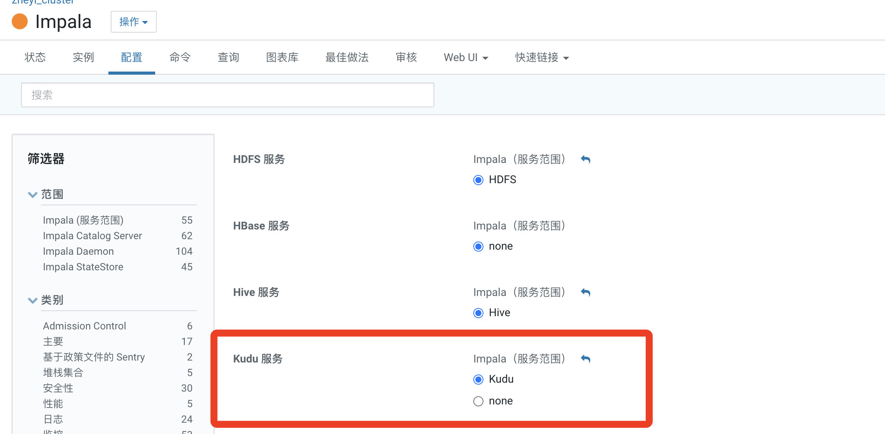

# Kudu与Impala整合
参考：https://zhuanlan.zhihu.com/p/594553362

## 打开impala 配置

## 内部表

使用 Impala 创建新的 Kudu 表时，可以将表创建为内部表或外部表。内部表由Impala管理，当您从Impala中删除时，数据和表确实被删除。当您使用 Impala 创建新表时，通常是内部表。

使用impala创建内部表时，必须先列出主键列，主键默认就是不能为NULL。例如：创建内容表如下：

	CREATE TABLE t_impala_kudu(
	id int ,
	name string,
	age int,
	primary key (id)
	)
	PARTITION BY HASH PARTITIONS 5
	STORED AS KUDU
	TBLPROPERTIES(
	'kudu.master_address'='cdh3:7051',
	'kudu.num_tablet_replicas' = '1'
	);

结果

	+-------------------------+
	| summary                 |
	+-------------------------+
	| Table has been created. |
	+-------------------------+
	Fetched 1 row(s) in 0.19s
	

内部表由impala管理，当创建表时，'kudu.master_address'指定Kudu集群，在ClouderaManager中impala配置了支持Kudu，也可以不指定；不能设置属性'kudu.table_name'指定Kudu中表的名字，表名默认就是“impala::xxx.xx”，当删除表时，对应的表在impala中和kudu中都会删除。	

## 外部表

外部表（由CREATE EXTERNAL TABLE创建）不受 Impala 管理，并且删除此表不会将表从其源位置（此处为 Kudu）丢弃。相反，它只会去除Impala和Kudu之间的映射。这是 Kudu 提供的用于将现有表映射到 Impala 的语法。

使用Java api 在Kudu中创建表personInfo，创建好之后，可以通过Kudu WebUI中发现对应的在Impala中创建外表映射Kudu表的语句：

	CREATE EXTERNAL TABLE `t_kudu_map` STORED AS KUDU
	TBLPROPERTIES(
		'kudu.table_name' = 't_test',
		'kudu.master_address'='cdh3:7051'
	);

## ​​​​​​​​​​​​​​Impala SQL操作Kudu

	CREATE TABLE t_test(
	id int ,
	name string,
	age int,
	primary key (id)
	)
	PARTITION BY HASH PARTITIONS 5
	STORED AS KUDU
	TBLPROPERTIES(
	'kudu.master_address'='cdh3:7051',
	'kudu.num_tablet_replicas' = '1'
	);
	
	
向表中插入数据:

	#插入一条数据
	[cm3:21000] default> insert into t_test (id,name,age) values (1,"zhangsan",18);
	
	#查询数据
	[cm3:21000] default> select * from t_test;
	+----+----------+-----+
	| id | name     | age |
	+----+----------+-----+
	| 1   | zhangsan | 18  |
	+----+----------+-----+
	
	#插入多条数据
	[cm3:21000] default> insert into t_test (id,name,age) values (2,"lisi",19),(3,"王五",20);
	
	#查询结果
	[cm3:21000] default> select * from t_test;
	+----+----------+-----+
	| id | name     | age |
	+----+----------+-----+
	| 2   | lisi      | 19  |
	| 1   | zhangsan | 18  |
	| 3   | 王五       | 20  |
	+----+----------+-----+
	
##	DML-向表中批量插入数据

	CREATE TABLE t_test2(
		id int ,
		name string,
		age int,
		primary key (id)
		)
		PARTITION BY HASH PARTITIONS 5
		STORED AS KUDU
		TBLPROPERTIES(
		'kudu.master_address'='cdh3:7051',
		'kudu.num_tablet_replicas' = '1'
	);
	
	#向表 t_test2中插入以下数据
	[cm3:21000] default> insert into t_test2 (id,name,age) values (10,"maliu",100),(20,"tianqi",200);
	
	#向表t_test中批量插入数据
	[cm3:21000] default> insert into t_test select * from t_test2;
	
	#查询表t_test中的数据：
	[cm3:21000] default> select * from t_test;
	
	+----+----------+-----+
	| id | name     | age |
	+----+----------+-----+
	| 10 | maliu    | 100 |
	| 2   | lisi     | 19  |
	| 20 | tianqi   | 200 |
	| 3   | 王五      | 20  |
	| 1   | zhangsan | 18  |
	+----+----------+-----+
	

## DML-更新数据

	#更新表t_test中的id为1的age为180
	[cm3:21000] default> update t_test set age = 180 where id =1;
	
	#查询t_test中id为1的数据更新结果
	[cm3:21000] default> select * from t_test where id = 1;
	+----+----------+-----+
	| id | name     | age |
	+----+----------+-----+
	| 1   | zhangsan | 180 |
	+----+----------+-----+
	

## DML-删除数据

	#删除表中id 为20的数据
	[cm3:21000] default> delete from t_test where id = 20;
	
	#查询t_test表中的结果
	[cm3:21000] default> select * from t_test;
	+----+----------+-----+
	| id | name     | age |
	+----+----------+-----+
	| 2  | lisi      | 19  |
	| 1  | zhangsan | 180 |
	| 3  | 王五       | 20  |
	| 10 | maliu     | 100 |
	+----+----------+-----+
	
## DDL-表重命名

	#将表t_test重命名为t_test1
	[cm3:21000] default> alter table t_test rename to  t_test1;
	
	#查看impala中的表信息
	[cm3:21000] default> show tables;
	+---------------+
	| name            |
	+---------------+
	| t_impala_kudu |
	| t_test1        |
	| t_test2        |
	+---------------+
	

## DDL-修改Impala映射底层的Kudu表

	#在Impala中创建外表 t_kudu_map 映射Kudu表 personInfo
	CREATE EXTERNAL TABLE `t_kudu_map` STORED AS KUDU
	TBLPROPERTIES(
	 'kudu.table_name' = 'personInfo',
	 'kudu.master_addresses' = 'cdh3:7051'
	)
	
	#在Kudu中使用Java api 创建一张表 personInfo2，结构与表personInfo一样即可。
	
	#修改Impala 外表 t_kudu_map 底层映射的personInfo为personInfo1表
	[cm3:21000] default> alter table t_kudu_map set TBLPROPERTIES('kudu.table_name'='personInfo1');
	
	注意：使用 “show create table t_kudu_map”查看表 t_kudu_map的建表语句，发现底层映射的Kudu表变成了 personInfo1。
	
## DDL-将内部表转换成外部表

	#将表 t_test1内部表转换成外部表
	[cm3:21000] default> alter table t_test1 set tblproperties('EXTERNAL'='true');	