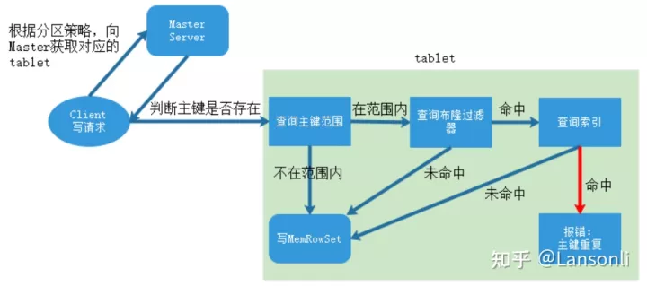
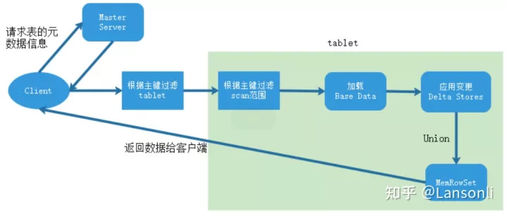
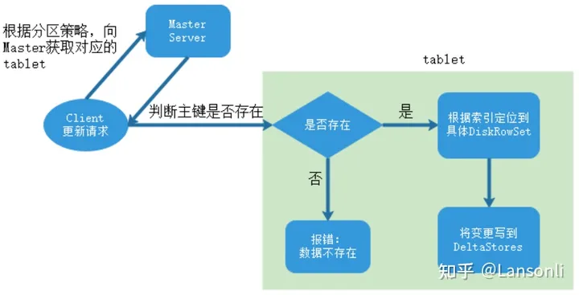

# Kudu读写数据过程

## 写入数据

当 Client 请求写数据时，先根据主键从 Mater Server 中获取要访问的目标 Tablets，然后到对应的 Tablet 获取数据。因为 KUDU 表存在主键约束，所以需要进行主键是否已经存在的判断。一个 Tablet 中存在很多个 RowSets，为了提升性能，我们要尽可能地减少要扫描的 RowSets 数量。首先，我们先通过每个 RowSet 中记录的主键的（最大最小）范围，过滤掉一批不存在目标主键的 RowSets，然后在根据 RowSet 中的布隆过滤器，过滤掉确定不存在目标主键的 RowSets，最后再通过 RowSets 中主键索引，精确定位目标主键是否存在，如果主键已经存在，则报错:主键重复，否则就进行写 MemRowSet。写入操作先被提交到tablet的预写日志(WAL)目录，并根据Raft一致性算法取得follow节点的同意，然后才会被添加到其中一个tablet的内存中，插入会被添加到tablet的MemRowSet中。

## 读取数据

​数据读取过程大致如下：先根据要扫描数据的主键范围，定位到目标的Tablets，然后读取Tablets中的 RowSets。在读取每个RowSet时，先根据主键过滤要scan范围，然后加载范围内的base data，再找到对应的delta stores，应用所有变更，最后union上MenRowSet中的内容，返回数据给 Client。

## 更新数据

数据更新的核心是定位到待更新数据的位置，这块与写入的时候类似，就不展开了，等定位到具体位置后，然后将变更写到对应的delta store中。