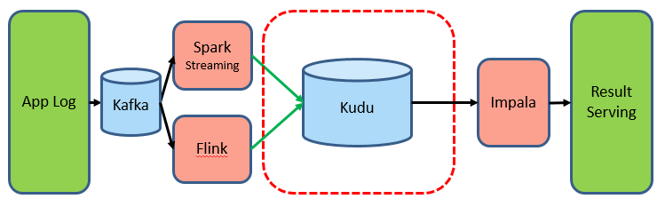

# 使用 Kudu 和 Impala 实现透明的分层存储管理
参考：https://zhuanlan.zhihu.com/p/65593795

## 当前 Kudu 的使用场景

当前在我们运维的 Kudu 集群上，主要分为以下两种场景：

###（1）数据库数据上的快速分析

目前应该有相当一部分同学在使用事务型数据库（MySQL、Oracle）做数据分析，他们把数据写入数据库，然后使用 SQL 进行有效信息提取，当数据规模很小的时候，这种方式确实是立竿见影的，但是当数据量级起来以后，会发现数据库吃不消了或者成本开销太大了，此时就需要把数据从事务型数据库里拷贝出来或者说剥离出来，装入一个分析型的数据库里。我们在考察了 GreenPlum、HAWQ、HBase、HDFS、ClickHouse 等开源组件后，发现对于实时性和变更性的需求，目前只有 Kudu 一种组件能够满足需求，所以就产生了这样的一种场景：

MySQL 数据库增、删、改的数据通过 Binlog 实时的被同步到 Kudu 里，同时在 Impala（或者其他计算引擎如 Spark、Hive、Presto、MapReduce）上可以实时的看到。

这种场景也是目前业界使用最广泛的，认可度最高

### （2）用户行为日志的快速分析

对于用户行为日志的实时性敏感的业务，比如电商流量、AB 测试、优惠券的点击反馈、广告投放效果以及秒级导入秒级查询等需求，按 Kudu 出现以前的架构基本上都是这张图的模式：

不仅链路长而且实时性得不到有力保障，有些甚至是 T + 1 的，极大的削弱了业务的丰富度。
引入 Kudu 以后，大家看，数据的导入和查询都是在线实时的：

同时，目前生产上很多同学把用户行为日志，分别往 Kudu 和 HDFS（parquet）存储了两份，Kudu 部分只保留最近的数据（比如最近一周或者一月）用于实时计算、HDFS 部分用于长远存储，这种做法没有问题，因为用户只关心最近的数据，但是当需要对整个表进行分析时候会存在困难： HDFS 上的不实时、Kudu 上的不全，这也是第二部分“实现透明的分层存储管理”会告诉大家如何来解决这个问题。

## 实现透明的分层存储管理

透明分层存储管理是基于“滑动窗口”（不了解的同学可以搜索下“TCP滑动窗口”）来实现的，把最新的或者可能存在变更的数据存储在 Kudu 里，等数据“变冷”稳定不会变化后，再刷出到 HDFS（parquet）上，然后通过 view 联合 Kudu 和 HDFS 的方式展现完整的数据，用户则基于 view 进行 SQL 查询。通过这种方式，既解决了数据的实时性，也解决了数据的完整性。

这里有两个滑动窗口：一个是 Kudu 和 HDFS 的 range 分片滑动窗口，另一个是 view 的滑动窗口。

另外，需要特别补充下中间“Boundary”的处理，即 SQL 查询的时候怎么处理这部分正在移动的数据？答案是在 view 的定义里：

	CREATE VIEW my_table_view AS
	SELECT name, time, message
	FROM my_table_kudu
	WHERE time >= "2018-01-01"
	UNION ALL
	SELECT name, time, message
	FROM my_table_parquet
	WHERE time < "2018-01-01"
	AND year = year(time)
	AND month = month(time)
	AND day = day(time);
	
请注意 SQL 中的 Kudu 表和 parquet 表的 time 字段的限制，view 定义了各自的时间范围，所以数据是不影响的。

### 举个例子

####step1

把 Kudu 数据拷贝到 HDFS ，此时因为 time 属性没变，所以 HDFS 上新增的 range 数据扫描不到：

#### step2

修改 view，使其包含 HDFS 增加新的分区，不包含 Kudu 旧的分区，那么这部分数据的扫描就切换到的 HDFS 上了；

