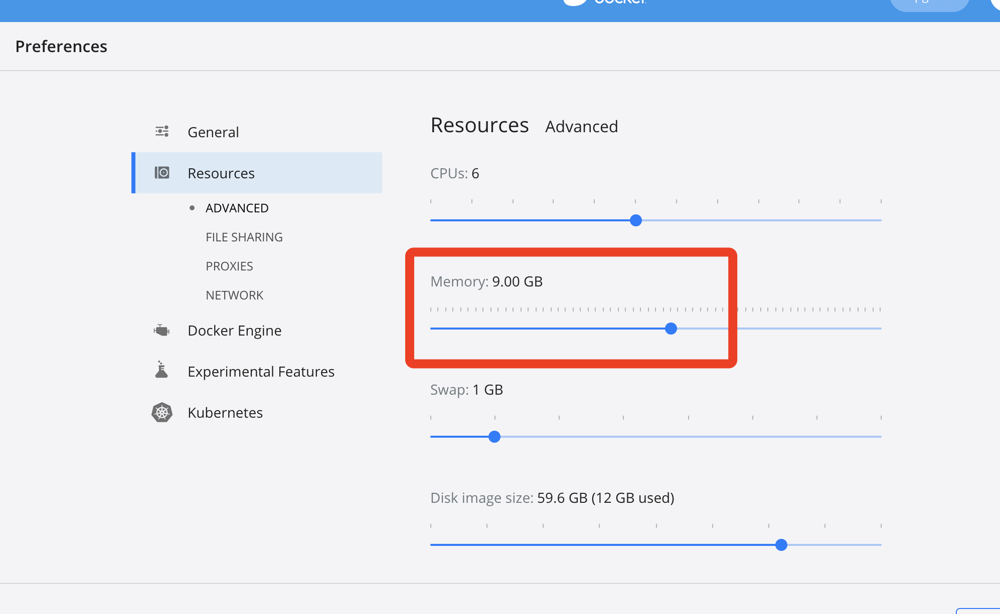

# Docker部署Kylin

## 拉取镜像

	docker pull apachekylin/apache-kylin-standalone:3.1.0
	

## 确保内存8G以上

	

## 运行docker

	docker run -d \
	    -m 8G \
	    -p 7070:7070 \
	    -p 8088:8088 \
	    -p 50070:50070 \
	    -p 8032:8032 \
	    -p 8042:8042 \
	    -p 16010:16010 \
	    --name apache-kylin-standalone \
	    apachekylin/apache-kylin-standalone:3.1.0

## 界面

	livy web http://47.112.142.231:8998/
	Kylin 页面：http://47.112.142.231:7070/kylin/login – 默认账号：ADMIN 默认密码:KYLIN
	HDFS NameNode 页面：http://47.112.142.231:50070/dfshealth.html#tab-overview
	YARN ResourceManager 页面：http://47.112.142.231:8088/cluster
	HBase 页面：http://47.112.142.231:16010/master-status
	
	
如果看不到登陆页面，需要在bin文件下，./kylin.sh start来启动

