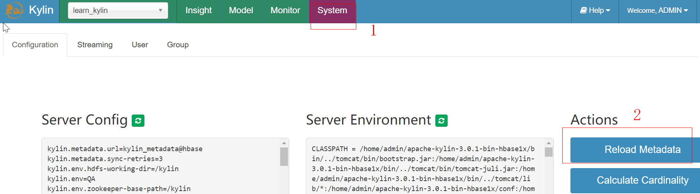
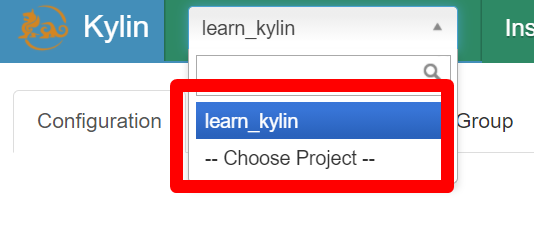
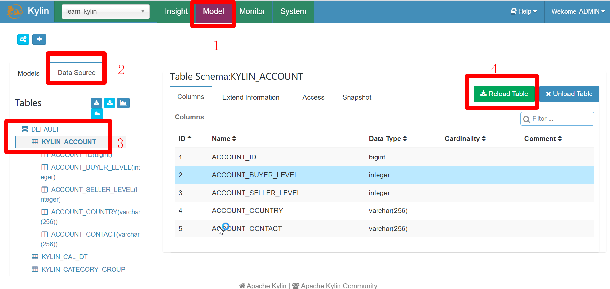
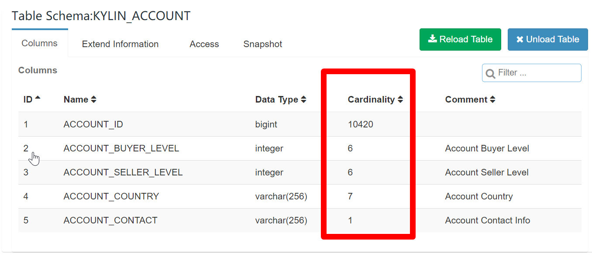
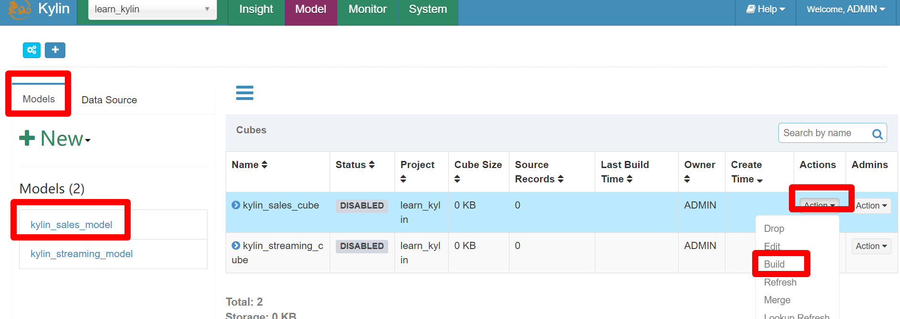
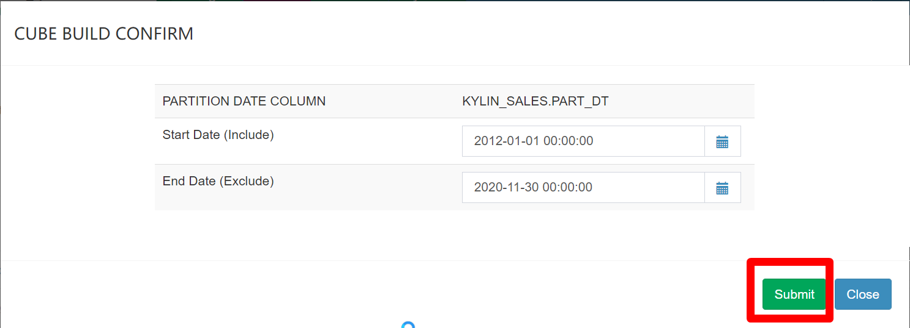
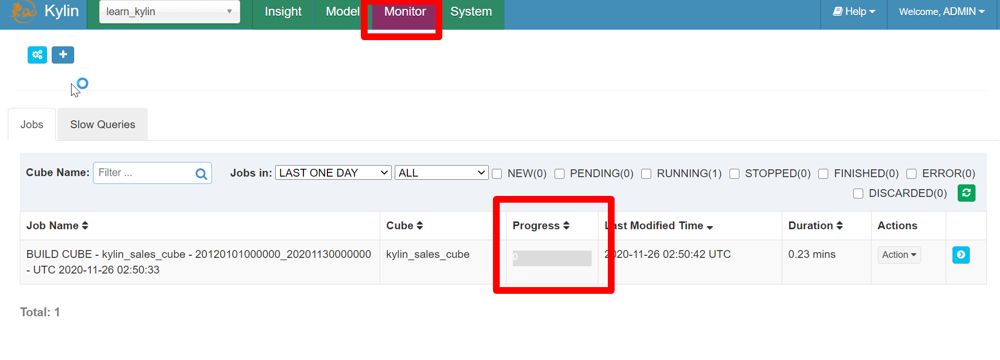
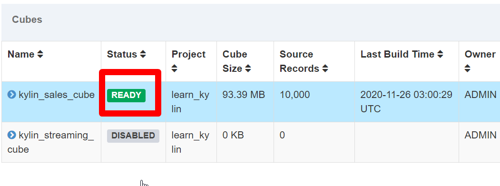
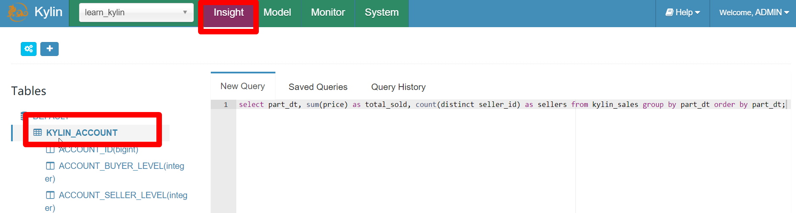
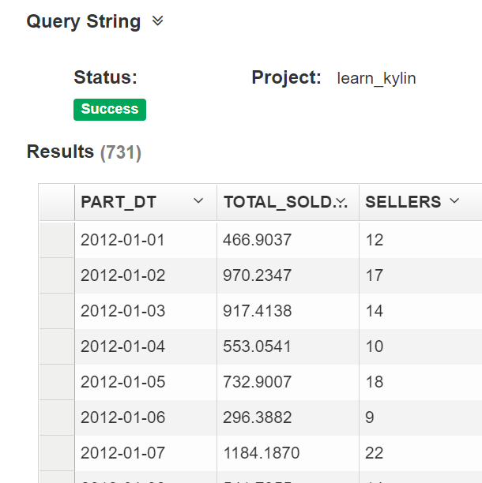

# Kylin 官方Demo

参考：https://www.cnblogs.com/bolingcavalry/archive/2020/10/24/13869811.html

## 进入容器（如果部署方式是容器的话）

	docker exec -it 2c6af92b9701 bash

## 导入测试数据 

	${KYLIN_HOME}/bin/sample.sh

## 构建Cube

进入管理界面

	http://47.108.157.83:58010/kylin/login

默认账号密码： ADMIN/KYLIN

### 加载Meta数据

加载成功：

### 创建MapReduce

在Model页面可以看到事实表和维度表，如下图的操作可以创建一个MapReduce任务，计算维度表KYLIN_ACCOUNT每个列的基数(Cardinality)：

执行完毕后刷新：

### 构建Cube

提交任务：

查看进度

build完成后，会出现ready图标：

## 查询

	select part_dt, sum(price) as total_sold, count(distinct seller_id) as sellers from kylin_sales group by part_dt order by part_dt;

查询结果：

