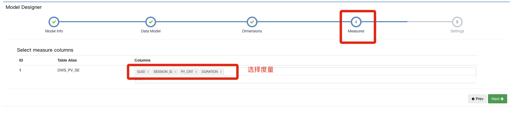

# 1. Model设计

## 测试数据

### Hive建表（事实表）

在对应目录下 ./hive 进入hive sql

	drop table dws_pv_se;
	
	create table dws_pv_se(
		guid string,
		session_id string,
		pv_cnt int,
		device_type string,
		province string,
		city string,
		region string,
		dtstr string,
		page_id string,
		duration bigint
	)
	partitioned by (dt string)
	row format delimited fields terminated by ','
	;

* pv_cnt：pv数量
* dtstr：日期字符串
* duration：访问时长
* page_id：入口页面id

	
###  导入数据（事实表）

#### pvs1.txt

	g01,s01,6,mi8,北京,北京,昌平区,2020-08-17,p01,300
	g01,s02,8,mi8,北京,北京,昌平区,2020-08-17,p02,200
	g02,s03,6,mi6,河北,石家庄,天心区,2020-08-17,p01,320
	g01,s04,16,mi8,北京,北京,昌平区,2020-08-17,p01,300
	g03,s05,20,mate7,河北,石家庄,天心区,2020-08-17,p03,180
	g03,s06,6,mate7,河北,石家庄,天心区,2020-08-17,p04,260
	g04,s07,12,iphone8,河北,保定,秀贤区,2020-08-17,p05,300
	g04,s08,7,iphone8,河北,保定,秀贤区,2020-08-17,p04,300
	g04,s09,14,iphone8,河北,保定,秀贤区,2020-08-17,p03,300
	g05,s11,10,mate7,北京,北京,朝阳区,2020-08-17,p02,200
	g05,s12,11,mate7,北京,北京,朝阳区,2020-08-17,p06,350
	g06,s13,23,mi8,上海,上海,闵行区,2020-08-17,p01,600
	g06,s14,32,mi8,上海,上海,闵行区,2020-08-17,p06,400
	g07,s15,9,iphone8,上海,上海,闵行区,2020-08-17,p06,400
	g08,s16,10,mi6,上海,上海,徐汇区,2020-08-17,p06,480

#### pvs2.txt

	g01,s31,10,mi8,北京,北京,昌平区,2020-08-18,p01,300
	g01,s32,22,mi8,北京,北京,昌平区,2020-08-18,p02,200
	g02,s33,25,mi6,河北,石家庄,天心区,2020-08-18,p01,320
	g02,s34,20,mi6,河北,石家庄,天心区,2020-08-18,p04,320
	g10,s35,26,mate7,河北,石家庄,天心区,2020-08-18,p03,180
	g10,s36,30,mate7,河北,石家庄,天心区,2020-08-18,p05,260
	g04,s37,17,iphone8,河北,保定,秀贤区,2020-08-18,p02,300
	g04,s20,20,iphone8,河北,保定,秀贤区,2020-08-18,p04,300
	g04,s21,38,iphone8,河北,保定,秀贤区,2020-08-18,p03,300
	g09,s22,20,mate7,北京,北京,朝阳区,2020-08-18,p02,200
	g09,s23,40,mate7,北京,北京,朝阳区,2020-08-18,p06,350
	g06,s24,20,mi8,上海,上海,闵行区,2020-08-18,p01,600
	g06,s25,32,mi8,上海,上海,闵行区,2020-08-18,p06,400
	g07,s26,13,iphone8,上海,上海,闵行区,2020-08-18,p05,400
	g08,s27,20,mi6,上海,上海,徐汇区,2020-08-18,p06,480
	

#### 导入数据

在对应目录下 ./hive 进入hive sql

	load data local inpath '/root/pvs1.txt' into table dws_pv_se partition (dt = '2020-08-17');
	load data local inpath '/root/pvs2.txt' into table dws_pv_se partition (dt = '2020-08-18');
	

### Hive建表（维度表）

在对应目录下 ./hive 进入hive sql

	create table dim_page(
		page_id string,
		page_type string,
		pindao string
	)
	row format delimited fields terminated by ','
	;

###  导入数据（维度表）

#### pg.txt

	p01,detail,日化
	p02,recommend,新品
	p03,activity,好货
	p04,activity,好货
	p05,detail,家电
	p06,detail,家电
	p07,detail,视频

#### 导入数据

在对应目录下 ./hive 进入hive sql

	load data local inpath '/root/pg.txt' into table dim_page;
	

## 添加数据源

在load table metadata中添加数据源

	dws_pv_se,dim_page
	

## 新建model

